Bloom provides a wide variety of book templates. There are two main categories:

1. [Book templates for everyday use](/built-in-templates#ea6cb7f4ea474fecadcd27293a7dfcd8)
2. [Book templates for specialized use](/built-in-templates#d45820c8430a4176bf1fb506a561014b)

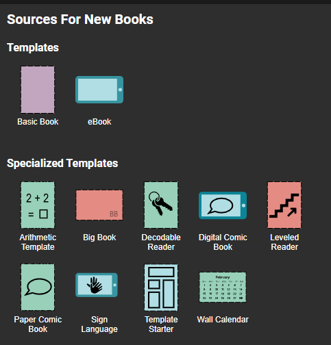

## Book templates for everyday use {#ea6cb7f4ea474fecadcd27293a7dfcd8}

There are two book templates for everyday use: Basic Book and eBook. The Basic Book is intended for printing, and the eBook is intended for digital reading only as a BloomPUB. BloomPUBs can be viewed in Bloom Library, Bloom Reader, or using BloomPUB Viewer for Windows.  

### The Basic Book template {#2934bb19df1280ac885fc15ba63f3b33}

The most commonly selected template is the **Basic Book** template. By default, this template creates an A5 paper size with a portrait orientation. This template gives you ample margins on the top, bottom, and sides making it ideal for printing:

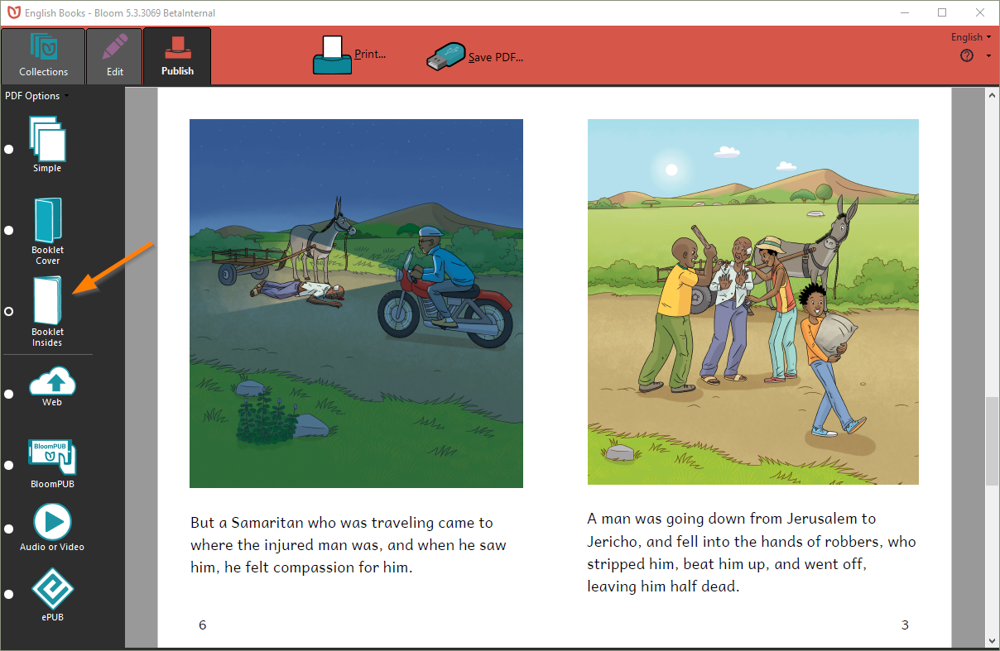

For complete details on margins and gutters, please refer to [Margins](/margins).

Because of Bloom’s flexible publishing strategy, the exact same A5 Portrait book designed for printing will also publish very well in either Bloom’s native digital format BloomPUB…

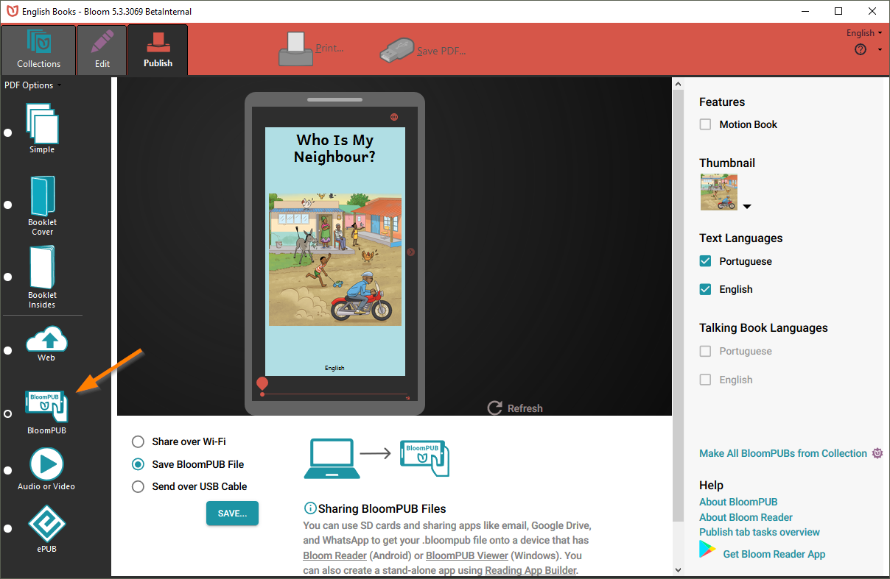

…or published as an ePUB:

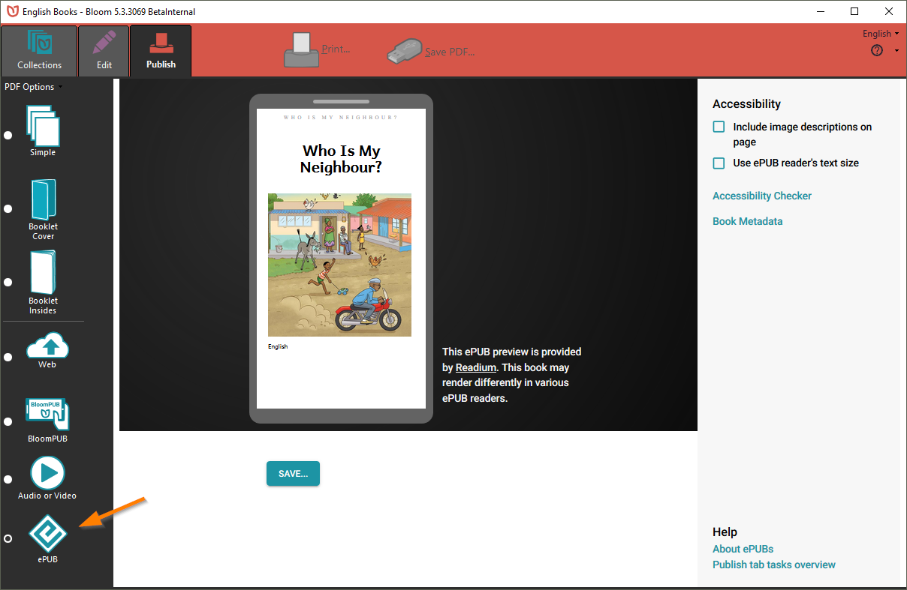

And the book can also be uploaded to the Bloom Library where the **PDF**, the **BloomPUB**, and the **ePUB** can be readily accessed and downloaded. 

Finally,  the book can simply be read online by clicking on the READ button:

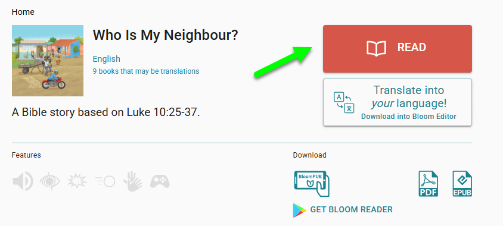

Now, it is important to understand that Bloom’s **Basic Book** template does not restrict you to A5 Portrait. A5 Portrait is simply the default page size and layout because of its popularity. In fact, Bloom provides many other page sizes (imperial and metric) and both layout options (portrait and landscape). 

When published to Bloom Library, Bloom will also automatically create a Device 16x9 version of your print book, making reasonable adjustments to the text size to accommodate to the smaller size. Here is an example of how an A5 page might look when compressed into Device 16x9 format:

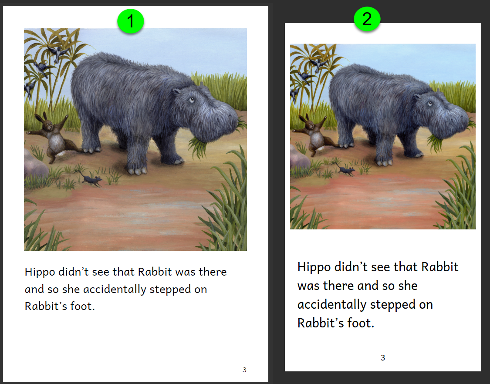

:::caution

Note: if a paper-sized book contains any Overlays, the BloomPUB will not be reformatted to Device 16x9, but will retain it’s original shape.

:::

The Basic Book template comes with several Page templates appropriate for that layout:

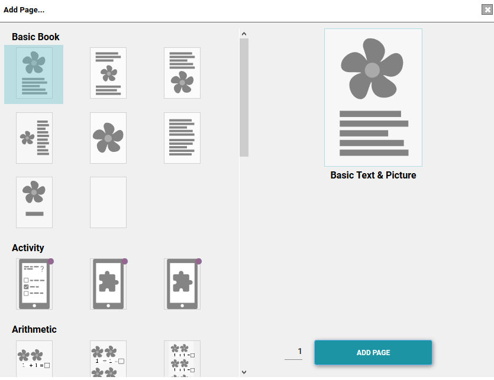

And using Bloom’s Change Layout slider, you can always design your own page:

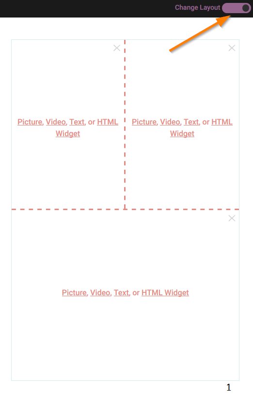

### The eBook template {#60d6b2965ebd4e1f9995a764a17020fd}

The eBook template makes a Device 16x9 landscape book. This format is a very popular format for organizations such as [Education for Life ](https://bloomlibrary.org/EFL-education-for-life-org)whose primary distribution strategy is digital, not print.

:::caution

Bloom books made from this template are not intended for print.

:::

Bloom eBooks retain 100% WSYWIG (what-you-see-is-what-you-get) between the book designed in Edit view in Bloom editor, and the published BloomPUB viewed in Bloom Library, Bloom Reader, or BloomPUB Viewer.

Bloom eBooks also are rendered faithfully in many ePUB viewers when published in “Fixed - ePUB 3 mode” from Bloom editor. However, for advanced like Talking Books and Image Descriptions, please refer to [Limitations of ePUB Readers](/ePUB-notes).

Bloom provides three different eBook themes in [Book Settings](/book-settings). Here is a sample page using the three different themes:

**Default eBook theme**

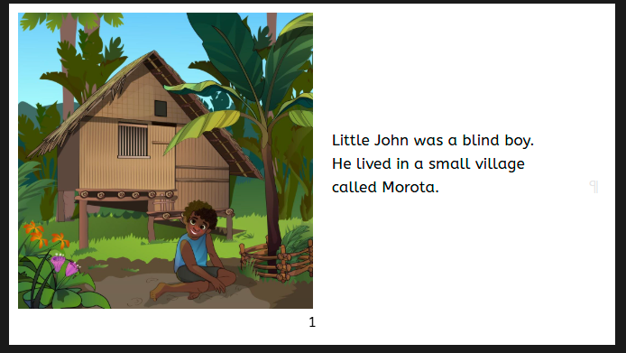

**Rounded Corner eBook theme**

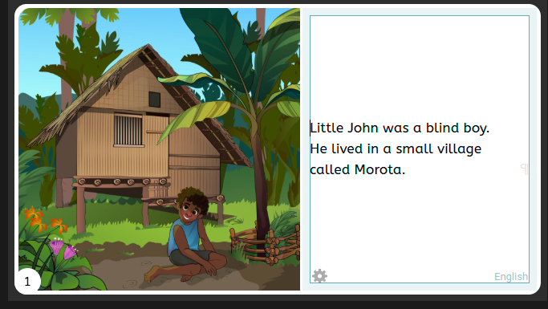

**Zero Margin eBook theme**

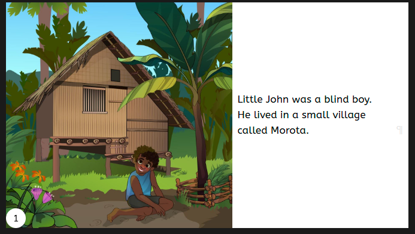

## Book templates for specialized use {#d45820c8430a4176bf1fb506a561014b}

With the incredible publishing flexibility that Bloom provides with the **Basic Book** template, most users will use this template for the vast majority of their book-making needs. But Bloom does have a number of templates for more specialized needs.

All specialized book templates come with a variety of specialized page templates.

### Books designed for Sign Language {#09351ab4c30d48c484b9c06e5c9b3a2c}

The **Sign Language** template makes a 16x9 landscape book designed to contain video recordings of a person signing a story. To set up a Sign Language collection, please refer to [Start a Sign Language Collection](/start-sign-language-collection).

### Books designed to meet focused early literacy needs {#03f110c5ee894fdc96373d636f27d977}

A **Decodable Reader** is a book that carefully limits the letters and words used so that it fits what a new reader is ready to read. A Levelled **Reader** is a book that is written specifically for a learner who is at a certain level of reading development.

A common practice among many promoters of literacy programs for minority language groups is to publish a yearly **Wall Calendar** in the local language.

### Books designed to teach basic number skills {#fb592bd864144fafa8ebde5f25f1b339}

Use the **Arithmetic Template** for this purpose.

### Books designed for teachers {#73b4ec4c600a44d289ac44bf8906d0e7}

**Big Books** are designed for teachers to hold and read in front of a class.

### Comic Books {#63f840fd64f0445aa82c939c958c4f0a}

There are two comic book templates. Pages are intended to receive a full-page image over a black background. The Overlay Tool is automatically opened for these book types.

- The **Digital Comic Book** template gives a 16x9 landscape e-Book with pages designed for a full-page (no margins) image with overlay elements like speech bubbles and captions.
- The **Paper Comic Book** template gives a US Comic Portait page size. This book is a candidate for full bleed printing.

### Template Starter {#2934bb19df1280898dedefe92e4bb785}

This is a special template to create your own template. Few users should use this. This is only suitable for literacy specialists or managers of larger literacy programs.

### Playground {#2934bb19df1280fab479d0450e0cf7cc}

A template to try out all of Bloom’s advanced features. See [Playground](/release-notes-6-2#2684bb19df12805eb53de8a2dd25a042).

