The `Collections` tab is where you can find and organize all of your books, as well as multiple ways to create new books.

## Parts of the Collections Tab {#d7d00db6aa61492587d31f8279da06d2}

There are multiple parts of the `Collections` tab:

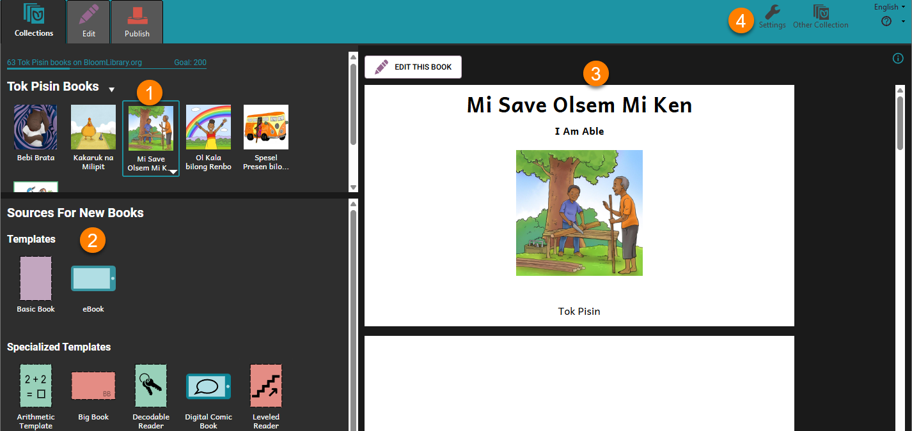

1. [Your Collection of Books](/collections-tab#ab98874adc7e4df3ab2b2041a58ca2eb)
2. [Sources for New Books](/collections-tab#bdabbbbf56fd4881901e7f411b1c2bd3)
3. [Book Preview Area](/collections-tab#fd503ffb53404a36869bb065736202f9)
4. [Collection Settings](/collections-tab#cb9073a21d7b4b04be0aaba5884a00e7)

## Your Collection of Books {#ab98874adc7e4df3ab2b2041a58ca2eb}

In the **upper-left corner** of the `Collections` tab, you will see the collection that you **currently** have open.

This is where you can **find and edit** the **books** that you are working on.

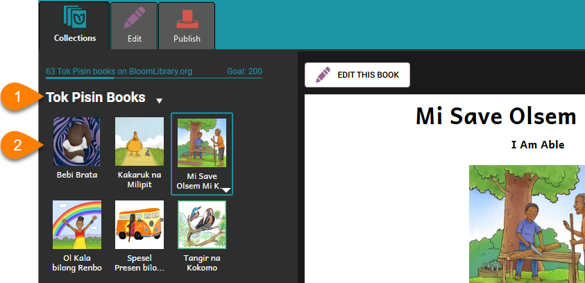

1. At the top, you see the **title** of this collection.
2. Underneath the title, you will see the **books** in this collection.

## Sources for New Books {#bdabbbbf56fd4881901e7f411b1c2bd3}

In the **bottom-left corner** of the `Collections` tab, you will see `Sources for New Books`. This is where you can find **new books** to create.

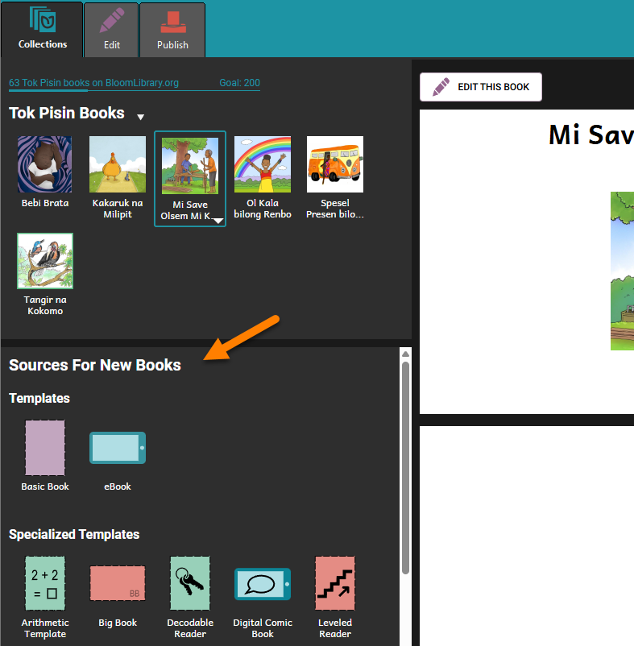

There are many different types of books to choose from:

- [Book Templates](/collections-tab#88adc23237dc4615bb06b26992ef2131)
- [Sample Shell Books](/collections-tab#c95bd7673fe34857aed83401d94ad830)
- [Books from BloomLibrary.org](/collections-tab#e2b69cf4b72540408826cbd5b9141801)
- [Books from Other Collections](/collections-tab#efea1a3236204445a637948ca39f5e33)

### Book Templates {#88adc23237dc4615bb06b26992ef2131}

Bloom comes with many different kinds of book templates. You can use these to create different kinds of books easily.

For more information, see [Bloom’s Built-in Book Templates](/built-in-templates).

### Sample Shell Books {#c95bd7673fe34857aed83401d94ad830}

Bloom also comes with a few **sample shell books**. These books are **ready-to-translate**: they already have a full story, complete with pictures and text, which makes it easy to publish in a local language.

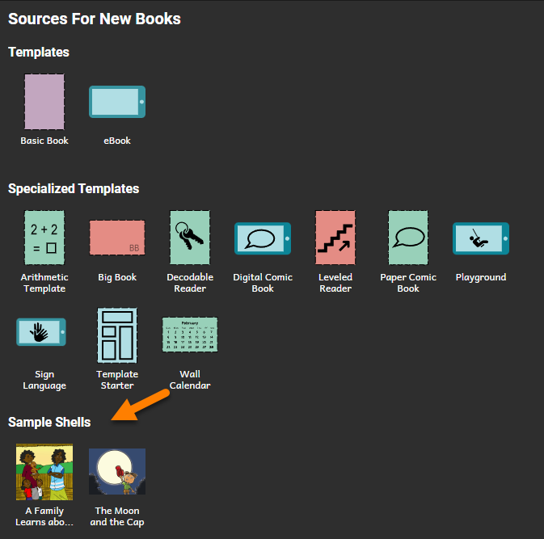

Learn more about [Shell Books in Bloom](/shell-books-in-bloom).

### Books from BloomLibrary.org {#e2b69cf4b72540408826cbd5b9141801}

The [Bloom Library](https://bloomlibrary.org/read) has thousands of shell books that can be downloaded for free and used to make your own books.

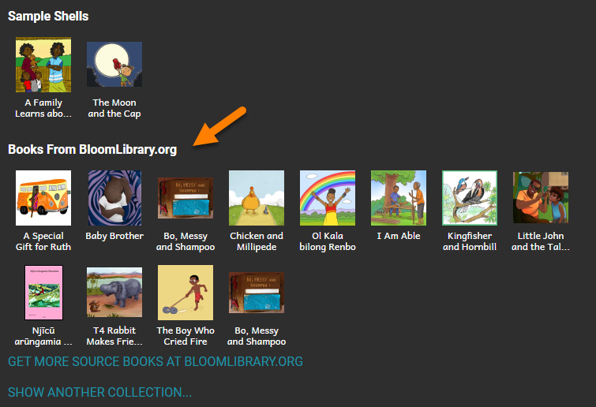

**Get More Books From the Bloom Library**

If you do not see any books in the Bloom Library section, or you want to download more books to use, click `GET MORE SOURCE BOOKS AT BLOOMLIBRARY.ORG`.

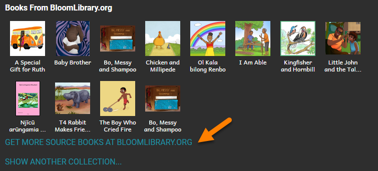

To learn more about downloading books from Bloom Library, see [Download Books from Bloom Library](/download-books-bloom-library).

### Books from Other Collections {#efea1a3236204445a637948ca39f5e33}

**Books from Bloom Packs**

If you have installed any Bloom Packs, the books from those [Bloom Packs](/bloom-packs) will appear below the `Books From BloomLibrary.org` section. For example:

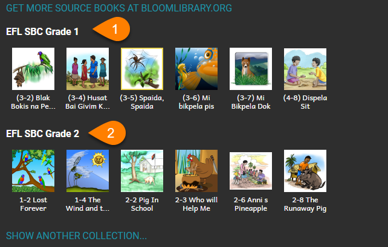

1. EFL SBC Grade 1
2. EFL SBC Grade 2

**Other Collections on Your Computer**

If you have other collections on your computer, you can show books from those collection(s) here. See [Show Another Collection](/show-another-collection).

### Book Preview Area {#fd503ffb53404a36869bb065736202f9}

The Book Preview area shows a larger version of the book or template that you select.

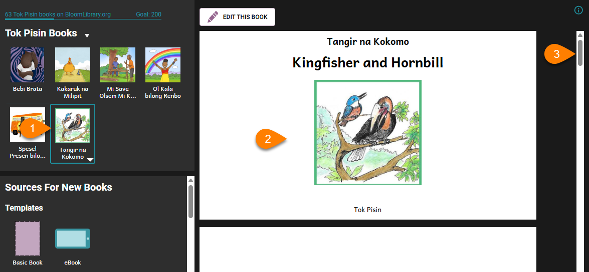

1. Click on the **picture/title (thumbnail)** for any book.
2. The book will display in the Book Preview Area.
3. Use the **scrollbar** on the right-hand side to scroll through the book.

## **Edit or Make a Book** {#2686a78b0bd1487798d5c1436f86c545}

If you want to edit a book:

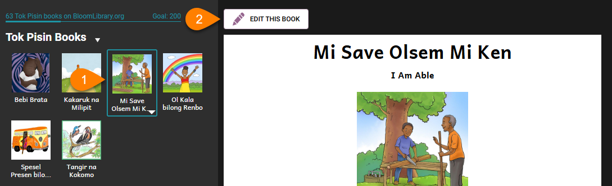

1. Click on any book in **your Collection** (upper-left pane).
2. Click `EDIT THIS BOOK`.

To create a book using a **template,** **shell book,** or **Bloom Library** book:

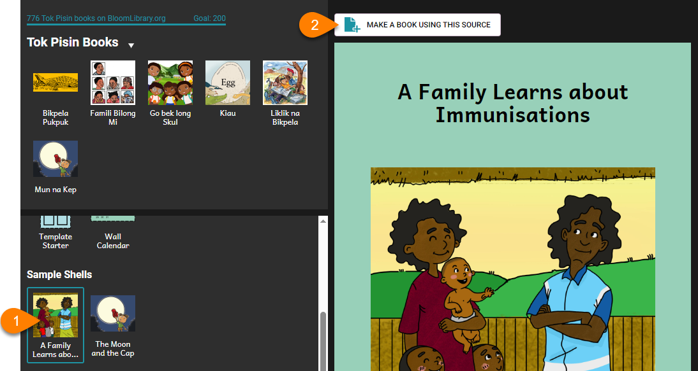

1. Click on any book in the `Sources for New Books section`
2. Click `MAKE A BOOK USING THIS SOURCE`.

## Collection Settings {#cb9073a21d7b4b04be0aaba5884a00e7}

:::note

See [Collection Settings](/collection-settings) to learn about changing Collection Settings.

:::

## Open or Create a Different Collection {#d99e8fe85cff4e22b4371f8dbfa77dae}

If you want to **open** or **create** a **different** collection, follow these steps:

1. Click the the `Other Collection` button:

	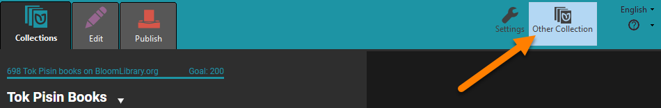

2. A window will open with multiple options:
	1. `Create New Collection`: Click to create a brand new collection (see [Create a New Collection](/create-a-new-collection#1d6b50d3274041feaf260bfd18d07d4f)).
	2. **Open a different collection**: If available, click to open a different collection in Bloom.
	3. `Browser for another collection on this computer`: Click to search for another collection somewhere else on your computer.

		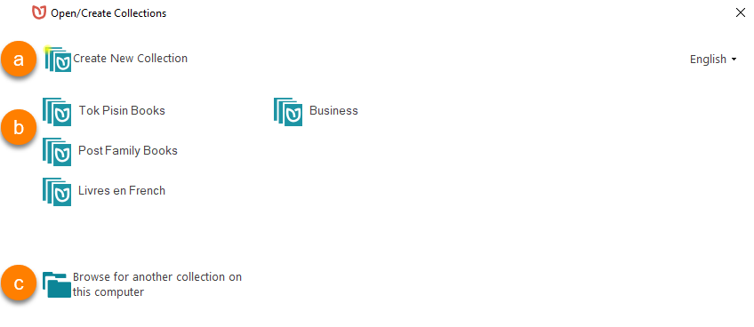

