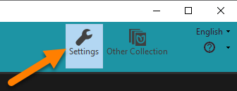

:::note

Content coming soon.

:::

# Parts of the Collections Tab {#d7d00db6aa61492587d31f8279da06d2}

The Collection tab is where you

- Access all of the books in the current collection.
- Create a new book from a `Template` or `Shell Book`.
- 

# Your Collection {#ab98874adc7e4df3ab2b2041a58ca2eb}

# Sources for New Books {#bdabbbbf56fd4881901e7f411b1c2bd3}

# Collection Settings {#cb9073a21d7b4b04be0aaba5884a00e7}

To open the settings for your current collection

1. Click on the Collections tab.
2. Click on Settings in the upper-right corner of the Bloom window.

	

## Languages Tab {#86d7ec4a747345abbd16d80d9489181c}

## Book Making Tab {#2e80d1c44630461a87344ae111c97204}

## Project Information Tab {#2bb5ada5220e47218befcb59b6b6780d}

## Bloom Enterprise Tab {#cc79d8d9a76c4adeb976398d52cddd21}

## Advanced Program Settings Tab {#80975dc1d81a444080d8ee527c1808b4}

# Other Collection {#938026dce2164ce1982576bcef6ceaf3}

