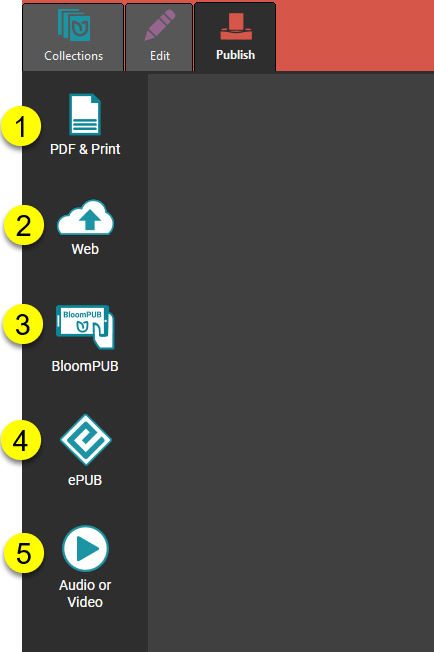

:::note

Page is a Draft version.

:::

# Parts of the Publish Tab {#d802c9601c74416c9653c0b30179881d}

When you open up Publish, you will see this window with 5 different ways to publish your book:

1. **PDF & Print:** This allows you to publish your book in a PDF format. Once you have published, you can be able to print your book into a hardcopy document.

2. **Web:** Here, you can publish your book to the BloomLibrary after which you can download the book to the Bloom Reader App for reading or to the Bloom Editor for translation into another language.

3. **BloomPUB**: BloomPUB is Bloom’s own digital publishing format. It faithfully reproduces all the features of your book.

4. **ePUB**: ePUB is a widely used digital publishing format, but it cannot reliably present some Bloom book features.

	:::note
	
	For a comparison between the BloomPUB and ePUB formats see [BloomPUB vs. ePUB: What’s the Difference](/compare-bloomPUB-ePUB). 
	
	:::
	
	

5. **Audio or Video**: You can save your book to  a video of a talking book or sign language book.

