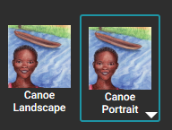

In [this article,](/developing-organization-book-style) we briefly outlined how each organization will often develop a particular “style” to serve its goals and its target audience best when authoring new original books. 

The same is also true when adapting pre-existing shell books. The original author(s) of any particular book would have had their own “style” and that style won’t necessarily coincide with yours. 

For example, if your organization has determined that digital landscape “talking books” is the ideal format to serve its goals best, and the book you wish to adapt is designed for A5 Portrait, does that mean you can not use that book?

No.

It means that you will need to adapt the book to your desired format.

Let’s look at one example of adapting a book.

# Changing Page Layout and Format: an example {#1f9dac7649de48fc9841906a927b0d27}

[Sara’s Canoe](https://bloomlibrary.org/Little-Zebra-Books/book/46lBlhj6GA?lang=en) is a storybook designed to be printed as an A5 booklet. Here are two facing (portrait) pages:

But let’s suppose that your organization wants a Device 16x9 landscape book like this:

How might you accomplish this transformation?

First, select the page size/layout dropdown and change it to Device 16x9 Landscape.

This will result in this: 

Next, you want to change all of the pages so that the image is positioned on the left, and the text on the right. Choose any page thumbnail in the page list, then right-click and choose “Change Different Layout”. 

Then:

1. Choose the `Basic Text & Picture` template.
2. Tick the box to `change all similar pages`.
3. Finalize by clicking `USE THIS LAYOUT`.

Now that the book has been converted to a Device 16x9 Landscape book, your next steps might be to consider using a special Page Theme for the book, such as the Zero Margin or Rounded Border theme. The Page Theme is found in the Book Settings.

Finally, you will want to adjust images and text for a “best fit” for the new layout. 

# Having multiple versions of a book {#6d8ac96b58fc4b7cafe51982d31bc835}

When an author makes a book using the Basic Book template, that book is well suited for both print and digital. However, there are limitations. In particular, the basic orientation — portrait vs. landscape — will be the same for both the print and the digital. But if, for example, you wanted a portrait book for print and a landscape book for digital (or vice-versa), then you must create two separate versions of your book.

To achieve this, right-click on your book in Collections, and choose **Duplicate Book**:

Then follow the example above to change the size and layout of your book.

After you have finished editing, return to the Collections tab. Will we see the two books listed side-by-side with exactly the same name. 

To reduce ambiguity, rename the books to distinguish them. Right-click and choose Rename Book. Perhaps something like this:

:::tip

The **Rename Book** command only renames the book _thumbnail_; it does not change the _title_ of the book.

:::

