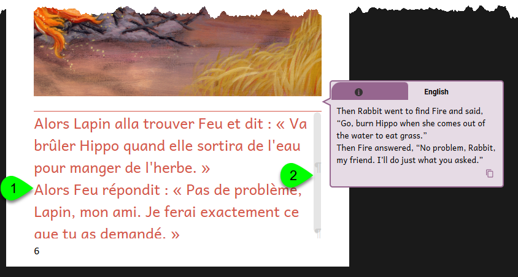
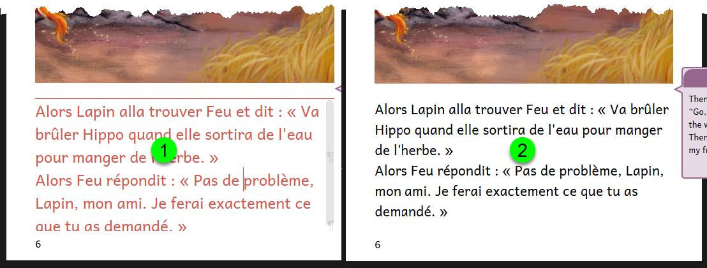
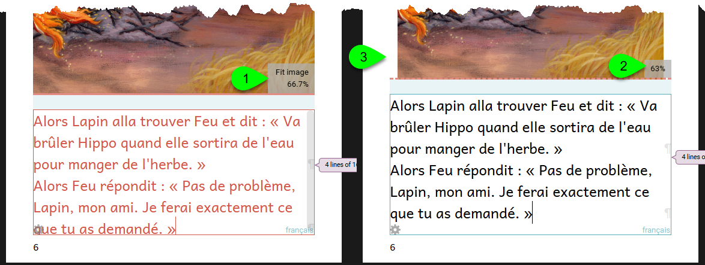
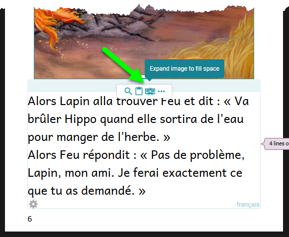
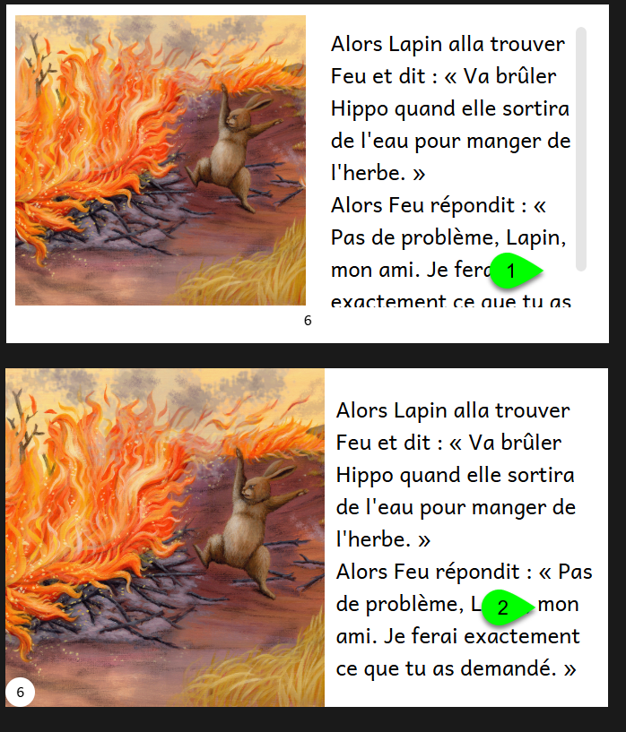
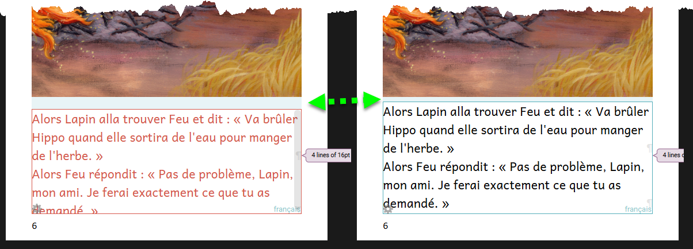
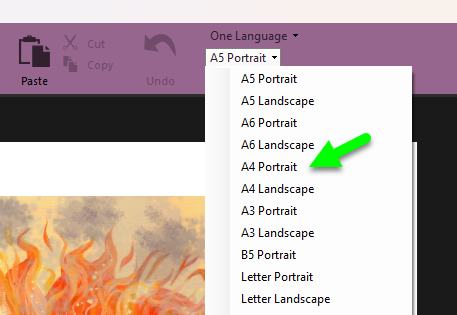
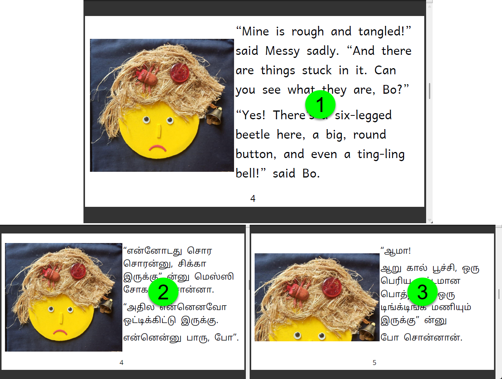

## Introduction {#2014bb19df1280b79791e63450a6ec3d}

Languages differ in how much text they need to tell the same story. For example, a German or French translation of an English story often requires significantly more text to communicate the same message. In contrast, translating English into Hebrew can result in a shorter text.

:::tip

If you are authoring new books with the expectation or hope that they be translated into other languages, it is essential to keep this in mind. 

For more information on this, see [Text Expansion and Contraction](https://eriksen.com/language/text-expansion/).

:::

When you translate a Bloom book written in a fairly “compact” language into one that requires more text, the text might not fit on the page and may overflow. In a book designed for print, Bloom indicates a **text overflow condition** by changing the color of the text red (1), and by showing a scrollbar on the right (2):

Of course, for a book designed for digital reading only (i.e. a Device 16x9 book), text overflow is not necessarily a problem; it is more of an aesthetic decision in the design of your book to avoid this or not. For this reason, Bloom will not turn the text red in Device 16x9 books. In the published BloomPUB, the reader can move the text up and down using the scrollbars.

But for a book designed for **print —** such as an A5 or Letter book — you will need to make some adjustments so that all of the text fits in the given space. Otherwise, some of the text will be cut off when it is printed.

There are several ways to adjust a book to accommodate more text. But each of these adjustments has different costs and benefits associated with it. 

Some adjustments are minor, while others are more major.

## Minor Adjustments {#2397758582e040b69ae096ae797587f7}

### Reduce the size of the font {#2924bb19df12806b9bf8fc72760bda75}

This is the easiest solution. For example, reducing the font size from 18pt (1) to 16pt (2) on this page, resolves the overflow condition:

For more detailed instructions on changing the font size, see [Format Text Styles](/formatting-text-styles).

While this solution is easy, it does have a cost in slightly reducing the readability of this book for younger readers.

### Change the page division {#2924bb19df1280779b11c10bb33c5a6d}

If reducing the font size is unacceptable or undesirable, you may wish to increase the space allotted to the text at the cost of reducing the space allotted for the image. 

In this example, the space allotted for image has been reduced from 66.7% to 63%:

However, after making this adjustment, the image will no longer align with the text (3). This makes your book look unprofessional. To resolve this problem, select the image and expand it to fill the entire space:

### Change the Page Theme {#2924bb19df1280bba356c694ea83e951}

If your book is Device 16x9 format, there are two alternate page themes you can use. See [Book Settings](/book-settings). Changing the Page Theme from Default (1) to Zero Margin (2) may resolve a text overflow condition as in this example:

### Reduce the Text Padding {#2924bb19df1280b3ad9bc89149641817}

By default, Bloom inserts a certain amount of “padding” between different parts of the page. Reducing the default amount of padding might help to resolve a text overflow condition as in this example: 

## Major Adjustments {#2d5a79325c0d433db2cedf565243ef20}

### Increase the page size {#2934bb19df128018a2eee33e41f83582}

Increasing the page size of a book is, of course, very easy: select a larger page size from the page layout list.

Even though this change is easy, we list this as a “major” change since this has major implications for how your book will be experienced and enjoyed, and how it will be printed. Therefore, this change needs to be thought through carefully. For further reading, see [Layout Considerations](/layout-considerations).

### Split the text across newly added pages {#2934bb19df1280bd97f2de71727c79ef}

Sometimes, minor changes will not suffice and you wish to retain the same page size. In this case, it is usually best to split the text from the original book across a newly added page, or even two. 

In the following example, the English text from page 4 of [this book (](https://bloomlibrary.org/chetana/book/1BMJGyHsm2?lang=en)1) needed to be split across two pages in [the Tamil translation](https://bloomlibrary.org/chetana/book/AJBR3sVqpZ?lang=ta) (2) and (3):

Typically, the easiest way to achieve this is to [duplicate the page](/pages#28bab62b643e46b6b157452cb55e286f), then edit your text. If the story line suggests it, you may wish to crop the image on the duplicate page to focus on something different. In the above, the image in (3) has been cropped to focus on Messy’s hair.

