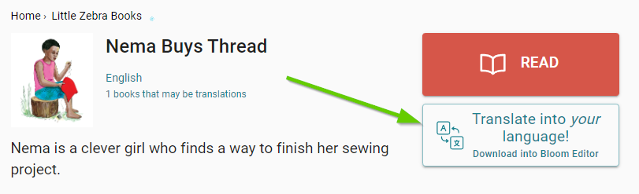
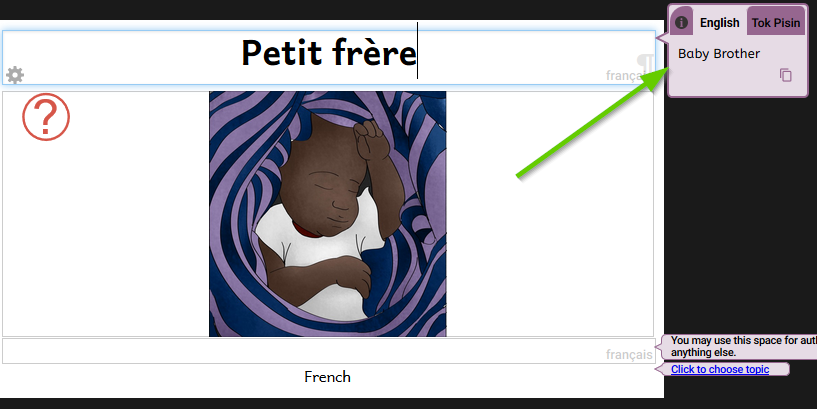

# Find and Download a Book to Translate {#1bf2e026a34c4bd7a4eea9bd70881cd4}

[Bloom Library](https://bloomlibrary.org/) hosts many thousands of books written in hundreds of languages. The source materials for most of these books can be freely downloaded into the Bloom Editor and translated into other languages and then published. 

To find a book that you want to translate or adapt, Bloom Library provides you with a variety of ways to narrow your search:

- by language
- by topic
- by special interests
- by book features

In addition, there are special “bookshelves” for particular publishers and organizations which can be a rich source of engaging storybooks.

# Download a Book for Translation {#7b848845e61041dc930d87535f11249d}

If you have not yet [installed Bloom editor](/installing-bloom-on-windows), please do so now.  

Once you have found a book you want to translate, simply click on the button “Translate into your language”. 

After the book has been downloaded, in Bloom Editor, click on the button “Make a book using this source”.

# Translate Carefully {#799c071b86214aa1a86ae360e83dd350}

Even though many of the books hosted on the Bloom Library are simple story books, you should nevertheless take your time and be careful with your translation, especially before uploading it to Bloom Library.

To begin your translation, if the book offers several “source” languages, choose the source language which you understand best.

For example, this original book offers both English and Tok Pisin.

After you have completed your translation, ensure that friends or colleagues check your translation for accuracy, clarity, spelling, and punctuation.

We also recommend that you follow the steps for [Translating and Adapting Storybooks](https://bloomlibrary.org/page/create/page/Create-Resources-TranslatingAdapting) to help ensure your books will be enjoyed by many!

