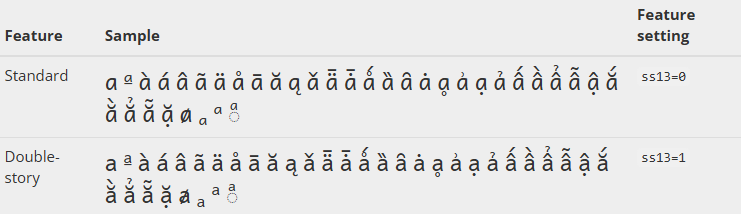

# Overview {#dbf73faf644f4fdfa3876fc1129feff8}


Many modern fonts provide two (or more) different “styles” of some of the letters in their alphabets (character sets). The standard style is shown by default (without doing anything special), whereas the non-standard/special style is displayed only if the user specifically requests it.


The technical name for these “styles” is “Font Features”. 


For example, SIL’s [Andika font ](https://software.sil.org/andika/features/)has two different styles for the letter “a” shown here:





The Bloom editor supports the use of Font Features. In this way, Bloom users can produce books following the specific font requirements of their respective language communities.


To enable a non-standard/special style in a Bloom collection, you must edit the file `customCollectionStyles.css` and add specific instructions for the features you require for the language you need. This file is located in the main folder for your book collection and must be edited using a plain text editor such as Windows Notepad.


The instructions you give are language-specific. For example, to select the “double-story” letter “a” for English, French, and Portuguese, you would add the following code to this file: 


```javascript
[lang="en"], [lang="fr"], [lang="pt"]
{
   font-feature-settings: "ss13" 1;
}
```


# Identifying Feature Settings {#a0192887860b49fca94fb2b696ae1802}


To find out which feature setting(s) you need, you must research and find the documentation for the specific font you are planning to use in your books. If you are using an [SIL font](https://software.sil.org/fonts/), look for that information on the page for the font in a bolded link saying “font features” or “smart font features”.


Multiple font features can be specified in the custom CSS file on separate lines separated by commas, for example:


```javascript
[lang="tsp"]
{
   font-feature-settings: "cv56" 1, "smcp" 1, "ss04" 1;
}
```


Similarly, multiple languages are separated by commas:


```javascript
[lang="tuz"], [lang="fr"] 

{
   font-feature-settings: "ss01" 0, "ss04" 0;
}
```

