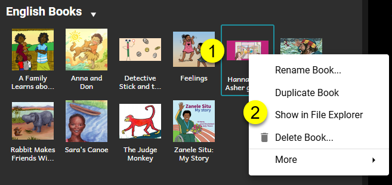

There are two reasons you may wish to share a Bloom book with a colleague:

1. [Share for Viewing](/share-books#2694bb19df12808793f5cc4059dd76e1).
2. [Share for Editing](/share-books#2694bb19df1280829781c2bc578a3e5c).

# Share for Viewing {#2694bb19df12808793f5cc4059dd76e1}

Bloom provides multiple ways to share your book with others for viewing or reading purposes. 

See [Publishing](/publish-tab).

# Share for Editing {#2694bb19df1280829781c2bc578a3e5c}

The primary method for collaborating with colleagues on Bloom books — i.e., sharing in the actual editing of these Bloom books — is by using Bloom’s [Team Collections](/team-collections-intro) feature. This feature requires a [Bloom Subscription](/about-bloom-subscriptions).

If, however, you do **not** have a Bloom Subscription, you will not be able to use that feature. In this case, you can still share a book with a colleague, but you will have to do so “manually”. 

:::note

When sharing books outside of a Team Collection, you will need to manage book ownership within your editing team, and you will need to keep track of which team member has the latest copy of each book.

:::

## What is a Bloom Book? {#2694bb19df128097aa29ed41ca0e39ce}

A “Bloom book” is actually a collection of **many** files housed under a “book” folder. In fact, some book folders may contain hundreds of individual files. If you wish to share a particular Bloom book with another person for editing, you must copy the entire book folder and all of its contents with that person.

To access that folder, you must:

1. Right-click on the book’s thumbnail.
2. Click **Show in File Explorer**.

You can now copy the entire book folder and share it with your colleague. If the book folder already exists on your colleague’s computer, then they must replace it with the new, more up-to-date copy.

:::note

Remember: you and your colleague must keep track of who has the latest copy of this book.  Also, keep in mind that each Bloom book has a unique book ID. See this [article](/derivatives).

:::

