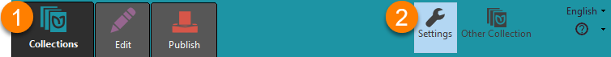
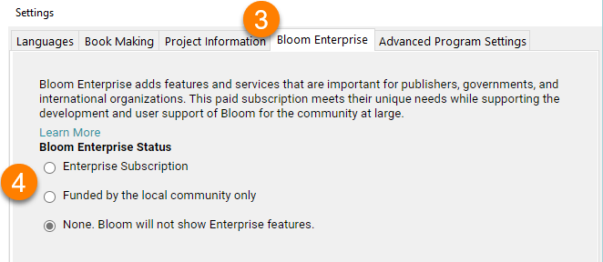
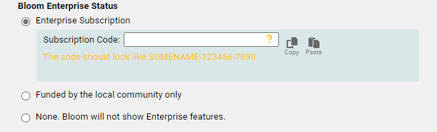
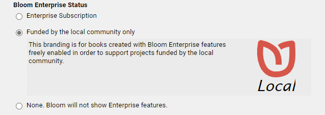
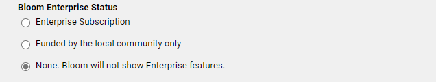
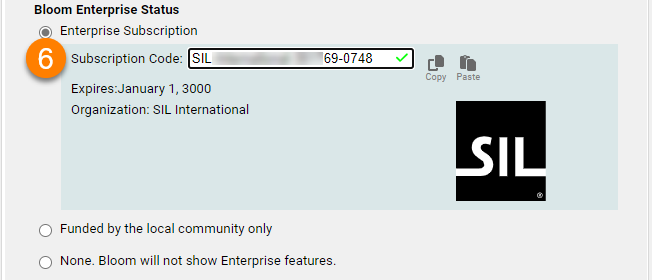
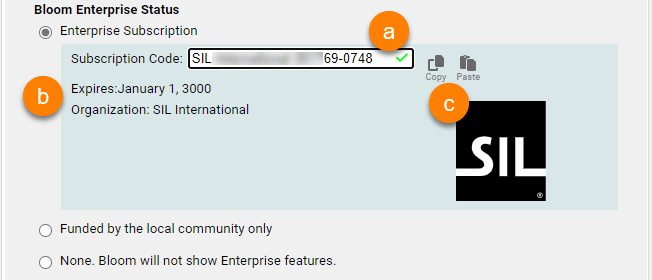
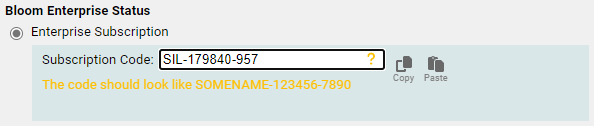
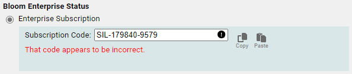
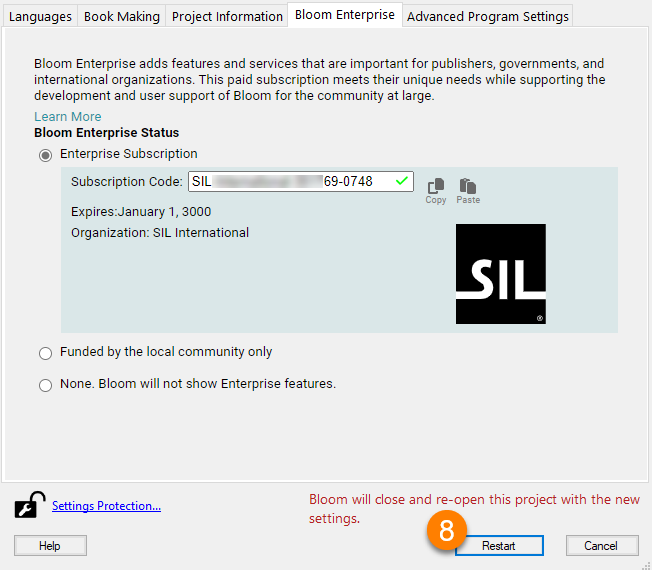

Follow these steps to enable Bloom Enterprise in Bloom Editor:

1. Go to the `Collections` tab.
2. Click on `Settings`:

	

3. Click on the `Bloom Enterprise` tab.
4. Choose a `Bloom Enterprise Status` option:

	

5. These are the options for `Bloom Enterprise Status`:
	1. `Enterprise Subscription`: A special code given to publishers, governments, and international organizations with a **funded Bloom Enterprise subscription:**

		

	2. `Funded by the local community only`: Offers free Enterprise features to locally supported projects:

		

	3. `None`: for **normal** Bloom users.

		

6. For an `Enterprise Subscription`, paste your `Subscription Code`:

	

7. If the `Subscription Code` is **valid**, you will see:
	1. A **green checkmark** next to the `Subscription Code`.
	2. An **expiration date** and **organization name.**
	3. A **logo** for your organization.

		

8. If the `Subscription Code` is **not valid**, you will see one of these messages:

	

	

	1. Try to copy/paste your `Subscription Code`.
	2. If you need additional assistance, please [contact us](mailto:enterprise@bloomlibrary.org).
9. Click the `Restart` button to restart Bloom with the new Enterprise settings:

	

