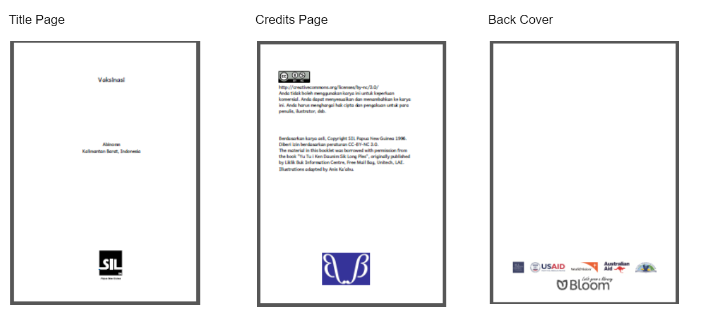
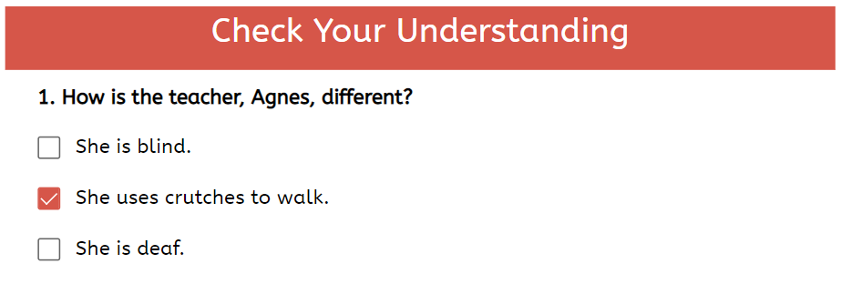
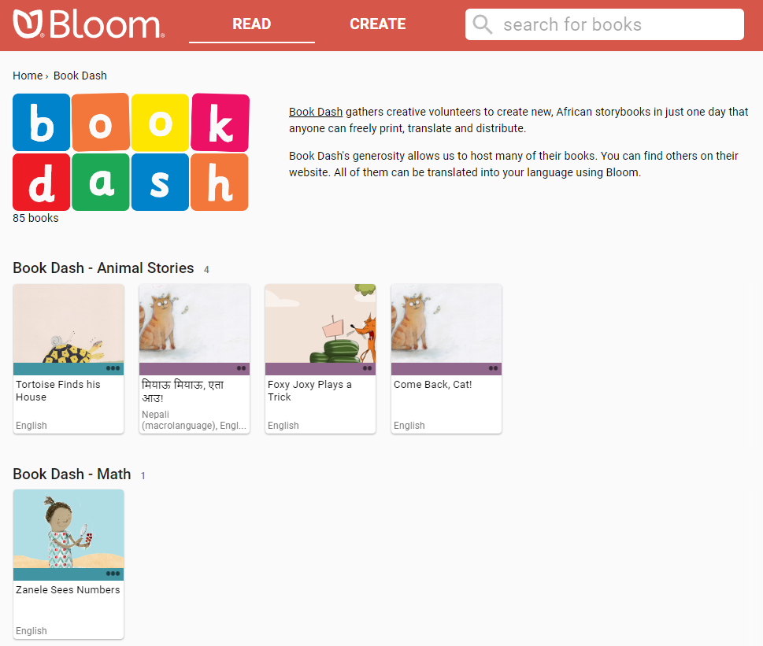

**Bloom Enterprise** subscribers have access to the following features and tools.

# Enterprise Book Features {#750fd0291c824f4b8affe185c92e8617}

## Branding and custom page layouts {#8193915c093b4da99004038e38fe09dc}

Bloom can automatically display your logo(s) on the cover, title page, or back cover of your books. Enterprise customers can also specify the copyright and license that each book will contain. For further details on Bloom branding, see [Custom Branding](/what-branding-can-do).

:::note

Bloom Enterprise customers may also request custom covers and front-matter pages at an additional charge, based on the amount of work such customization requires.

:::

## Overlay Tool {#c420f5ea3d97478998101e3c5b79aa8c}

The **Overlay Tool** allows the user to place text, images, or video over a partial or full-page image. This allows more complex page layouts, including Digital and Paper Comic Book Templates.

## Activity pages {#5014d1f2248e479787c21b45850417e8}

Bloom supports two kinds of **activity pages** in digital books: Comprehension Questions and Simple Choice Activities.’ 

**Comprehension questions** let you design multiple-choice questions for readers to answer. These activities enhance the reading experience, and Bloom’s analytics system can capture whether readers answer the questions correctly or incorrectly. Such information can provide valuable data for an organization or project’s monitoring and evaluation efforts. 

**Simple Choice Activities** come in two varieties: **Choose Word from Picture** and **Choose Picture from Word.** 

## HTML5 widgets {#b4debe07f92845dea1d78cffbbbef385}

**HTML5 widgets** are JavaScript apps that are programmed outside of Bloom and can be embedded in Bloom book pages. These widgets open up many options for making books interactive.

To view just one example of a Bloom book with a widget, go to page 9 below:

<iframe width="100%" height="450px" allow="fullscreen" allowFullScreen={true}
  src="https://bloomlibrary.org/bloom-player/bloomplayer.htm?url=https://s3.amazonaws.com/bloomharvest/educationforlife@sil.org/dce90651-e17a-4f28-a135-42fd3327c137/bloomdigital/index.htm&initiallyShowAppBar=false&paused=true&allowToggleAppBar=true&independent=false&host=docs.bloomlibrary.org"></iframe>

# Enterprise Editing Tools {#2af3fbf23d4c4a9c97a6b0d1e6155ec1}

## Team Collections {#55c8baa318884dcf874c76f7e0dd9859}

Team Collections enable a team to collaborate on a single collection of books. Team members check books in and out as they work on them, and use the Dropbox file-sharing service to synchronize files between their computers.

See **[Problem Internal Link]** to learn more.

## Spreadsheet import/export {#04fd63f5a0fa443bb635115674b580a2}

**Spreadsheet export/import** allows you to export the contents of a Bloom book to a specially formatted Excel spreadsheet, and import the content back into a Bloom book. While there are some limitations on what can be exported and imported, this can be a convenient way to add translations into one or more new languages to a Bloom book.

See [Spreadsheet Import and Export](/spreadsheet-import-export) to learn more.

# Enterprise Publishing Features {#6279ba4ee1cb4264aef9a2cdf2c3ff6c}

## Bloom Library Collections {#e681141a57404c3fb71d4a1405423568}

Enterprise customers can request a dedicated page on [bloomlibrary.org](http://bloomlibrary.org/) that features their books. The page can also feature a logo, a short blurb about the project or organization, and a link for more information. Bloom Library pages can also be embedded on your own website.

### Uploading Collections to Bloom Library {#9f527fedf9a54915bc595948fab91aae}

Bloom Enterprise users can upload all the books in a collection—or even several collections of books—to Bloom Library in one step. 

See [Bloom Library Collections](/97205ce5-ecae-482b-8ce0-3749d11473e2) for more info.

## Convenient Creation of Multiple BloomPUBs {#66a5414a6cd44ce58f6f48113a1993ca}

**Bloom Reader** is a free Android app that allows readers with Android devices to enjoy Bloom books offline. Bloom Reader uses a special BloomPUB file format that supports all Bloom’s features, including audio and video playback. Bloom Enterprise subscribers can create BloomPUB files for all books in a collection in one step.

## How to Embed a Bloom Library Collection In Your Website {#8012be7996f048298403270e67bac335}

See [How to Embed a Bloom Library Collection in Your Website](/embed-collection).

See also [How to Embed a Single Book from Bloom Library in Your Website](/embed-single-bloom-library-book).

# Analytics {#5c23210796fc4497a8a406ab4eeefc23}

Bloomlibrary.org collects anonymized analytics data from books read online, in Bloom Reader, or in other apps that use Bloom books. Enterprise customers can monitor the usage of their books through this dashboard, including reading activity, location data, and responses to comprehension questions. 

See [Bloom Analytics For Publishers](/analytics-for-publishers) to learn more.

