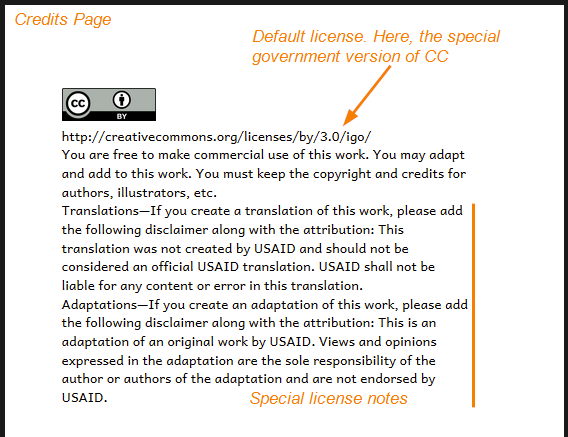
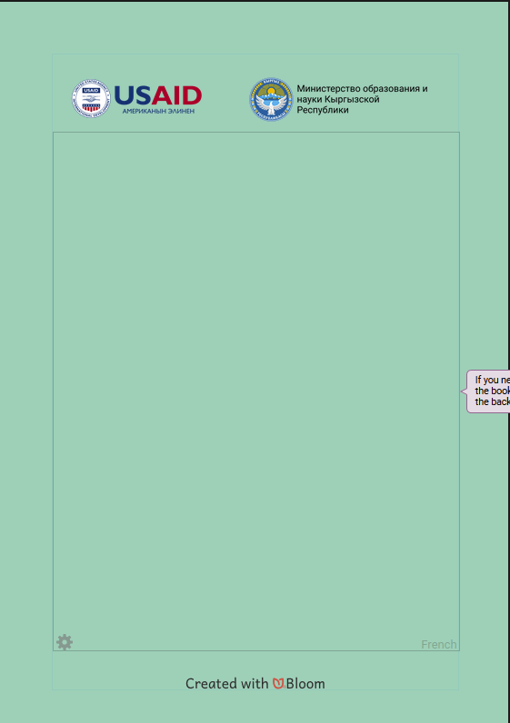

A typical Bloom book has prebuilt **content slots** in the front and back matter. A custom **branding pack** can fill these slots with text or graphics to create a consistent branding across a collection of books. 

Standard branding slots include the following: 

- Front cover top
- Front cover bottom
- Credits page top
- Credits page bottom
- Title page bottom
- Outside back cover top
- Outside back cover bottom

In addition, a branding pack can declare:

- Default copyright notice
- Default license notice
- Default license notes

Creating a custom branding pack is a paid service. If you think you need a custom Xmatter pack, contact the Bloom team at [enterprise@bloomlibrary.org](mailto:enterprise@bloomlibrary.org). 

:::note

You can do a lot with a custom branding pack, there are limits: see [What Bloom branding cannot do](/what-branding-can-do#b681c648ec2e401999e6cefafeb002fa) below.

:::

## Branding pack samples {#6bfdcc9b92a2444ca7d72edcc3fd1560}

Here are some examples of front and back matter pages that have been customized using a custom branding pack

### Cover Page {#3682c0756f9a4f8a89f4910659868324}

### Title Page {#f3f1446f6c664f8c9b2e4ab8e193d0b1}

### Credits Page Top {#0303656344fd4e7a81d9dc1f619bdef2}

### Credit Page default license & license notes {#b06f70e834b24b2d836daa994b082d16}

_(from Suluh-INOVASI)_

_(from GRN-REACH)_

### Credits Page Bottom {#01d0830a711f4a85b2c7d9efae7a1716}

### Back Cover Top {#0eada8b87fad45e98bfa0877dbc9907e}

### Back Cover Bottom {#65799ef379854ba8b8b4bd3701bc6b26}

_(from Suluh-INOVAS)_

## What Bloom branding <u>cannot</u> do {#b681c648ec2e401999e6cefafeb002fa}

Making a branding pack in Bloom is like decorating a house: it’s easy, but there are limits. In contrast, making a custom **Front/Back Matter pack** is like moving walls or adding on new rooms. With a custom front/back matter pack (called an **Xmatter pac**k), you can add new front and back matter pages and new branding slots. Custom Xmatter packs must be created by a Bloom developer.

Creating custom Xmatter packs is a paid service. If you think you need a custom Xmatter pack, contact the Bloom team at [enterprise@bloomlibrary.org](mailto:enterprise@bloomlibrary.org). 

