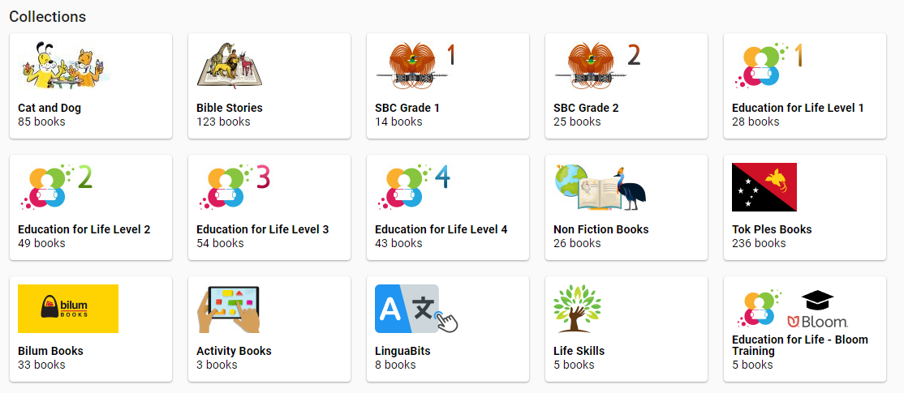
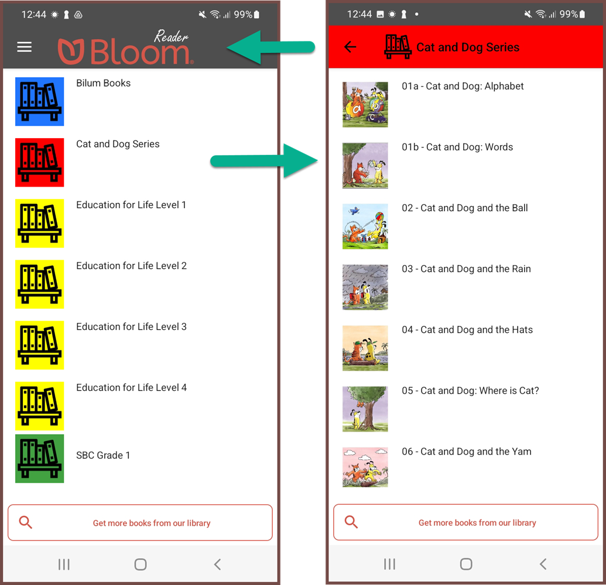

:::caution

This material is for Bloom clients holding a Bloom Enterprise subscription.

:::


## Overview {#df0855b964e24b7394027fff9c54cea3}


Organizations holding a Bloom Enterprise subscription can organize their books into different bookshelves (book collections). For example, below is a sampling of the Bloom Library bookshelves for the organization _Education for Life_:





Bloom provides two different bulk operations to its Enterprise clients: 

1. Bulk uploading an entire collection of books to **Bloom Library**, and
2. Making BloomPUBs for an entire collection for distribution to the **Bloom Reader** app.

_Both_ bulk operations depend on grouping books into particular “bookshelves” similar to those shown above for _Education for Life_.


### Essential Steps for Setup {#129a30f7be7b45e59c5b7e6be3b3ae75}


There are two essential steps before initiating either of these bulk processing operations.

1. Set the [Bloom Library Bookshelf](/bloom-bookshelves#8874d41827394c69a5ef00d4508fda2a) for the book collection to set the bookshelf.
2. Ensure the [publishing settings](/bloom-bookshelves#0ef8e2f1272c4ea88040940a6cdcce56) for each book are correct.

**Set Bloom Library Bookshelf**


Here are the steps to select the **Bloom Library Bookshelf**:


1. Choose the `Book Making` tab of Bloom Editor Settings.
2. Select the **bookshelf** from the `Bloom Library Bookshelf` drop-down.
3. Click `OK`.

:::caution

Setting up bookshelves is something done in coordination with the Bloom Librarian. 

:::


**Check Publishing Settings**


Once the **Bloom Library Bookshelf** has been selected for the collection of books, the second essential step is to carefully set the publishing settings for _each_ individual book in the collection. 

1. Click on the `Publish` tab.
	1. Click the `Web` option:

		

2. For **each** book, ensure the following are correct:
	- Book **Copyright**.
	- Book **Summary**.
	- Selection of **Text Languages**.
	- Selection of **Talking Book Languages**.
	- Selection of book **Features** (for example: `Talking Book`, `Sign Language`, `Motion Book`, etc)
	- **Cover Color**
	- **Visibility**

## Bulk Uploading to Web {#9db147e9949e425cb73cb3b013f07c55}


After completing the two essential steps, the entire collection can be bulk uploaded. 


Choose any book, and go to Publish to Web.


There are three options for uploading:

1. Upload a single Book.
2. Upload an entire collection of books.
3. Upload a folder containing multiple collections.

The third option is rarely used and will not be discussed further in this article. To access bulk uploading of a single collection, click the arrow beside **UPLOAD BOOK** and choose **Upload this Collection**.


After making this selection, click the button to initiate the operation:


The bulk-uploader program will open in a separate window and begin its operation. 


There are a number of very important things to keep in mind about the bulk-uploader program. This bulk-uploader program will :

- Upload all new books (i.e. any book that had not been previously uploaded to Bloom Library).
- Upload (and _overwrite_) any previously uploaded book that has changed.
- Skip uploading any previously uploaded book that has _not_ changed.

## Bloom Reader and Bloom Library Bookshelves {#a0bda0de7ece4067ae3ab1dcbca98bd6}


Bloom editor also provides a means to bulk publish BloomPUBs and prepare a special “`.bloomshelf`” file to accompany these BloomPUBs for [bulk distribution ](/BR-distribution)on Bloom Reader. The same bookshelf is used for both Bloom Library and Bloom Reader.


Here again is a sampling of Education for Life’s viewed from the Bloom Reader app:





When a Bloom Reader app is loaded Bloom bookshelves, each bookshelf’s name will appear beside a bookshelf icon in a specific color (left-side image). Tapping on a specific bookshelf will open it, thus displaying its books (right-side image).


Bloom Reader Bookshelves provide an excellent way to organize many books on a single device. This, in turn, enables users to find the books they are interested in reading more quickly.


See also [How to distribute Bloom books on SD Cards or Phones](/BR-distribution).


## Make All BloomPUBs {#9eaab0ca96f44e25ae8a2cae05f545e5}


Here are the **steps to bulk publish all BloomPUBs** in a single operation:


1. Click on the **Publish** tab.
2. Choose **BloomPUB**.
3. Click **Make All BloomPUBs from Collection**.

A **Make All BloomPUBs from Collection** dialog will appear with a number of options:


1. Tick this box to produce the special **.bloomshelf file** needed to group the BloomPUBs together into separate bookshelves on the Bloom Reader app.
2. Click the color chooser to select a color for this bookshelf.
3. If your organization wants to track particular Bloom Reader campaigns, choose a specific Distribution Tag to identify that campaign.
	1. See also [Measuring the Impact of your Bloom Reader Campaigns with Distribution Tags](/bloom-reader-distribution-tags).
4. Tick this box if you need the books bundled together into a single `.bloombundle` file.
	1. See also [BloomPUB Bundles](/bloomPUB-bundles).
5. Click the `MAKE` button to start the process.

Bloom will make these BloomPUBs in a temporary folder called:


```javascript
C:\Users\YOUR NAME\AppData\Local\Temp\BloomPubs
```


After the operation is complete, Bloom will open a **File Explorer** window and show you the file(s) created.


Share the file(s) to a phone which has Bloom Reader installed. See [Other Sharing Methods](/get-books-bloom-reader#e35d8c2330514305aa5622eebaeb57b4) for suggestions how to share these files.


### Make and Distribute Multiple Bookshelves {#e0819367b8814d6d93330669772f903b}


If you are preparing multiple bookshelves for distribution on an SD card, or prepaid phones:

1. Create a separate folder to store all of the Bloom Reader bookshelves.
2. After each bookshelf is created, copy the files over to the separate folder.
3. Once all of the required materials are gathered, copy all bookshelf files to an SD card for mass distribution.
