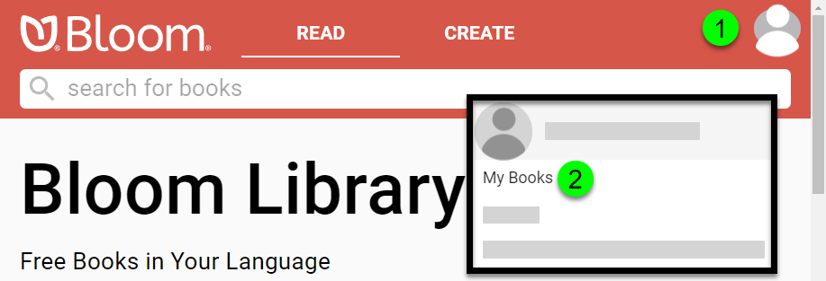

When you are logged into your Bloom Library account, there is a convenient way to view all of the books you have uploaded to the library. 

First, you must **Sign In** to your Bloom Library account:

1. **Click on the blank avatar symbol in the top right corner.**
1. **Click on** **`Sign In / Sign Up`**.

Bloom Library will present two options: you can **`Sign In with Google`** , or you can **`Sign In with email`**: 

After signing in, your avatar will be displayed in the top right corner.

1. Click on your avatar.
1. Click on **`My Books`**.

Following this, all of your books will be presented. 

