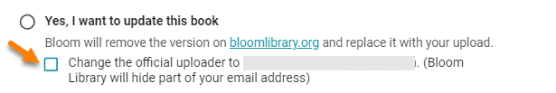

# Overwrite Permissions {#4ad240ac3bac4a6d92a2dfcd839b4e6a}

When you upload a book to Bloom Library, Bloom will check and determine if that book already exists on Bloom Library. If the book already exists, Bloom will then decide whether you have permission to _overwrite_ the book or not.

Permission to overwrite a book on Bloom Library is granted in either of the following situations:

1. In the Publish to Web panel in Bloom Editor, you are signed into the same Bloom Library account as the original uploader used when they uploaded the book.
2. You have been granted special permission to overwrite books for a particular bookshelf on Bloom Library. This is usually associated with a Bloom Enterprise subscription.
3. You have Bloom Library moderator status.

If you do _not_ have permission to upload the book, the UPLOAD button will be disabled. 

# Changing the Official Uploader {#0c536d0e37f34932a11a0d35bf8ab96a}

Bloom Enterprise clients may wish to change the official uploader’s identity. To do this, tick the box indicated below:

