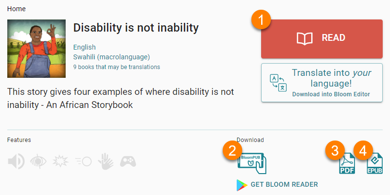
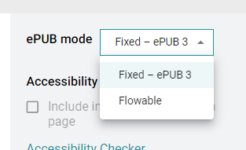

When you publish a book to Bloom Library, Bloom Library will provide a way to READ your book online, and will automatically create up to three different versions of the book for downloading:

1. [READ Online](/bloom-library-publishing-formats#2158b73f72f24f25a47d1fffed01044b)
2. [BloomPUB Download](/bloom-library-publishing-formats#99b53971024e4066bbc27e79d801db01)
3. [PDF Download](/bloom-library-publishing-formats#8e80c47d3a89489096c9052884421939)
4. [ePUB Download](/bloom-library-publishing-formats#b7fd6b8d8b0c4e20b62d0c2f26d219bb)

## READ Online {#2158b73f72f24f25a47d1fffed01044b}

Using the READ button, your book can be enjoyed from any computer (Windows, iOS, Linux) or device (Android or iOS). The page design and layout will be a near-perfect match of the book you created in the Bloom Editor. The only exception is that the credits page and title page will be listed at the end of the book.

## BloomPUB Download {#99b53971024e4066bbc27e79d801db01}

BloomPUBs can be read using **Bloom Reader** (an Android app) or the **BloomPUB Viewer** (a Windows app). 

**BloomPUB** Viewer is similar to online READing and will match your book’s design in Bloom editor.

In contrast, since **Bloom Reader** is an Android app designed for phones, and most phones have a 16x9 aspect ratio, Bloom Reader will resize BloomPUBs to conform to a “Device 16x9” size.

## PDF Download {#8e80c47d3a89489096c9052884421939}

The PDF will match your book’s design in the Bloom Editor, including the ordering of the credits page and title page.

## ePUB Download {#b7fd6b8d8b0c4e20b62d0c2f26d219bb}

ePUBs can be published in Fixed or Flowable modes:

In all current versions of Bloom, the default mode is Fixed, unless the user explicitly chooses Flowable in Bloom Editor before publishing to Bloom Library.

For further technical information on these two ePUB modes, please refer to [this article](/ePUB-notes). 

