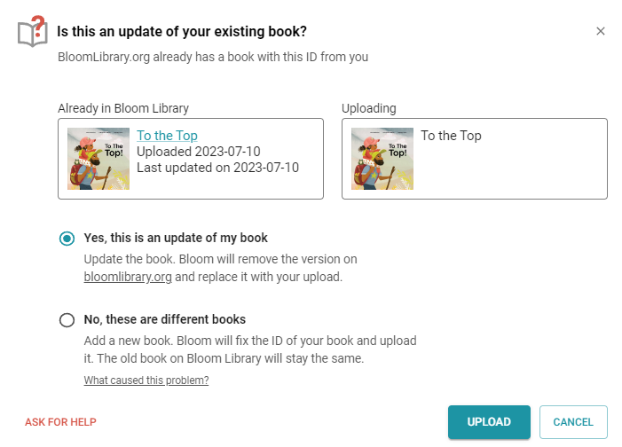

When you re-upload a book to Bloom Library, Bloom will first ask you to confirm that this is an update to an existing book, and not a brand new book:

:::tip

Hint: 99% of the time, you will answer “yes” to the above question, especially if the thumbnail images and titles are the same.

:::

After re-uploading a book, it is essential to note that your browser may keep displaying the _old_ version of your book rather than the new one. This is because all browsers “cache” (save copies of) recently viewed web pages.

To ensure you are viewing the updated version of your Bloom book, you need to tell your browser to “clear its cache” and force it to reload the book into your browser. The way to do this differs depending on the browser you use. 

For more details on how to do this, please refer to [this article](https://fabricdigital.co.nz/blog/how-to-hard-refresh-your-browser-and-clear-cache).

