:::note

This page is a draft version.

:::

## Download Books to Use in Bloom Editor {#0baca6f21eec4f2db437f30ddcb273b8}

There are thousands of books available for you to use from the Bloom Library. You can download these books directly from the [Bloom Library website](https://bloomlibrary.org/).

:::note

If you have Bloom Editor installed on your computer, books that you download will **automatically open** in Bloom Editor.

:::

Here are the steps to download a book from Bloom Library:

1. In the Bloom Editor, click on `GET MORE SOURCE BOOKS AT BLOOMLIBRARY.ORG`:

	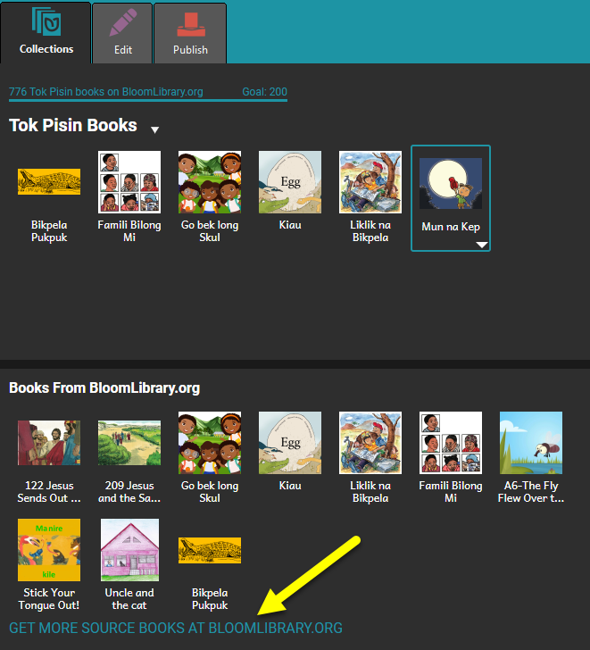

	1. You can also go to [BloomLibrary.org](https://bloomlibrary.org/) in a web browser.
2. Click on the group of books that you want to see. You can view by:

	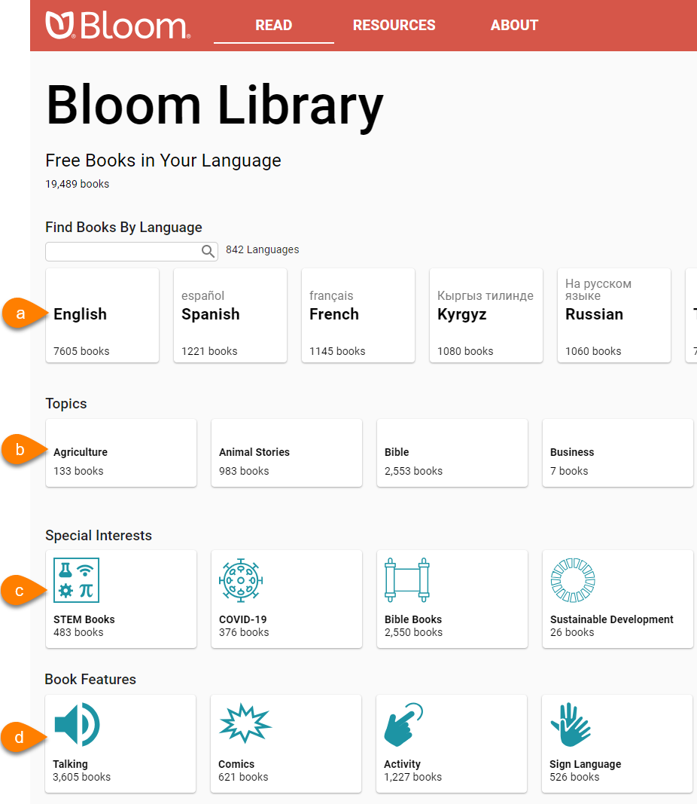

	1. Language
	2. Topic
	3. Special Interests
	4. Book Features
3. To see more languages or topics, use the **left/right** arrows to scroll through the groups:

	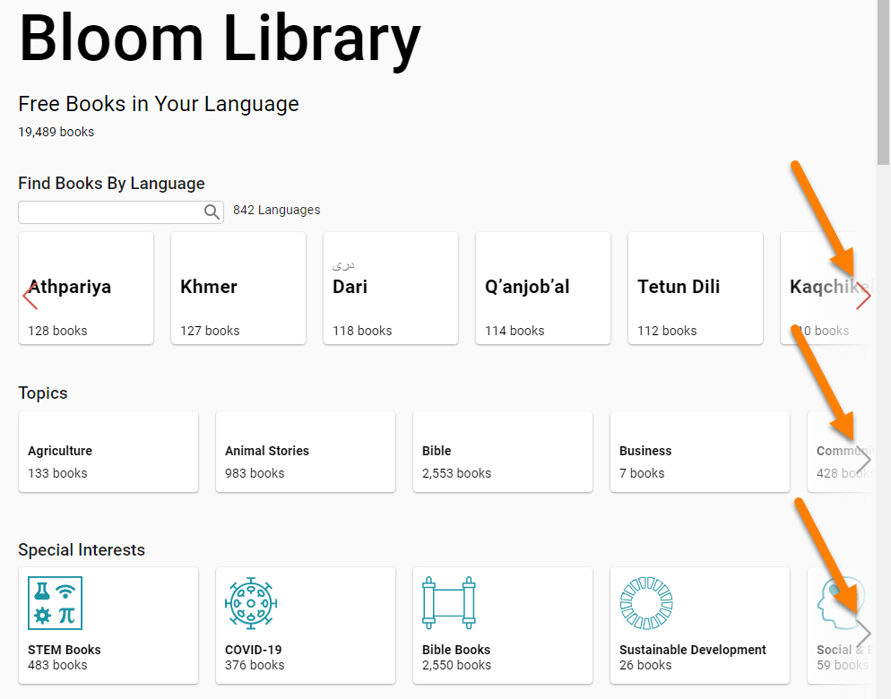

4. To search for a specific language:

	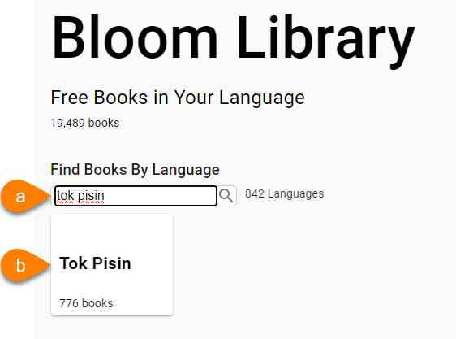

	1. Type the name of the language in the `Find Books By Language` search box.
	2. Click the **name** of the language.
5. If you see a list of languages, click on the **language** that you want to see books for:

	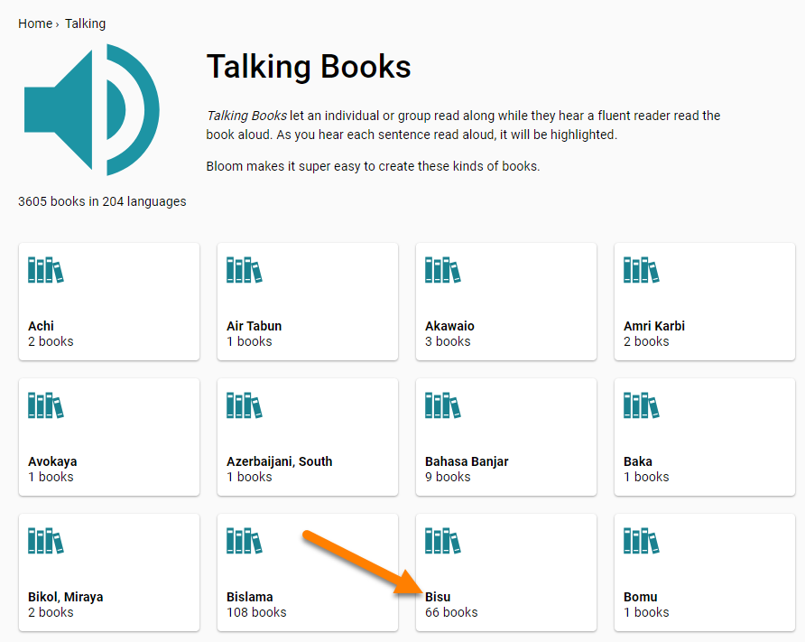

6. Once you see see **individual books**, click on the book that you want to **view/download**:

	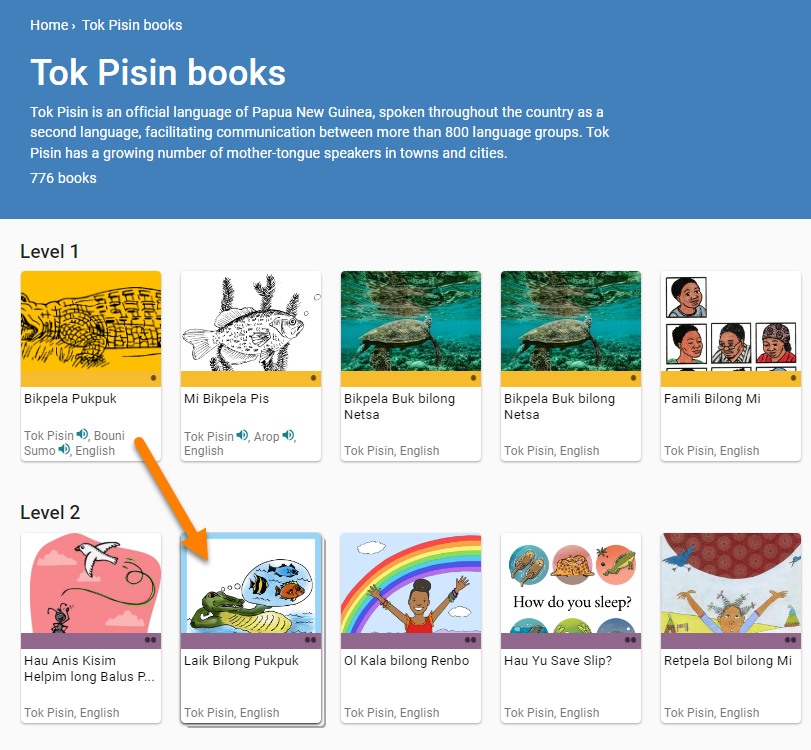

7. To use this book in Bloom Editor, click `Translate into your language!`

	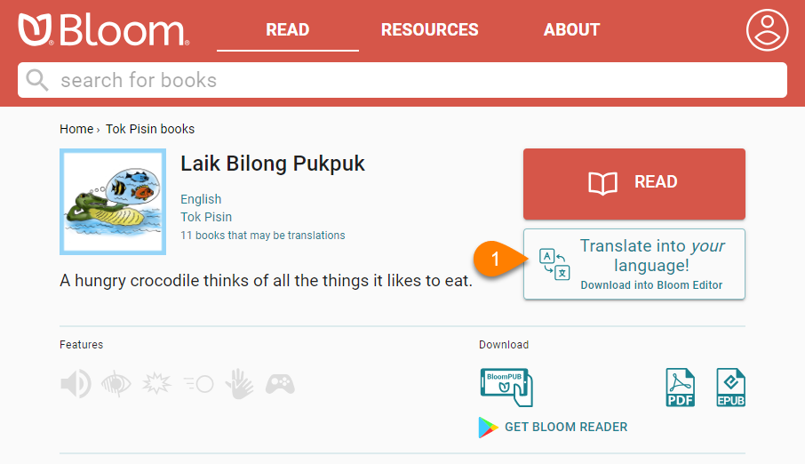

8. Note: You can also download this book in other formats:

	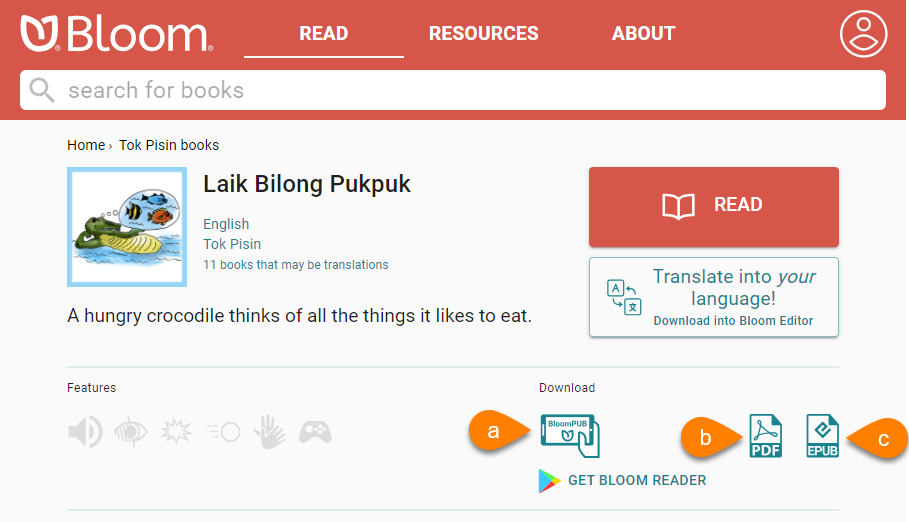

	1. **BloomPub**: For reading in the [Bloom Reader app](/download-books-bloom-library#12eedfff286a469eaf12ad1dbb672962) or BloomPub Viewer.
	2. **PDF**: For reading on a computer, sharing via email, etc, or printing.
	3. **EPUB**: For reading using an e-Reader.

You may see multiple windows while the book downloads:

1. If you see this window:

	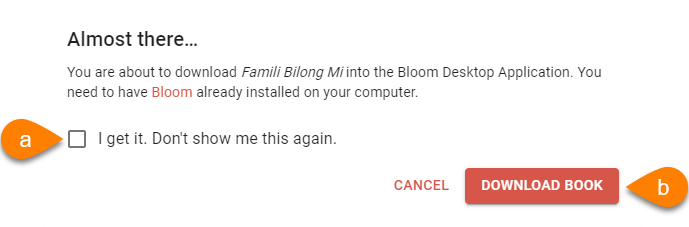

	1. **Optional**: Click `I get it. Don’t show me this again`.
	2. Click `Download Book`.
2. If you see this window:

	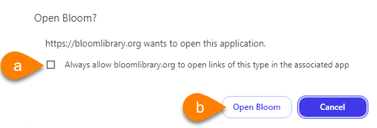

	1. Check the box for `Always allow bloomlibrary.org…`
	2. Click `Open Bloom`.
3. If you see this window:

	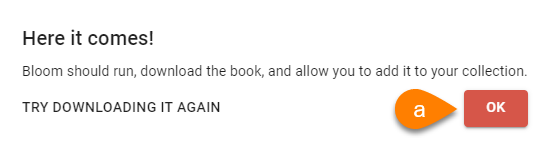

	1. Click `OK`.
4. If you see this window, the book is downloading into Bloom Editor:

	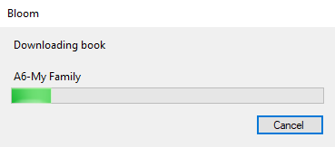

	1. **Wait** for the download to **finish**.
5. When you see this window, it means that the books has successfully downloaded into Bloom Editor.

	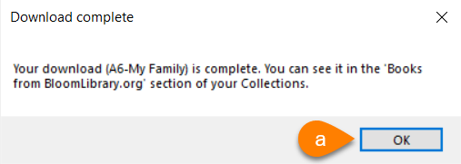

	1. Click `OK`.
6. Bloom Editor should open, and the book should be available in the Books From [BloomLibrary.org](http://bloomlibrary.org/) section:

	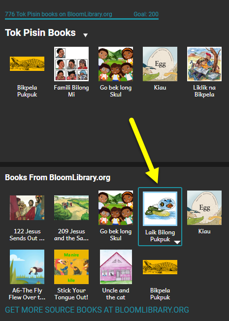

7. To **create** this book in your own language:

	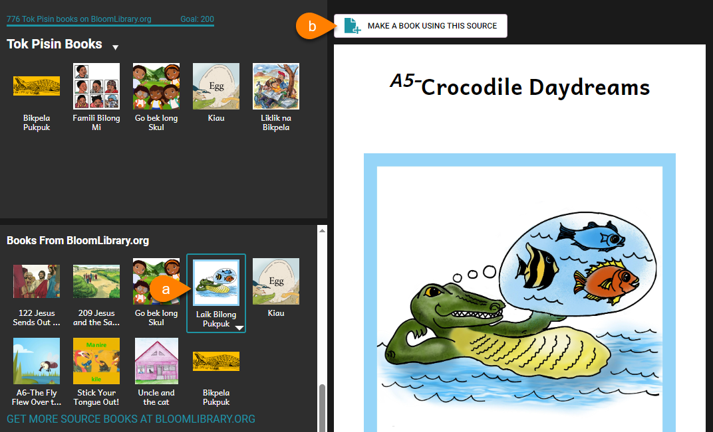

	1. Click on the book thumbnail.
	2. Click `MAKE A BOOK USING THIS SOURCE`.

## Download BloomPUB to Read in Bloom Reader {#12eedfff286a469eaf12ad1dbb672962}

There are several ways to download a BloomPUB book from Bloom Library so you can read it in [Bloom Reader](/about-bloom-reader-and-bloompubs).

- [Get books from Bloom Library from within Bloom Reader](/get-books-bloom-reader#3e3abed99e5042d8a0570f79c42a31e4)
- [Get books from Bloom Library in a Web Browser](/get-books-bloom-reader#0c2e2d830dcd4b769af3d29c24ac0e3c)
- Download a [BloomPUB file to a computer](/download-books-bloom-library#888bb607ed0b4794b6b50137ee88017e), then [transfer the BloomPUB file to an Android device](/get-books-bloom-reader#e35d8c2330514305aa5622eebaeb57b4).
