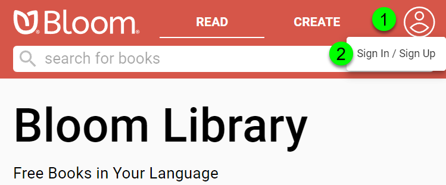
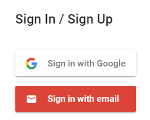

# Access your books {#352f7432fae64d5f9cb4ba4cad5c4ed6}

When you are logged into your Bloom Library account, there is a convenient way to view all of the books you have uploaded to the library. 

First, you must **Sign In** to your Bloom Library account:

1. **Click on the blank avatar symbol in the top right corner.**
2. **Click on** **`Sign In / Sign Up`**.

Bloom Library will present two options: you can **`Sign In with Google`** , or you can **`Sign In with email`**: 

After signing in, your avatar will be displayed in the top right corner.

1. Click on your avatar.
2. Click on **`My Books`**.

Following this, all of your books will be presented. Click on any book to view the book detail page.

# The Book detail page {#3604a01f4bc3428389540fcd293dbf52}

 If you click on a book you uploaded, you will see something like this:

|   |                                                                                                                                                                                                                                                                                      |
| - | ------------------------------------------------------------------------------------------------------------------------------------------------------------------------------------------------------------------------------------------------------------------------------------ |
| ❶ | Book title, language(s), and the book summary.                                                                                                                                                                                                                                       |
| ❷ | Button to **READ** the book online in BloomPUB format.                                                                                                                                                                                                                               |
| ❸ | Button to download the book into Bloom Editor for the purposes of translation.                                                                                                                                                                                                       |
| ❹ | Icons showing the features of this book: audio, image descriptions, overlays, motion, sign language, activities.                                                                                                                                                                     |
| ❺ | Icons showing which book formats can be downloaded: BloomPUB, PDF, or ePUB.                                                                                                                                                                                                          |
| ❻ | Information about the copyright, licensing, and statistics of the book.                                                                                                                                                                                                              |
| ❼ | Tags and keywords associated with this book. The main tag is set when you choose the Topic of the book’s front cover in Bloom editor. Other tags and keywords are set by the Bloom librarian or through the bookshelf selection (available to holders of Enterprise subscriptions).  |
| ❽ | Buttons to Share, Report, or Delete this book, or to mark the book as a draft.                                                                                                                                                                                                       |
| ❾ | A dropdown list to allow you to hide or show certain buttons for the book. For example, you might hide the button allowing people to download your book for translation.                                                                                                             |

