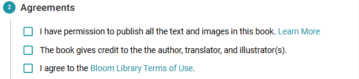

import ReactPlayer from "react-player";

Before uploading a book to Bloom Library, it is essential that you have full permission to do so and tick the boxes indicating your agreement. 

Bloom users often have questions about what this means. 

Here is an article that explains much of what you need to know:

[https://www.theedublogger.com/copyright-fair-use-and-creative-commons/](https://www.theedublogger.com/copyright-fair-use-and-creative-commons/)

In addition, this short video may be helpful:

<ReactPlayer controls url="https://youtu.be/nHg9uiw3DQg" />

