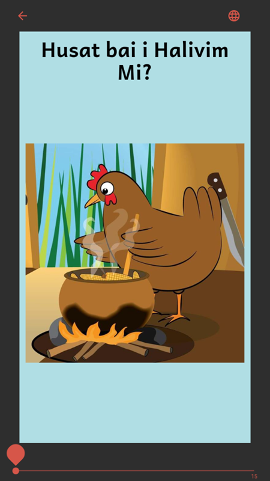
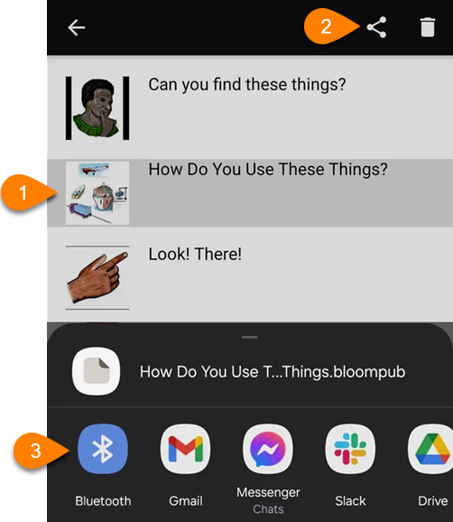

# About Bloom Reader and BloomPUBs {#ede9d2b7d58b46c0976e635dfd7baa24}

Bloom Reader is an app that allows you to enjoy Bloom books on your Android device (phone or tablet).

## Download Bloom Reader {#8797b884cec8400f93b01fdd735c62d3}

The Bloom Reader app is available from the [Google Play store](https://play.google.com/store/apps/details?id=org.sil.bloom.reader).

For instructions to download, install, and share the Bloom Reader app, see [Install Bloom Reader](/install-bloom-reader).

## Download Bloom Books from Bloom Library {#b5ce9d6c2d6a4a988fc07a0734b48450}

If your Android device is connected to the internet, Bloom Reader also provides direct access to [Bloom Library](https://bloomlibrary.org/) where books can be downloaded into the app to enjoy offline later.

## Send Books to Bloom Reader {#cc1a6dc032b84ca8b04d3f66fe92a507}

Books from Bloom Editor can be transferred to the Bloom Reader app through:

1. A shared Wi-Fi connection
OR
2. A connected USB cable:

## Share Books from Bloom Reader {#d126c4bbd5ee491c8f7c75d5619eec7b}

Bloom books (and the Bloom Reader app) can also be shared from one device to another via Bluetooth, messaging app, email, or other sharing methods:

## Import Bloom Books {#27fddf3ab6d44497ab826370c0ff6f8c}

Bloom Reader can import books from your Android device’s storage, or an external SD card. Loading an entire collection of books on SD cards can be a convenient way to distribute Bloom books to populations with unreliable internet access.

## BloomPUB Books {#703db164da8a4d57ba0661fadbd88f95}

Bloom Reader requires books in BloomPUB format (Bloom’s “native” format). Bloom Editor can easily produce BloomPUB files to use with Bloom Reader.

To learn about the difference between BloomPUB and ePUB formats, see [BloomPUB vs. ePUB: What’s the Difference](/compare-bloomPUB-ePUB).

