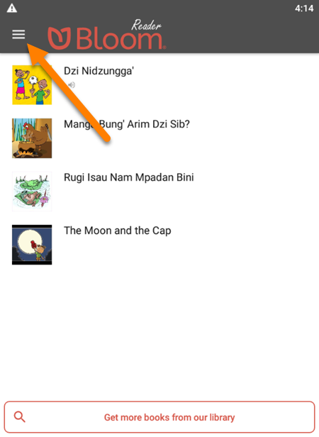
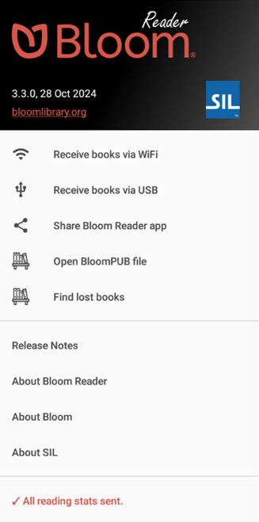
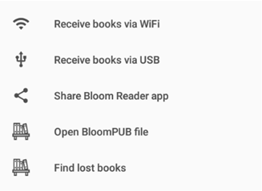
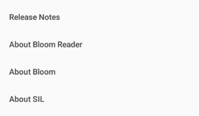
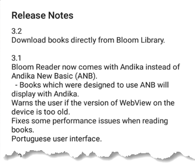
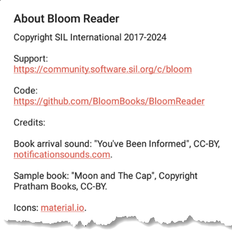

Most Android apps have a menu that gives you access to various functions within the app.

1. To open the menu in Bloom Reader, tap on the three-line **menu icon** at the top-left corner of the app:

	

2. The menu will slide open from the left showing several menu options:

	

There are three main sections in the Bloom Reader menu:

- [Bloom Reader Info](/bloom-reader-menu#22fda01340074515a368a6b8d4f646a8)
- [Bloom Reader Actions](/bloom-reader-menu#be8da1f335114674a7f5a07cf4a0c654)
- [About Bloom Reader](/bloom-reader-menu#bd286e201c194e3dbccf39788dc2e6d6)

## Bloom Reader Info {#22fda01340074515a368a6b8d4f646a8}

1. For example: this is version 3.3.0 of Bloom Reader, and was released on 28 Oct 2024.
2. There is also a link to the [Bloom Library](https://bloomlibrary.org/), where you can browse thousands of free Bloom books.

## Bloom Reader A**ctions** {#be8da1f335114674a7f5a07cf4a0c654}

- `Receive books via WiFi`: Receive books (from a computer with Bloom Editor) through a WiFi connection.
	- See [Receive books via Wi-Fi](/get-books-bloom-reader#9fce48475dce400ba9ff71c9870976d7) for more details.
- `Receive books via USB`: Receive books (from a computer with Bloom Editor) by plugging this device into the computer with a USB cable.
	- See [Receive books via USB](/get-books-bloom-reader#06a74e83b8f54577b359ee12885f45eb) for more details.
- `Share Bloom Reader app`: This allows you to share the Bloom Reader app with a friend or coworker so that they can install it on their Android device.
	- See [Share Bloom Reader Install File With Your Community](/install-bloom-reader#8ab53c9a433f4abab815facafd4f20d4) for more details.
- `Open BloomPUB file`: Open a BloomPUB file that is stored on this device, or an external SD card.
	- See [Get books from a folder on your Android device](/get-books-bloom-reader#0c2e2d830dcd4b769af3d29c24ac0e3c) for more details.
- `Find lost books`: Have Bloom Reader scan the `Bloom` folder on this device to find BloomPUB books that are not visible in the Bloom Reader app.
	- See [Find Lost Books in Bloom Reader](/find-lost-books-bloom-reader) for more details.

## **About** Section {#bd286e201c194e3dbccf39788dc2e6d6}

- `Release Notes`: Learn about improvements for each version of Bloom Reader:

	

- `About Bloom Reader`: Learn about the Bloom Reader app, including a link for user support, GitHub (for developers), and the components used in Bloom Reader:

	

- `About Bloom`: Learn about the [Bloom Editor](/bloom-platform#070f565a9a73475790b49a7ccd258ace), which allows you to create books and publish them to the Bloom Reader app as well as to print, web, audio, and video.
- `About SIL`: Learn about [SIL Global](https://www.sil.org/), the organization that develops Bloom software:

	

