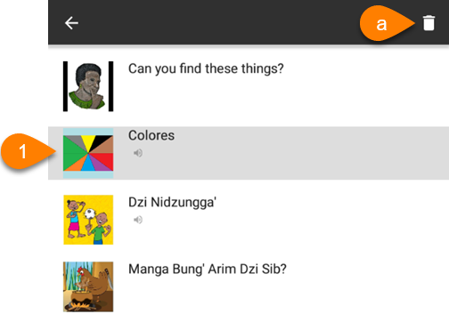
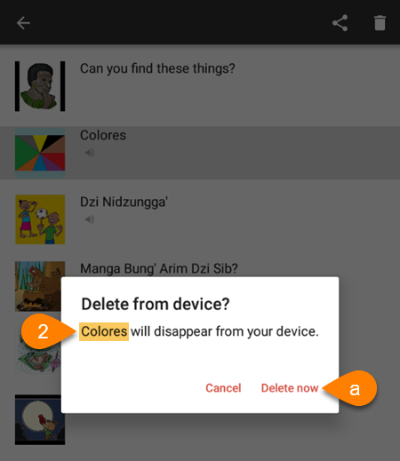

:::note

Follow these steps to **permanently delete** a book from Bloom Reader:

:::

1. On the Bloom Reader home screen, **long-press** the book that you want to delete.
	1. Tap the **trash can icon** in the upper-right corner:

	

2. Double-check the **name of the book** (to make sure you are deleting the **correct** book).
	1. Tap `Delete now`:

		

:::tip

If you accidentally delete a book, you will have to download it again. See [Get Books in Bloom Reader](/get-books-bloom-reader) for more info.

:::

