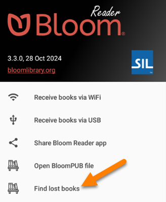
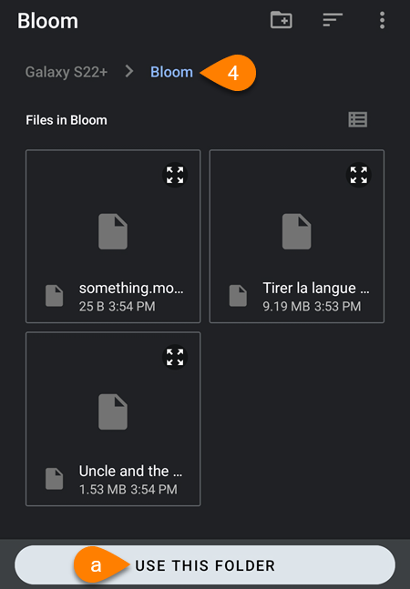
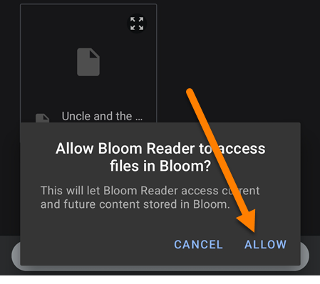
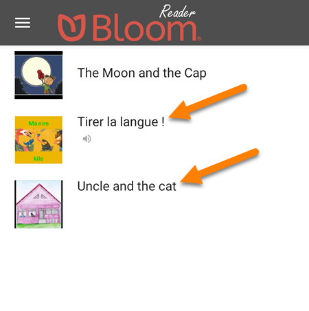

## Updated Method {#279c7626699e4f91b1d7d9ac619dda60}

:::caution

`Find lost books` was designed for **older Android phones** to be able to locate Bloom books that were once visible from within Bloom Reader, but are no longer visible in Bloom Reader.

`Find lost books` has been replaced by [Open BloomPUB file](/get-books-bloom-reader#0c2e2d830dcd4b769af3d29c24ac0e3c).

:::

If `Find lost books` does not locate the books you were expecting, please try using [Open BloomPUB file](/get-books-bloom-reader#0c2e2d830dcd4b769af3d29c24ac0e3c).

## **Steps to Find Lost Books** {#29d57467558a47879372815d2e58047c}

1. On your Android device, open the **Bloom Reader menu**:

	

2. Tap `Find lost books`:

	

3. If you see this notification, tap `USE THIS FOLDER`:
4. Bloom Reader will automatically open to the `Bloom` folder on the device.
	1. Tap `USE THIS FOLDER`:

	

5. If you see this notification, tap `ALLOW`:

	

6. Bloom will automatically scan the `Bloom` folder for any BloomPUB books. If it finds missing BloomPUB books, it will add them to the Bloom Reader home screen.

	

