There are multiple ways to get books onto the Bloom Reader app. You can get books from:

1. [Bloom Editor](/get-books-bloom-reader#1524bb19df1281b49db4e08540d499fe)
2. [Bloom Library from within Bloom Reader](/get-books-bloom-reader#3e3abed99e5042d8a0570f79c42a31e4)
3. [Bloom Library in a web browser](/get-books-bloom-reader#97e727473fd04b87bc53936b3855c523)
4. [A folder on your Android device](/get-books-bloom-reader#0c2e2d830dcd4b769af3d29c24ac0e3c)
5. [Other sharing methods (WhatsApp, Dropbox, Gmail, etc.)](/get-books-bloom-reader#e35d8c2330514305aa5622eebaeb57b4)

In addition, there are also ways to pre-load books into Bloom Reader. For details on doing this, see [this article](/BR-distribution). 

## Get books from Bloom Editor {#1524bb19df1281b49db4e08540d499fe}

Bloom Editor gives three options to [Publish to BloomPUB](/publish-to-bloompub):

1. [Save BloomPUB File (to disk)](/get-books-bloom-reader#0d88bef8d6ed41e0b1e100e0f59a637a)
2. [Share over Wi-Fi](/get-books-bloom-reader#9fce48475dce400ba9ff71c9870976d7)
3. [Send over USB Cable](/get-books-bloom-reader#06a74e83b8f54577b359ee12885f45eb)

Options 2 and 3 from Bloom Editor work in tandem with the corresponding options available in Bloom Reader’s menu:

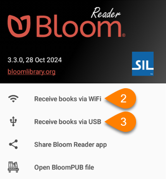

### Save BloomPUB (to disk) {#0d88bef8d6ed41e0b1e100e0f59a637a}

1. In Bloom Editor, follow the instructions to [Save BloomPUB File (to disk)](/publish-to-bloompub#6e7ebbbc73df46bfb94e791442c8aef3).
2. **Transfer** the saved BloomPUB file to an Android device with Bloom Reader installed.
	1. **Optional:** Use the [Other Sharing Method](/get-books-bloom-reader#e35d8c2330514305aa5622eebaeb57b4) to share the BloomPUB file.
3. Use the [Open BloomPUB file](/get-books-bloom-reader#0c2e2d830dcd4b769af3d29c24ac0e3c) option to read the BloomPUB in Bloom Reader.

### Receive books via Wi-Fi {#9fce48475dce400ba9ff71c9870976d7}

1. In **Bloom Editor**, follow the instructions to [Share over Wi-Fi](/publish-to-bloompub#cde8582f3e33455b91d106ab4a0cc716).
2. On your **Android device**, make sure that the device is connected to the **same Wi-Fi network** as the computer with Bloom Editor.
3. Open the **Bloom Reader menu**:

	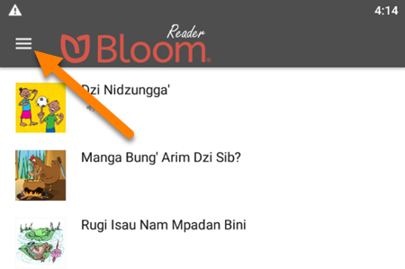

4. Tap `Receive books via WiFi`:

	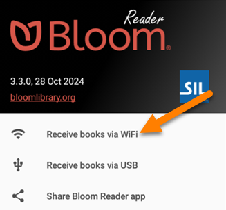

5. You will see a window that updates as the book is transferred:

	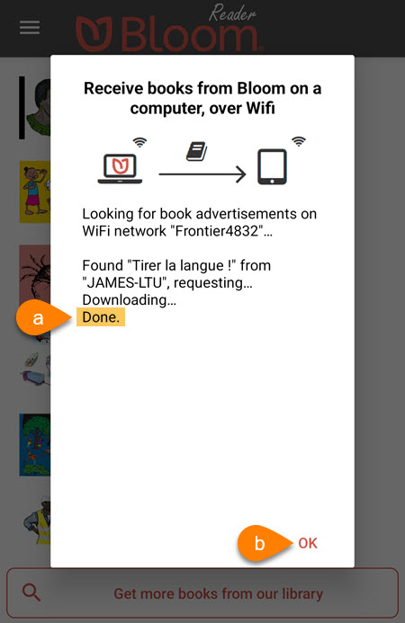

	1. When you see `Done`
	2. Click `OK`
6. You should now be able to read the book in the Bloom Reader app:

	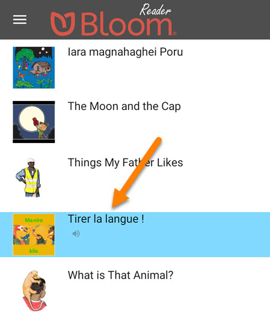

### Receive books via USB {#06a74e83b8f54577b359ee12885f45eb}

1. In **Bloom Editor**, follow the instructions to [Send over USB Cable](/publish-to-bloompub#ceafe81bd00f47e4be62323b7581e8a9).
2. On your **Android device**, make sure that:
	1. The device has the [Bloom Reader app installed](/install-bloom-reader).
	2. The device is connected to the computer with a USB cable.
	3. The device is allowing **MTP file transfer**.

	:::caution
	
	**Note:** Some Android phones do not allow file transfer with a USB cable.
	If you are unable to transfer via USB, check the drivers on your computer, the settings on your phone, or try to transfer the BloomPUB file another way.
	
	:::
	
	

3. If the device is connected properly, you will see a notification in **Bloom Editor** that says:
**“Connected to** _**XYZ-Device**_ **via USB”**:

	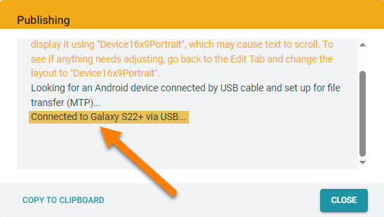

4. On your Android device, open the **Bloom Reader menu**:

	

5. Tap `Receive books via USB`:

	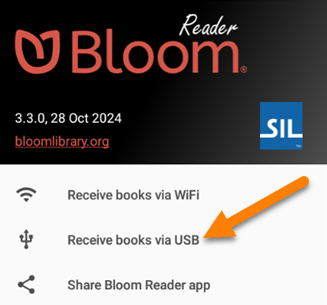

6. If you see this notification, tap `USE THIS FOLDER`:

	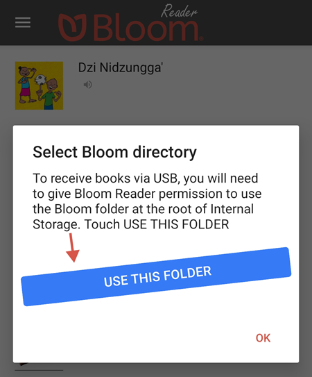

7. Bloom Reader will automatically open to the `Bloom` folder on the device.
	1. Tap `USE THIS FOLDER`:

		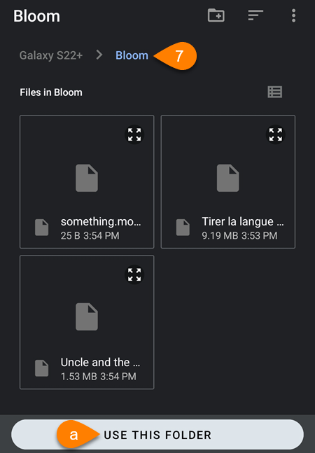

8. If you see this notification, tap `ALLOW`:

	

9. In **Bloom Editor**, you should also see a notification that says:
_**“You can now read “Book-Name” in the Bloom Reader!**_
	1. Click `Close`:

		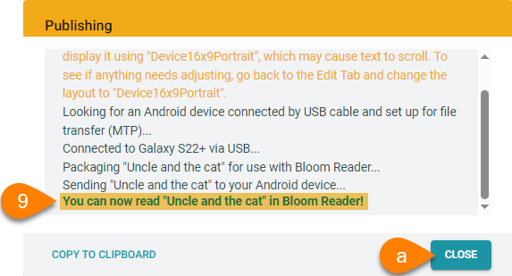

10. You should now be able to read the book in the **Bloom Reader** app:

	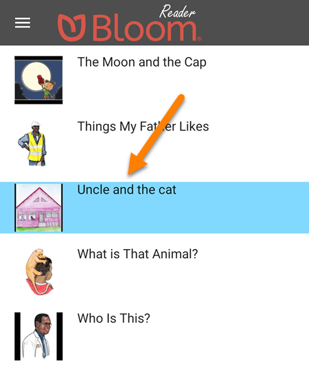

## Get books from Bloom Library from within Bloom Reader {#3e3abed99e5042d8a0570f79c42a31e4}

You can download use Bloom Reader to download books directly from the Bloom Library.

1. At the bottom of the **Bloom Reader home screen**, tap `Get more books from our library`:

	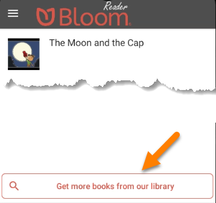

2. Type in the language you want to find books in:

	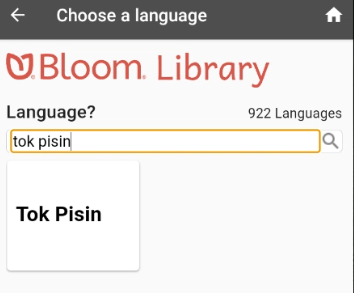

3. Books are shown in four different reading levels. To find a book, swipe the books in the level you are interested in:

	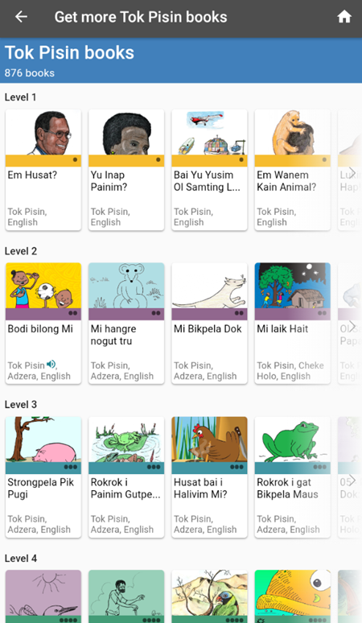

4. Once your find a book you are interested in, tap on the book’s thumbnail to see the book details:

	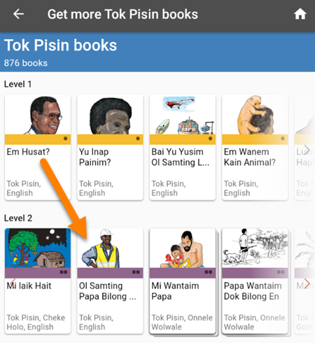

5. Tap the `DOWNLOAD` button to import the book into your Bloom Reader app:

	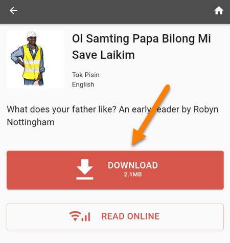

	1. If you want to preview the book online before downloading it, tap the `READ ONLINE` button:

	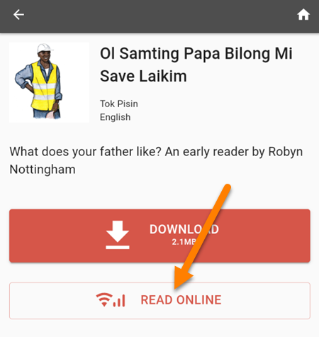

6. To return to the list of books in your selected language, tap the **back arrow** in the **top-left corner** of the screen:

	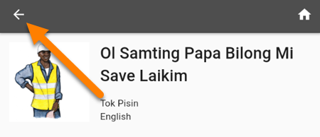

7. When you are finished downloading books, tap the **home button** in the **top-right corner** to return to the Bloom Reader homepage:

	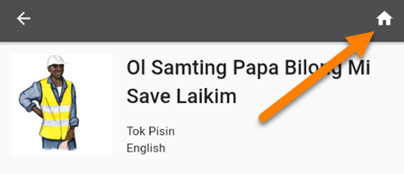

## Get books from Bloom Library in a Web Browser {#97e727473fd04b87bc53936b3855c523}

Getting books from Bloom Library within the Bloom Reader only provides one simple search filter: the language you are interested in. This works well when there are only a smaller number of books for the language of your interest.

If there are very many books for that particular language, then it is probably better to download books through a web browser on your device. By doing this, you can look for books by topic, by specialized bookshelves, and by searching for keywords.

**Steps to download books from a web browser:**

1. Open a **web browser** on your device.
2. Go to [bloomlibrary.org](https://bloomlibrary.org/)
3. Navigate to the book that you want to download.
4. Once you find the book you want:
	1. Tap the `READ OFFLINE` button to download the book into Bloom Reader:

		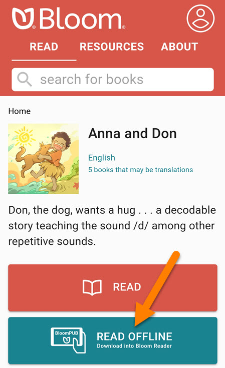

5. On some Android devices, you will be see an option to choose a destination folder to place the download.

	:::tip
	
	**Hint:** Download books to the **Downloads folder**.
	
	:::
	
	

6. When the download completes, **open the downloaded file**:

	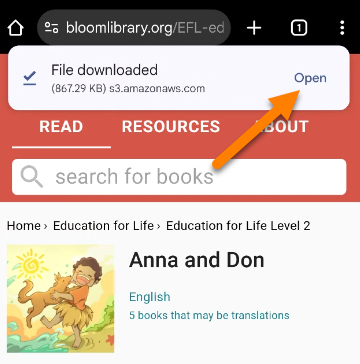

7. If you do not see a notification to open the downloaded file:
	1. Open the file from your **File Manager**:

		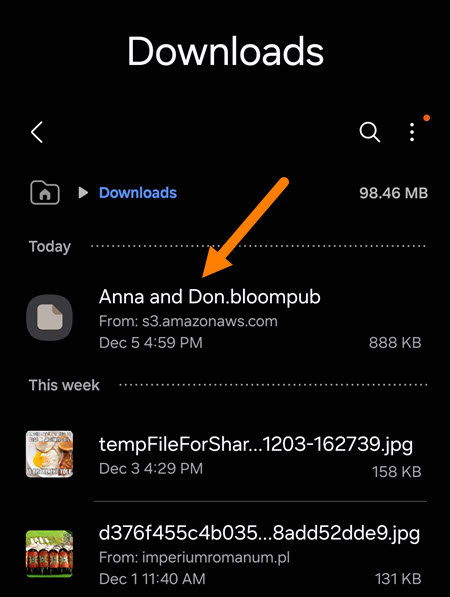

8. If your device asks which app to use to open the file, tap `Bloom Reader`.
	1. **Optional:** Tap `Always` to make Bloom Reader the **default** for BloomPUB books.

		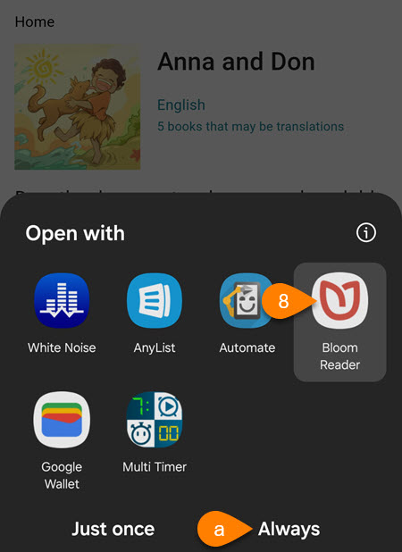

		

9. If the book still does not open, try the steps to [open a file on your Android device](/get-books-bloom-reader#0c2e2d830dcd4b769af3d29c24ac0e3c).

## Get books from a folder on your Android device {#0c2e2d830dcd4b769af3d29c24ac0e3c}

To import a book on your device’s internal storage or an external SD card:

1. On your Android device, open the **Bloom Reader menu**:

	

2. Tap `Open BloomPUB file`:

	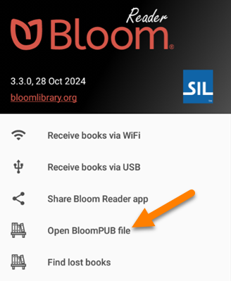

3. Navigate to the folder where the BloomPUB book is stored.
4. Tap on the **BloomPUB file**.

	

5. The book should automatically open in Bloom Reader.

## Get books from other sharing methods (WhatsApp, Dropbox, Gmail, etc.) {#e35d8c2330514305aa5622eebaeb57b4}

If you have a BloomPUB file on computer or Android device, you can share it with others in a variety of ways. These include:

- Messaging apps: WhatsApp, Skype, Facebook Messenger, etc.
- File Sharing apps: DropBox, Google Drive, One Drive, etc.
- Email: Gmail, Outlook, Yahoo mail, etc.
- File Transfer: Bluetooth, Wi-Fi transfer, USB cable transfer, etc.

**Steps to share a Bloom book with others:**

1. Generate/share a BloomPUB file. You can use either of these methods:
	1. [Publish to BloomPUB](/publish-to-bloompub) from Bloom Editor
	2. [Share a Book from Bloom Reader](/share-book-bloom-reader)
2. Send the BloomPUB book to an Android device using your preferred sharing method.
3. Save the file to the Android device.
4. Use the steps listed in  to open the file in Bloom Reader.
