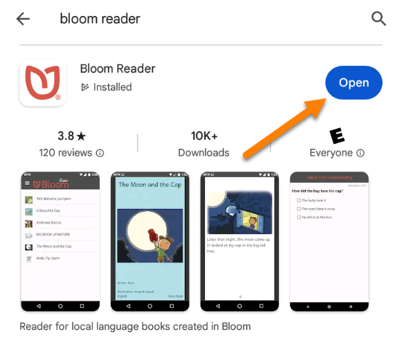
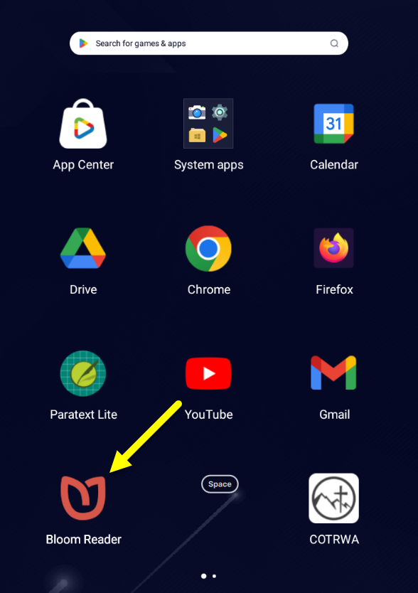
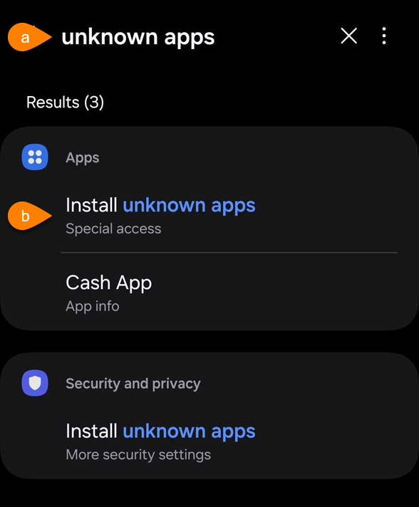
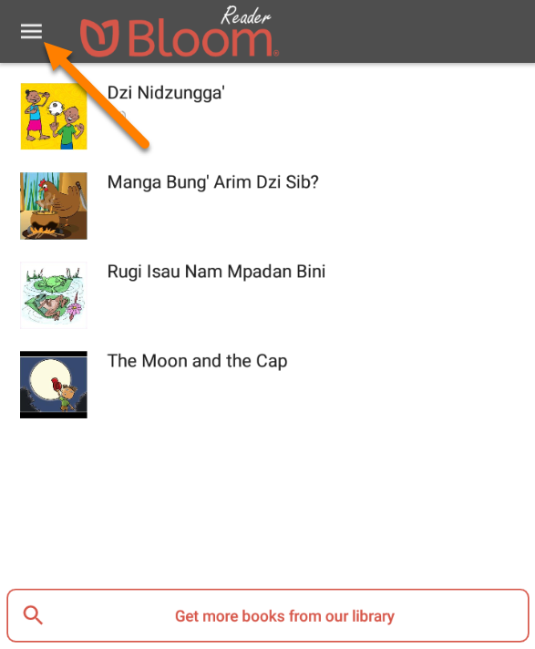
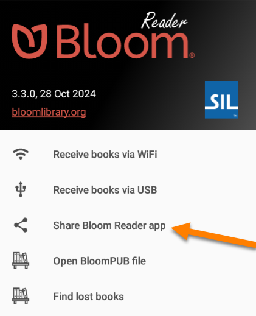
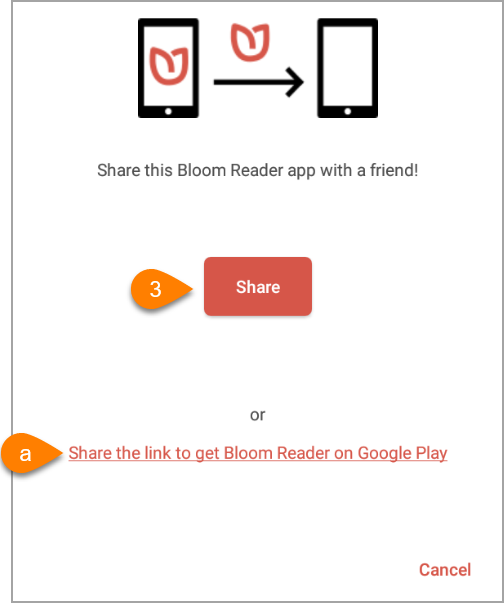
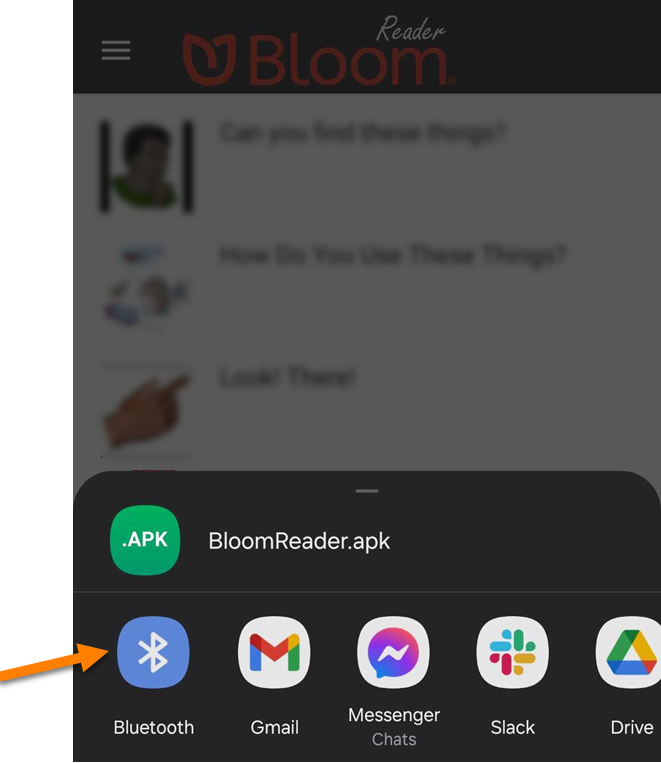

There are a number of ways that you can install Bloom Reader.

## From the Google Play Store {#e73a566ee6154407a784cb7fb3fccdc3}

If you have a good internet connection, the best way to get the app is through the [Google Play store](https://play.google.com/store/apps/details?id=org.sil.bloom.reader). This ensures you are getting the latest version of Bloom Reader.

**Follow these instructions to install the Bloom Reader app:**

1. Open the [Google Play store](https://play.google.com/store/apps).
2. Search for **Bloom Reader**.
3. Tap the `Install` button:

	

4. Tap the `Open` button:

	

5. OR tap the Bloom Reader icon on your homescreen:

	

## Install Directly From an APK File {#863c6d7f27794a909d13abe9b03fd7e6}

You can also install directly from an APK file:

1. Download the Bloom Reader [APK installation file](https://s3.amazonaws.com/bloomlibrary.org/bloomReader/apks/release/latest/BloomReader.apk) on your device.
2. Open/install the APK file on your device.
3. If the device will not install the APK file, you may need to [Enable Installation of Unknown Apps](/install-bloom-reader#c7989aba90474cd4a8b85c97708fc916).

### Enable Installation of Unknown Apps {#c7989aba90474cd4a8b85c97708fc916}

1. You may need to enable `Install unknown apps` before you can open an APK file.

	:::note
	
	This is found under **Settings > Apps > Menu > Special access > Install unknown apps**, or similar location in the **Android Settings**.
	
	:::
	
	

	1. If you cannot find this setting, search for **install unknown apps** in **Android Settings:**

		

	2. Tap `Install unknown apps` and enable the appropriate setting.

## Share Bloom Reader Install File With Your Community {#8ab53c9a433f4abab815facafd4f20d4}

If you already have Bloom Reader installed on your phone, you can share the **APK installation file** with them. It can be shared by Bluetooth, messaging app, email, or other sharing methods.

**To Share the App:**

1. **Open** Bloom Reader.
2. Click on the **menu button**:

	

3. Click `Share Bloom Reader app`:

	

4. Tap the `Share` button:

	

	1. OR tap `Share the link to get Bloom Reader on Google Play`
5. Choose your sharing method:

	

6. Follow the steps to share the APK file with your friend.
7. Once the file is transferred to your friend’s device, open the APK file on their device.
8. If the device will not install the APK file, you may need to [Enable Installation of Unknown Apps](/install-bloom-reader#c7989aba90474cd4a8b85c97708fc916).

## Install on Older Android Versions {#71c002fa0e494057a0bd122264d997f5}

:::note

If your device is Android 4.4 or earlier, you will need to download a separate APK file.

:::

**Steps to install on Android 4.4 or earlier:**

1. Download the [Bloom Reader 1.4.1](https://s3.amazonaws.com/bloomlibrary.org/bloomReader/apks/release/1.4/BloomReader1.4.apk) APK file.
2. Follow the steps to install an [APK file](/install-bloom-reader#c0b1abd006514883bc7707385a21b20b).
