## Read a Book in Bloom Reader {#f0535137300b431c8df943d3d6e3cfd6}

Reading a book in Bloom Reader is similar to using other reading apps.

1. Download the book(s) that you want to read in Bloom Reader.

	:::tip
	
	To download additional books, see [Get Books in Bloom Reader](/get-books-bloom-reader).
	
	:::
	
	

2. Tap the **thumbnail** or **title** of the book that you want to read:

	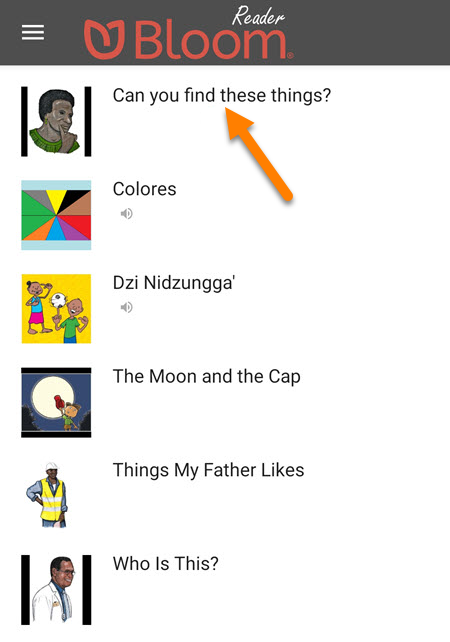

3. The book will **rotate** automatically (if necessary) and open in **full-screen** mode:

	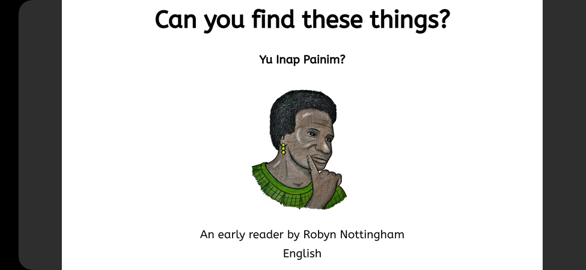

## Navigate Pages {#277e4bfd5bae4ebca752c885c0f9018e}

1. Swipe to the **right** to go to the **next** page:

	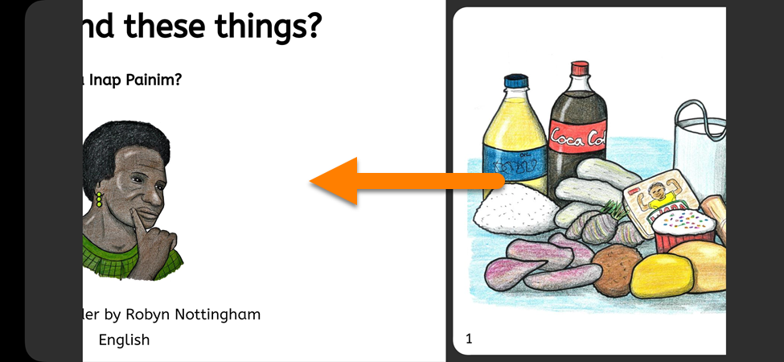

2. Swipe to the **left** to go to the **previous** page:

	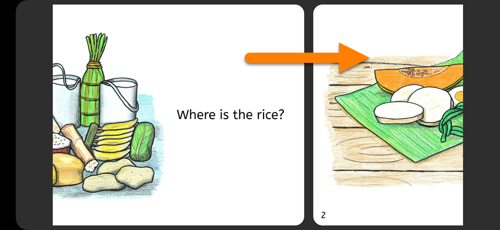

:::tip

Note: For **Right-to-Left** languages, the swipe direction is **reversed**.

:::

### Move Between Pages Quickly {#136955af92434bbea0ded50bf03a6655}

You can also change between multiple pages at once:

1. Tap on a **page** in the book:

	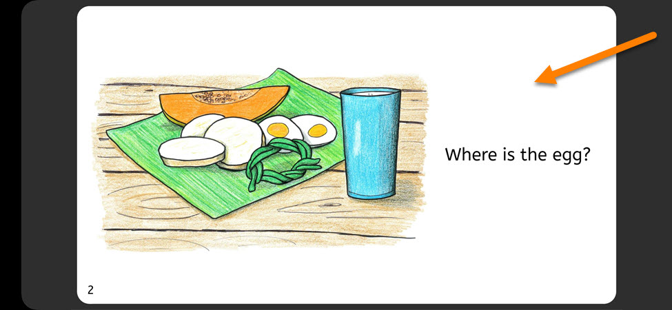

2. A **slider** will appear below the page:

	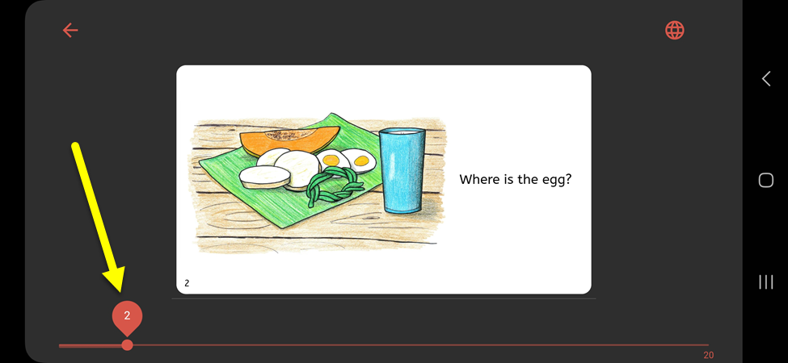

3. Move the slider to the **right/left** to navigate to a different page:

	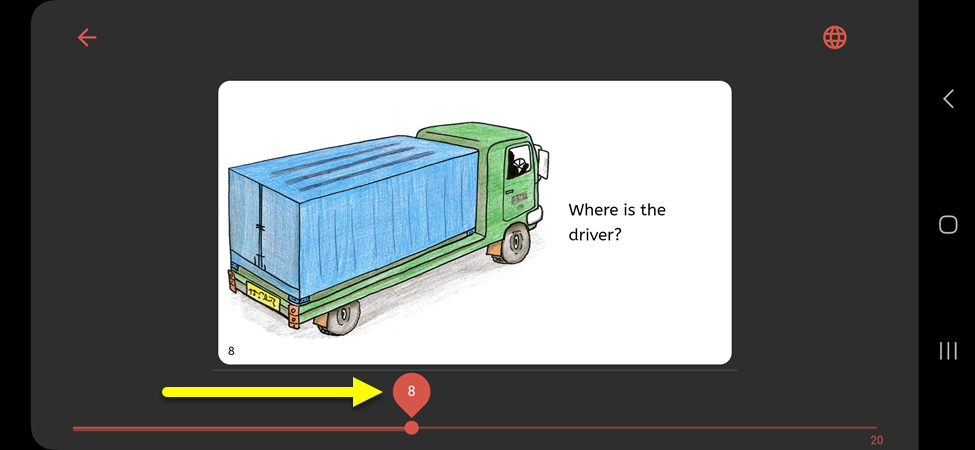

## Change Book Language {#7a826cbbfc2a4ac19a84c5327fcaad8a}

If a book was written in **multiple languages**, you can **change the language** in Bloom Reader.

1. Tap on a **page** in the book:

	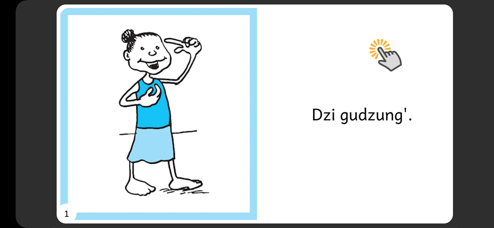

2. Tap the **globe icon** in the **upper-right** corner:

	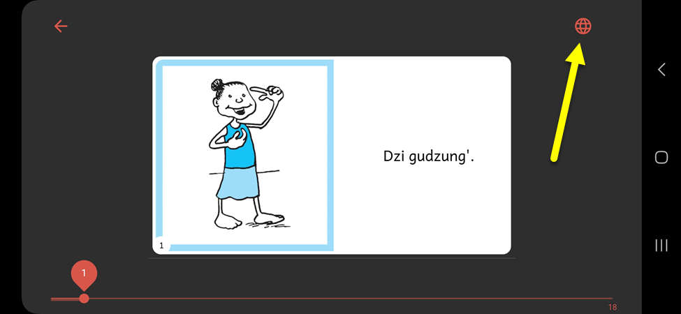

3. Tap on the **language** you want to use:

	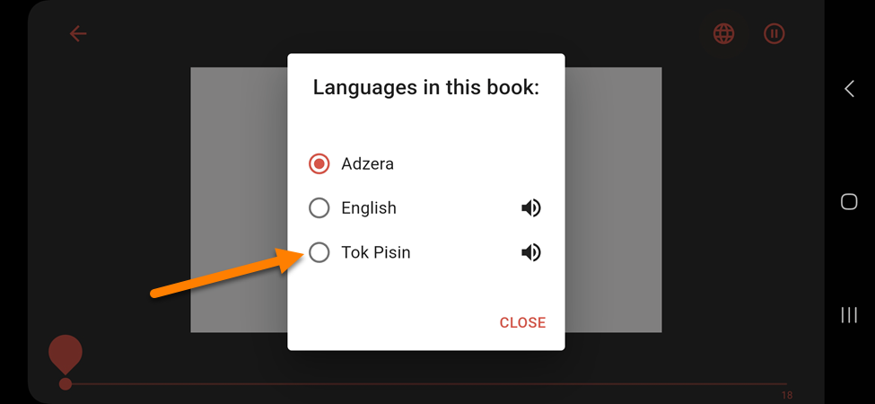

	1. **Note:** Languages with a **speaker icon** are [Talking Books](/talking-books) (they have an audio recording of the book):

		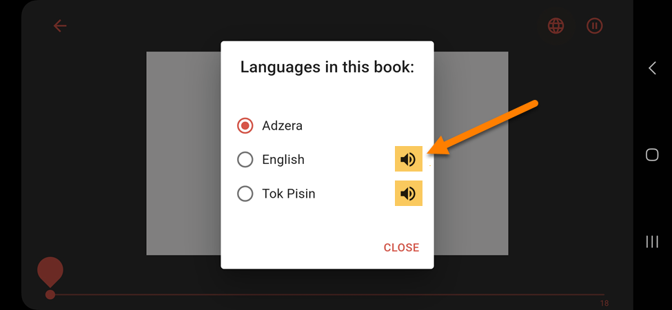

4. This book is now in the language you selected:

	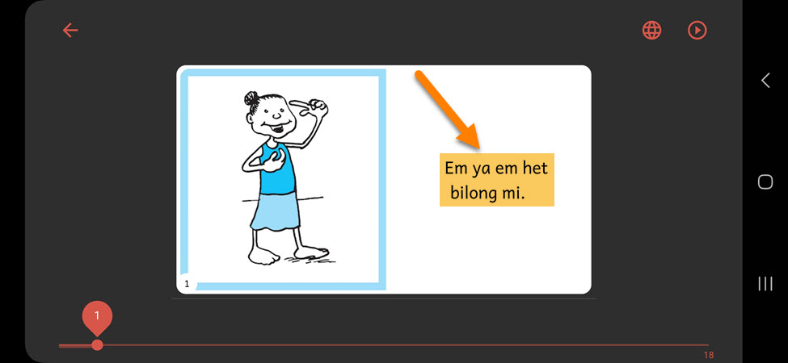

5. Tap on the **page** to return to fullscreen mode:

	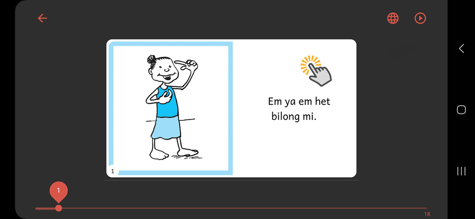

6. Continue reading the book in the language you selected:

	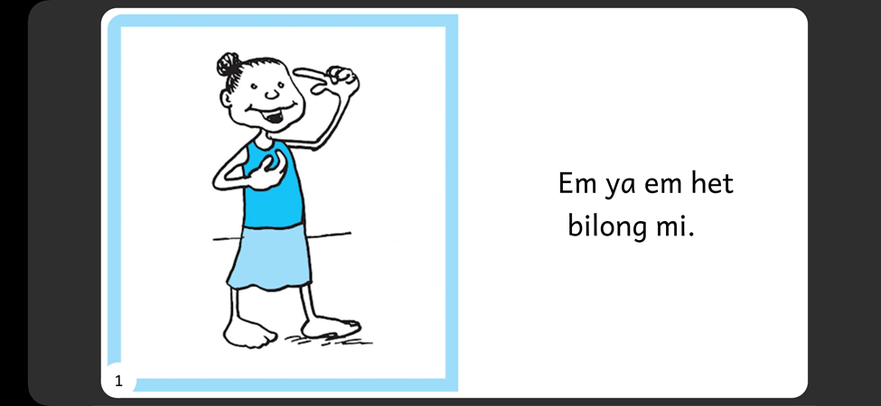

## Exit Book {#42677df631914ac592bfc3e5e5a798f2}

When you are done reading a book, you can exit back to the Bloom Reader home screen.

1. Tap on a page in the book:

	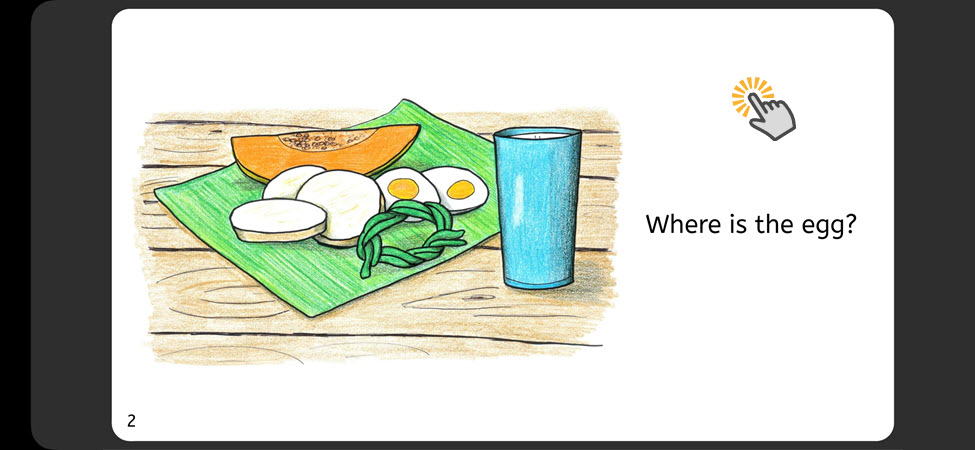

2. Tap the back button:

	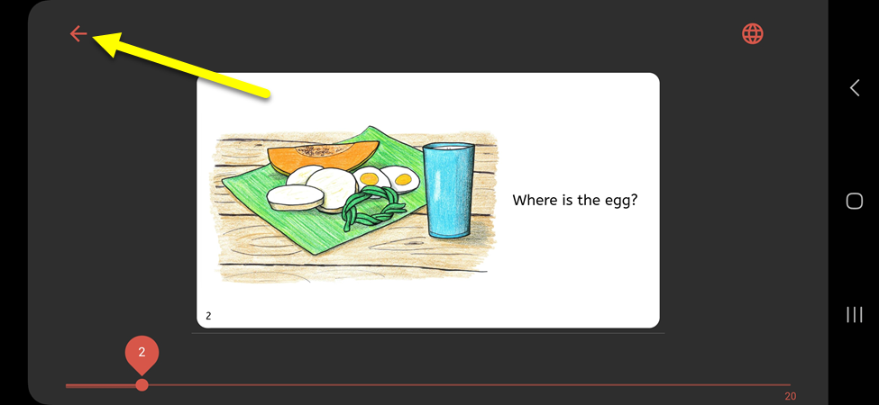

3. This will open the Bloom Reader home screen again:

	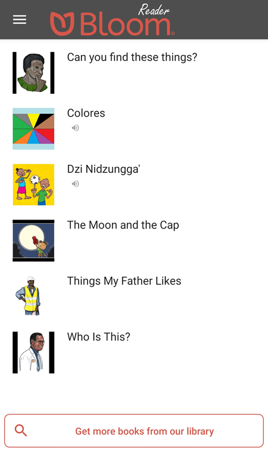

