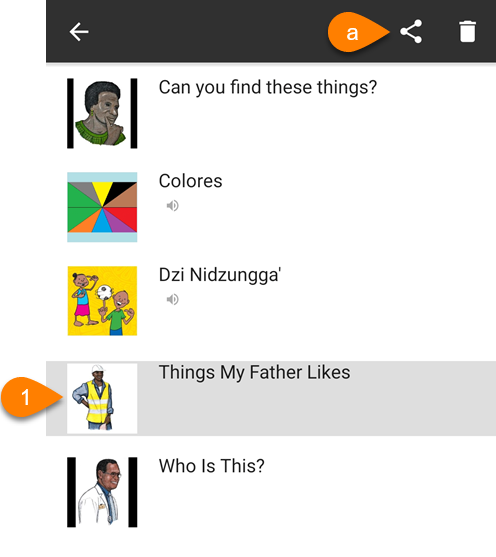
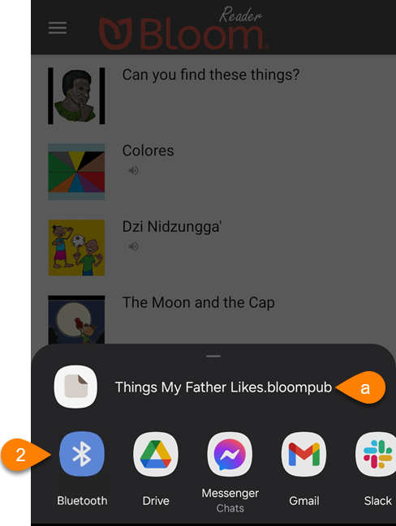

It is simple to share a book with friend or family member.

1. On the Bloom Reader home screen, **long-press** the book that you want to share:
	1. Tap the **Share** icon in the upper-right corner:

		

2. Choose the sharing method that you want to use to share this book:

	

	1. Take note of the filename of the `.bloompub` file you are sharing.
3. Once somebody receives the `.bloompub` file on their device, they can use the [Open BloomPUB File](/get-books-bloom-reader#0c2e2d830dcd4b769af3d29c24ac0e3c) option to open the book in Bloom Reader.

	:::tip
	
	If they are having trouble finding the file, they should double-check the [name of the file](/share-book-bloom-reader#df102754d3624911b7b1d16b88cc8f06) that you shared.
	
	:::
	
	

