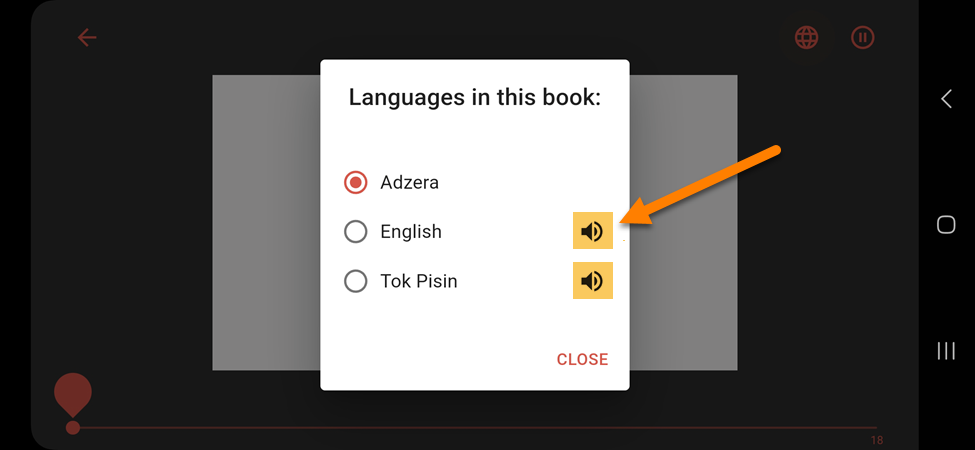

import video1 from "./Talking_Book_Demo_720p.mp4";
import ReactPlayer from "react-player";

In **Bloom Library** and **Bloom Reader**, audio is available for books with a **speaker icon** 🔊:

**Bloom Library:**

**Bloom Reader:**

## Audio Pages {#371687d358e94488b593f7fdfafce127}

Bloom books can have audio content.

Audio automatically plays when you change pages:

<ReactPlayer controls url={video1} />

### Pause/Stop Audio {#295cba92d6a54c7cb40d415159e419cc}

When audio is playing, you can **pause** or **stop** the audio:

1. Tap on a page:

	

2. Tap the **Pause** button to stop the audio:

	

3. Tap the page to return to the full-screen view:

	

:::tip

Audio will not play again until you press the [**Play button**](/use-talking-book-bloom-reader#bba54e2e2852497eb5fa0e266c96d54f).

:::

### Play Audio {#bba54e2e2852497eb5fa0e266c96d54f}

If audio is paused, you can start it again:

1. Tap on a page:

	

2. Tap the **Play** button:

	

3. The audio will start playing again:

	

4. Tap the page to return to the full-screen view:

	

:::tip

Audio will continue playing unless you [**pause**](/use-talking-book-bloom-reader#295cba92d6a54c7cb40d415159e419cc) it again.

:::

## Change Audio Language {#8257e59c442244c7925cfc102a0f7e13}

Many Bloom books are multilingual. Languages with a speaker icon next to them have an audio version.

To change the audio language of the book, follow the instructions for [Change Book Language](/read-book-bloom-reader#7a826cbbfc2a4ac19a84c5327fcaad8a).

:::note

**Please note:** Some languages in a book may now have audio available. If you would like to add audio to a book, see [Talking Books](/talking-books).

:::

