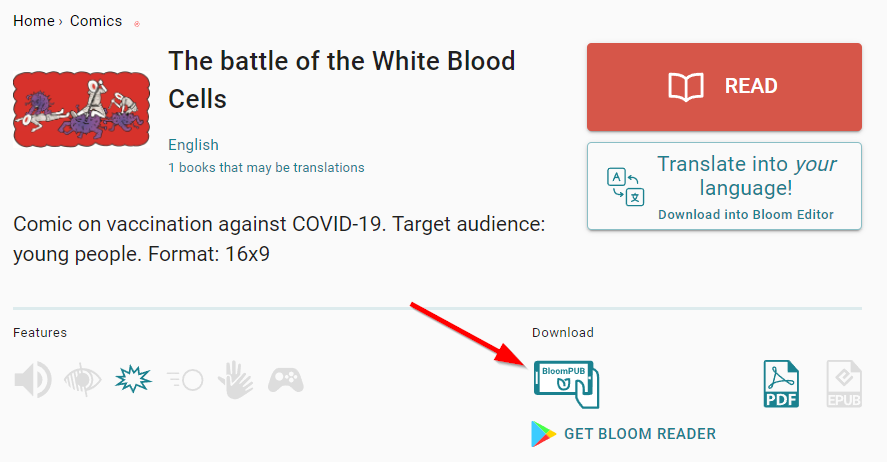
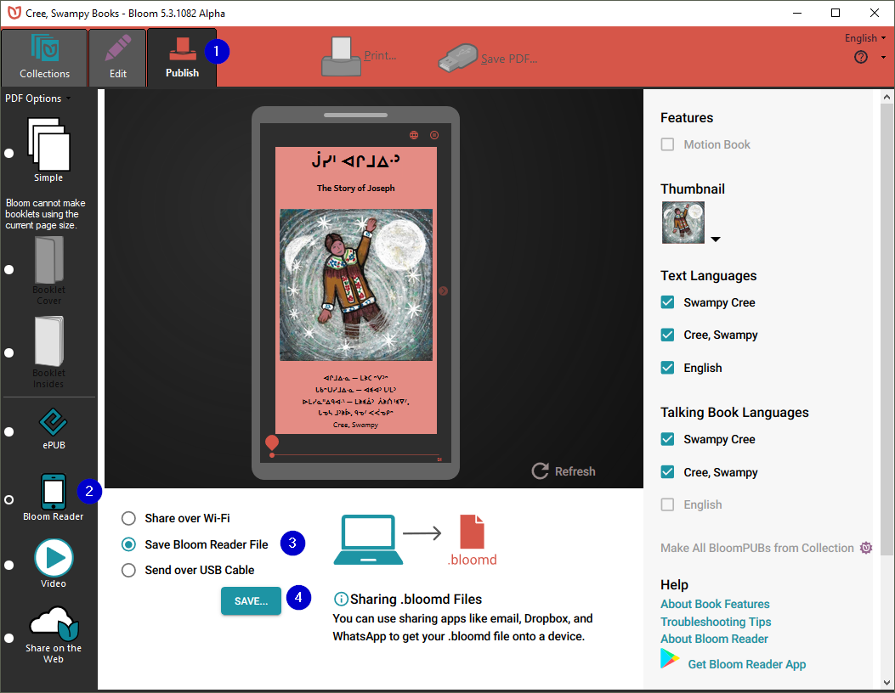

# Introduction {#49a5d5db510145f698d1c11b6717613c}

Distributing SD cards that are _pre-loaded_ with BloomPUBs is a fast and convenient way for an organization to grant users access to an _entire library_ of Bloom books. This is a particularly useful distribution method when the intended consumers of these books have limited or no access to the Internet in their home environment. An additional benefit of distributing BloomPUBs pre-loaded on SD cards is that the books are safeguarded from accidental deletion from within the Bloom Reader app. (They can, of course, be deleted through other means.)

An alternative is to sell phones pre-loaded with the Bloom Reader app already installed and a library of books.

In this article, we will provide step-by-step instructions for both methods. 

1. [Distributing Bloom books on SD Cards](/BR-distribution#58616141ac10471481495e18570fb619)
1. [Distributing Books via Pre-loaded Phones](/BR-distribution#aff5473a55cc4f2e8922622ce4e44d00)
1. [Advanced Options](/BR-distribution#ab53b94bfff44b448917d311bde496a0)

# 1. Distributing Bloom books on SD Cards {#58616141ac10471481495e18570fb619}

When **Bloom Reader** starts, it automatically looks for an SD card and for certain private folders reserved for the app. If it finds such a folder, it includes the books it finds there in the list of available books to read. If it finds `.`[`bloomshelf`](https://docs.google.com/document/u/0/d/1UUvwxJ32W2X5CRgq-TS-1HmPj7gCKH9Y9bxZKbmpdAI/edit) files, Bloom Reader also organizes the books according to those _shelves_.

There are three steps: 

1. [**Gather your BloomPUBs**](/BR-distribution#0b7163a212984327b4e9bf60de02db60)
1. [**Create the required folder on your SD card**](/BR-distribution#f659de0a085545d8b4da927d7ab5a670)
1. [**Copy over the BloomPUBS**](/BR-distribution#a54b67b77c0649b78e2df708eab086de)

## 1.1. **Gather your BloomPUBs** {#8bb1ee7ddb8441e4ac73405b55970b2d}

Gather all the books you want to distribute. These books will have an extension of either `.bloomd`   or `.bloompub`. You can get BloomPUBs by [downloading them from the Bloom Library](/BR-distribution#dc35440714c648c4b6a86cc9effd975e) (or perhaps a colleague has sent you a BloomPUB directly).

### Downloading BloomPUBs from the Bloom Library {#dc35440714c648c4b6a86cc9effd975e}

From [Bloom Library](https://bloomlibrary.org/read), click on the book you desire and look for the Download section. Then click on the BloomPUB icon; for example:

### Publishing BloomPUBs from the Bloom Editor {#b093d5a5e4bf4898856275c3b81aacc6}

Using the Bloom Editor, you can make a BloomPUB file of any book in your collection by choosing the Publishing tab ❶, selecting the Bloom Reader button ❷, selecting the **Save Bloom Reader File** button ❸, then clicking the **Save…** button ❹**:**

## 1.2. **Create the folder on your SD card** {#f659de0a085545d8b4da927d7ab5a670}

After gathering all your Bloom books on your computer, you will then use your computer to create the following series of folders on the SD card:

`Android\data\org.sil.bloom.reader\files\Books`

For example, if you mount the SD card as drive **D** on a Windows PC, you will first create the Android folder:

`D:\Android\`

Then, in the Android folder, you’ll add the data folder:

`D:\Android\data\`

And so on until you have a series of nested folders as follows:

`D:\Android\data\org.sil.bloom.reader\files\Books`

### 💡 Note that capitalization must be _exactly_ as shown. {#74dd8aa3dfe345e4bddd3392e6a2b8f5}

## 1.3. **Copy over the BloomPUBS** {#a54b67b77c0649b78e2df708eab086de}

Copy the BloomPUBs into the folder.

The SD card is now ready to distribute.

### 1.4 **Optional: Folders & Bookshelves** {#7e2134084c4149eca757e3810a62d47f}

Beginning with **Bloom Reader** 3.0, you can organize this folder using subfolders. For example, you could have:

`Android\data\org.sil.bloom.reader\files\Books\FooGrade1\letters.bloompub`

`Android\data\org.sil.bloom.reader\files\Books\FooGrade1\numbers.bloompub`

`Android\data\org.sil.bloom.reader\files\Books\FooGrade2\animals.bloompub`

# 2. Distributing Books via Pre-loaded Phones {#aff5473a55cc4f2e8922622ce4e44d00}

## 2.1. Connect the phone to your computer {#75205fc2c349426283f460d0bd98eae2}

To pre-load your books onto a phone, you will need to connect the phone through a USB cable to your computer. Depending on the device and its version of Android, it may or may not allow immediate access. If immediate access is granted, then the phone will show up in Windows Explorer under “This PC”. 

Here’s an example:

If you cannot see the connected phone, you will need to open your phone’s settings and find “USB settings.” There will be an option to allow you to transfer files. 

Here’s an example:

## 2.2. **Create a folder called “Bloom”** {#92368b010e454501b8da712f357cfc9c}

Once the phone is successfully connected, using Windows File Explorer, create a new folder called “Bloom” on the root of the Internal storage. 

## 2.3. **Copy over the BloomPUBS**  {#ce36cbefc79f4c5ba8e1d8fbf71b8816}

Drag and drop all the desired books to the newly created Bloom folder.

## 2.4. Install Bloom Reader {#f69af6b939a94fb88e74f8fd2523a4a7}

Install Bloom Reader on the phone, either through the Google Play store or by copying the app to the Download folder and then “side-loading” the Bloom Reader from the phone’s file manager app. 

To “side-load” the Bloom Reader app, you will need to grant permissions. For example, you may see something like this:

 

Click Settings to modify the permissions for installing unknown apps. Grant permission to your file manager by sliding the slider to the right ❶. Then click to Install Bloom Reader ❷:

## 2.5. Check for Lost Books {#82336487e50e48279aae17f2a4a4842a}

When Bloom Reader opens and detects the folder “Bloom” in the internal storage, a prompt will appear to allow you to retrieve these books. 

Click on “Check for Lost Books”:

Click **OK** to the following prompt:

The file manager will then show the Bloom folder. Click on the blue button, “USE THIS FOLDER”:

Finally, another prompt to confirm access will appear. Click ALLOW:

 

Bloom Reader will transfer all the BloomPUBs from the Bloom folder into its private folder.

The phone is now ready for distribution. 

# 3. **Advanced Options** {#ab53b94bfff44b448917d311bde496a0}

:::🚧

This section described advanced options and is _not_ recommended for most users.

:::

## **Using Bloom Reader Beta or Alpha** {#469dcba373ca4139bd6d497d8554867b}

The private books folder is _specific_ to each ‘channel’ of Bloom Reader. Unfortunately, this means that if you want to make an SD card that will work seamlessly with Bloom Reader Beta, the books must be placed in:

`Android\data\org.sil.bloom.reader.`**`beta`**`\files\Books`

and for Bloom Reader Alpha, in

`Android\data\org.sil.bloom.reader.`**`alpha`**`\files\Books`

If you wish, and you have enough space, you can place the same collection in all these locations on the same SD card, so that it works with multiple “channels” of Bloom Reader.

## **Support for older Bloom Reader versions** {#95d4c140bcb649bc9b5a88dabf4fdcc8}

**Bloom Reader** will also notice the existence of the older system using a `\BloomExternal` folder at the root of the SD card, if it does not find `\Android\data\org.sil.bloom.reader\files\Books`.

N.B. : you can use _either_ the `\BloomExternal` folder, _or_ the private Books folder, not both at the same time. (Both can be present, as explained below, to support both old and new versions of BloomReader, but the newer versions will ignore `\BloomExternal` if they find the private Books folder, expecting it to be a duplicate.)

This is more complicated and is _not_ recommended. The following are technical notes for those who need to know:

If Bloom Reader finds a `\BloomExternal` folder and does not find the private books folder described above, it will show a button the user can click, which will show instructions and guide the user through the process of giving BloomReader permission to access the folder. Once this permission is granted, books in `\BloomExternal` work just like those in the private books folder (except it will be somewhat slower, especially for larger books). If you have a need to support both newer (3.0+) and older (pre-3.0) versions of Bloom Reader, you can place the same collection of books in both places. However, we don’t expect this to be necessary for long, since devices will typically upgrade automatically to the latest version. It does mean, though, that SD cards made for older versions of Bloom will go on working, albeit less conveniently.

So, you can:

- Make SD cards with just books in `\Android\data\org.sil.bloom.reader\files\Books`. They will be ideal for current BloomReader.
- Keep using or making SD cards with just books in `\BloomExternal`. They will work with all versions of Bloom Reader, but will be slower with newer versions and require the user to give special permission
- Make SD cards with the same books in both **\Android\data\org.sil.bloom.reader\files\Books** <u>and</u> `\BloomExternal`. They will work well with both new and old versions of BloomReader.
