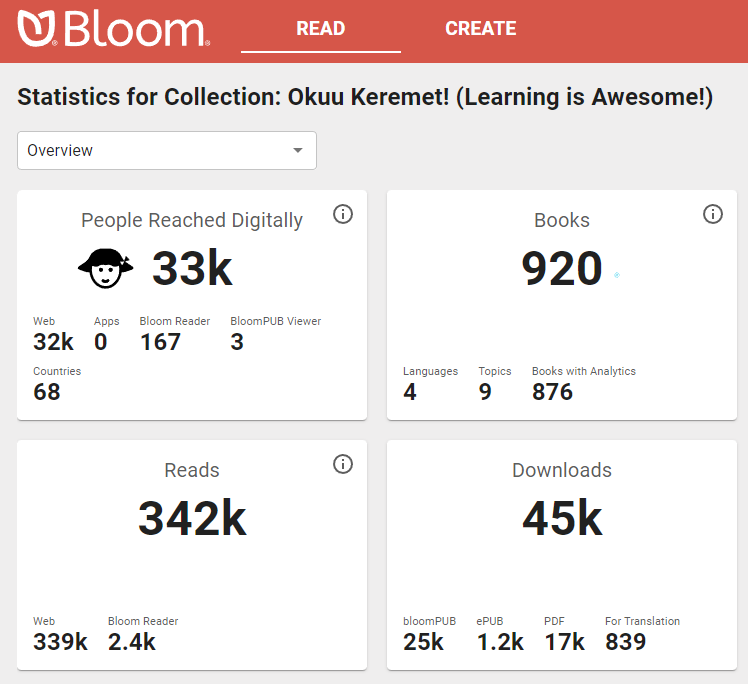
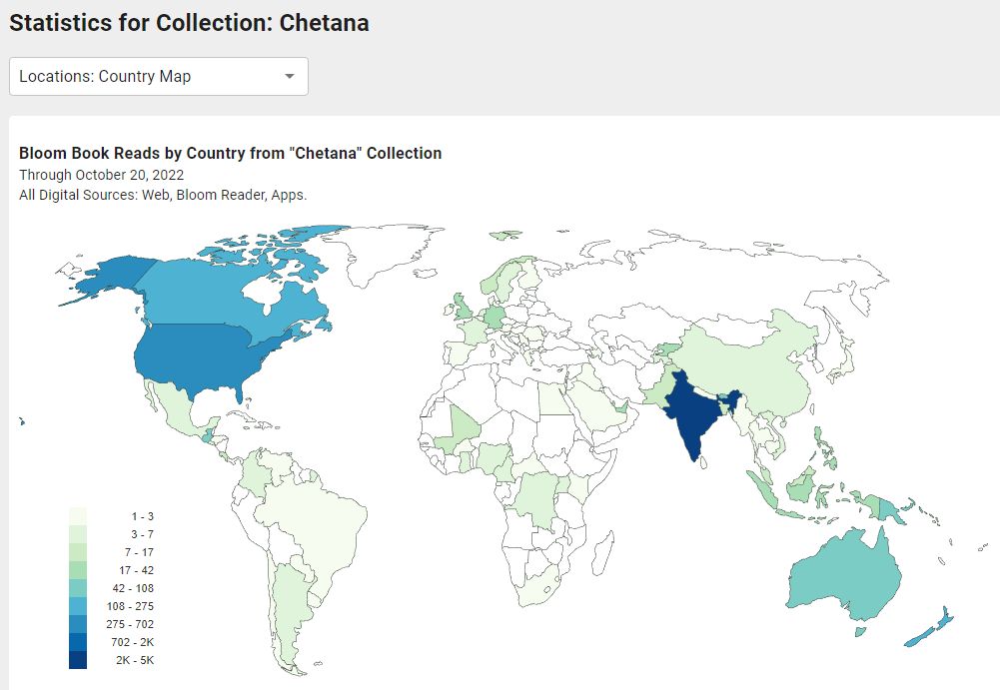
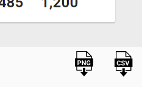
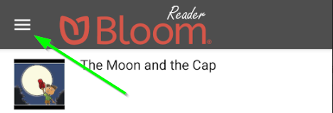
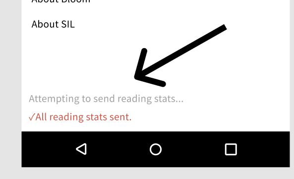

[Bloomlibrary.org](https://bloomlibrary.org/) collects anonymized analytics data from books read online, in Bloom Reader, or in other apps that use Bloom books. Enterprise customers can monitor the usage of their books through this dashboard, including reading activity, location data, and responses to comprehension questions. 

For an additional charge, customers can also be given access to the SQL database of analytic events for their collection for more detailed analysis or presentation.

## [BloomLibrary.org](http://bloomlibrary.org/) Stats pages {#2dcd9fe587634884bfa59171fcb6036a}

Bloom Enterprise subscribers get a URL that gives them analytics on the reach of the books in their collection, updated once a day.

There are various reports:

Each report comes with buttons to get an image or a spreadsheet file of that data:

## Advanced Low Level Access to Analytics Data {#6607be6ec44f4c78bb9620e9d319af94}

We can also supply the raw data to your project through access to our SQL database. You can use this with your own custom dashboards.

See [Available SQL Fields](https://docs.google.com/spreadsheets/d/1jvO_YHpcoYQyOw8sJoo-M07V6Km9YRsPI1rgAuSJVpc/preview)

Example dashboards using this data: [PNG RISE](https://www.inclusiveducation.com/rise), [PNG Western Province E-Learning](https://www.inclusiveducation.com/wp-elearning)

## Events We Measure {#f82b211cce6b401dab71e5368e8cc91e}

All Bloom Player contexts (Bloom Library, Bloom Reader, BloomPUB Viewer, RAB apps)

- Pages read
- Was the last (numbered) page in the book read?
	- This is some indication that the entire book was read. Note: it is possible to just flip past pages, or to move randomly through the book. So it wouldn’t be hard to cheat this system.
- Time spent
- Comprehension Quizzes
	- including how many questions were present and how many answered correctly.
- Duration of audio and video playback
- Book branding
- Bloom Library
- Downloads
- Bloom Reader Specific events
- Installations

No events at this time:

- Shared book
- Shared bookshelf
- Shared APK
- Share Link to app on Play Store
- EPUB

## User Information We Collect {#8291b5519b604551adbc11fa7ba51112}

Web

- IP address (--&gt; city / country?)

Bloom Reader only:

- Named device ids
- ANALYTICS_DEVICE_PROJECT
- ANALYTICS_DEVICE_ID
- Location
- Latitude, longitude, locationSource, locationAccuracy, locationAgeDays

	We record the locations available from each of the standard providers (network, gps, and passive) explicitly. But for the standard location for this report, we mainly want the most recent location we can get; precision is not very important.

	However, we know from experience that in poor countries, IP address doesn't give us reliable location, and we expect that wifi and other networks will be similarly unreliable as means of location. So if we have a reasonably recent high-precision location we will take that in preference to a lower-precision one that may be even more current. (Elsewhere we request one location per hour from GPS, if available, to ensure that the "last known location" for the gps provider will be reasonably recent.)

- Districtution Source
- Hardware info
- Android version?

## Difficulties Getting Analytics {#02b92e05ad0b4d3bbe7ca3e26fefbad4}

- Getting analytics from devices that are normally offline
- No internet
- Effect of blocking cookies?
- Firewalls
- No events on EPUB
- Privacy Issues
- No emails
- IP addresses?
- Cookies
- GPS resolution
- GPS opt in/out
- Device hardware IDs
- Named Device IDs

# Analytics Fields {#4b18c83470b04991ac20fb5d9eed2854}

See [Analytics Fields](/analytic-fields) 

# Internet Connection Issues {#68ca19aacadc4babbddfca08ca13acb4}

## How Much Bandwidth? {#6a6891fae43f4140ba3109de49c4ae52}

These are the most common analytics events sent by Bloom Reader:

- Bloom Reader started
- Bloom Reader backgrounded
- Book Opened
- Book Closed

Each event is less than 3KB. So a person who runs Bloom Reader, reads 2 books, then quits will send less than 18KB.

## What if the User Is Not Connected to the Internet? {#60d35172533f4104baaa59efc2b2baa8}

If the user is not connected to the internet, Bloom Reader will cache their events. The cache is limited to 1000 events.

To prompt Bloom Reader to send all of its events right now:

1. Open the Bloom Reader menu:

	

2. At the bottom of this screen, you will see Bloom Reader’s progress in sending the events:

