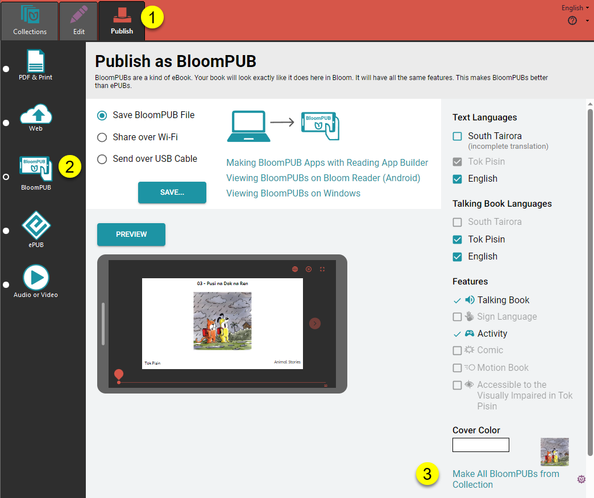

:::caution

This material is for Bloom clients holding a Bloom Enterprise subscription.

:::


## Bloom Reader and Bloom Library Bookshelves {#21e4bb19df12802eae35d72665201d8d}


Bloom editor also provides a means to bulk publish BloomPUBs and prepare a special “`.bloomshelf`” file to accompany these BloomPUBs for [bulk distribution ](/BR-distribution)on Bloom Reader. The same bookshelf is used for both Bloom Library and Bloom Reader.


Here again is a sampling of Education for Life’s viewed from the Bloom Reader app:


When a Bloom Reader app is loaded Bloom bookshelves, each bookshelf’s name will appear beside a bookshelf icon in a specific color (left-side image). Tapping on a specific bookshelf will open it, thus displaying its books (right-side image).


Bloom Reader Bookshelves provide an excellent way to organize many books on a single device. This, in turn, enables users to find the books they are interested in reading more quickly.


See also [How to distribute Bloom books on SD Cards or Phones](/BR-distribution).


## Make All BloomPUBs {#21e4bb19df12800b906dc247f015b22c}


Here are the **steps to bulk publish all BloomPUBs** in a single operation:




1. Click on the **Publish** tab.
2. Choose **BloomPUB**.
3. Click **Make All BloomPUBs from Collection**.

A **Make All BloomPUBs from Collection** dialog will appear with a number of options:


1. Tick this box to produce the special **.bloomshelf file** needed to group the BloomPUBs together into separate bookshelves on the Bloom Reader app.
2. Click the color chooser to select a color for this bookshelf.
3. If your organization wants to track particular Bloom Reader campaigns, choose a specific Distribution Tag to identify that campaign.
	1. See also [Measuring the Impact of your Bloom Reader Campaigns with Distribution Tags](/bloom-reader-distribution-tags).
4. Tick this box if you need the books bundled together into a single `.bloombundle` file.
	1. See also [BloomPUB Bundles](/bloomPUB-bundles).
5. Click the `MAKE` button to start the process.

Bloom will make these BloomPUBs in a temporary folder called:


```javascript
C:\Users\YOUR NAME\AppData\Local\Temp\BloomPubs
```


After the operation is complete, Bloom will open a **File Explorer** window and show you the file(s) created.


Share the file(s) to a phone which has Bloom Reader installed. See [Other Sharing Methods](/get-books-bloom-reader#e35d8c2330514305aa5622eebaeb57b4) for suggestions how to share these files.


### Make and Distribute Multiple Bookshelves {#21e4bb19df1280828bead114e8e1468b}


If you are preparing multiple bookshelves for distribution on an SD card, or prepaid phones:

1. Create a separate folder to store all of the Bloom Reader bookshelves.
2. After each bookshelf is created, copy the files over to the separate folder.
3. Once all of the required materials are gathered, copy all bookshelf files to an SD card for mass distribution.
