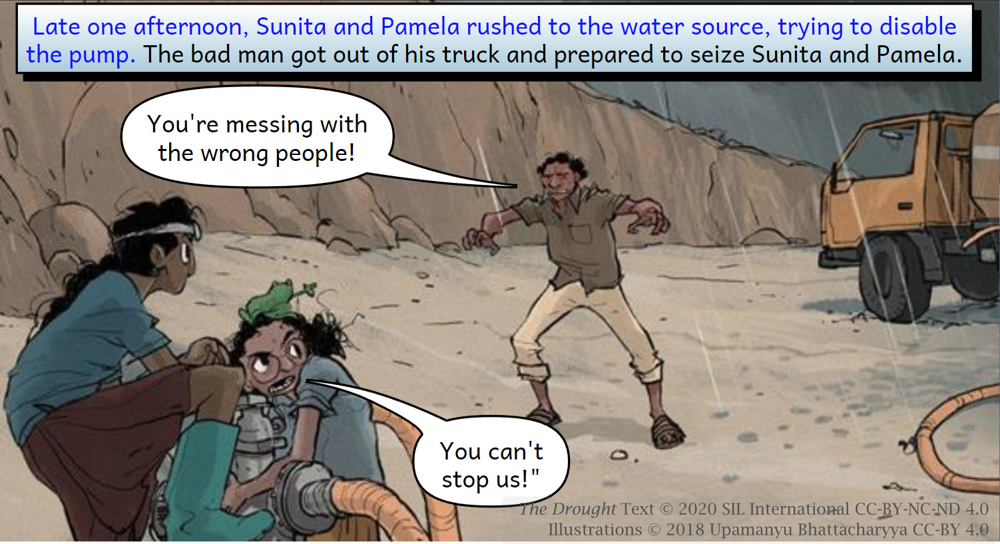

Bloom subscribers have access to the following features and tools to help speed up production and enable more consistent quality for larger projects. 

# Book Creation Features and Tools {#750fd0291c824f4b8affe185c92e8617}

## Team Collections {#21e4bb19df1280d59b78f6c680be7fec}

Team Collections enable a team to collaborate on a single collection of books. Team members check books in and out as they work on them, and use the Dropbox file-sharing service to synchronize files between their computers.

See  [Team Collections : Introduction](/team-collections-intro) to learn more.

## Overlay Tool {#c420f5ea3d97478998101e3c5b79aa8c}

The **Overlay Tool** allows the user to place text, images, or video over a partial or full-page image. This allows more complex page layouts, including Digital and Paper Comic Book Templates.

For more information on creating books with the overlay tool, see 

**[Problem Internal Link]**

## Game Pages {#5014d1f2248e479787c21b45850417e8}

Bloom supports a variety of quizzes and games in digital books. For more information, check out [Games Pages](/games-pages).

## Spreadsheet Import and Export {#21e4bb19df1280488fe1d462f7eef6db}

Exporting your Bloom book to a spreadsheet allows translators on your team to add additional language translations to your books in a spreadsheet rather than in Bloom Editor. 

For more information see 

[Spreadsheet Import and Export](/spreadsheet-import-export)

