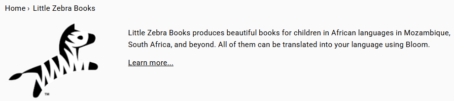
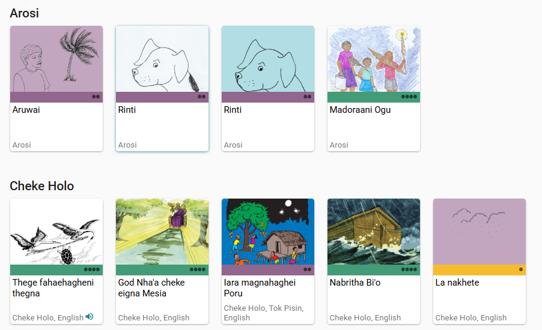
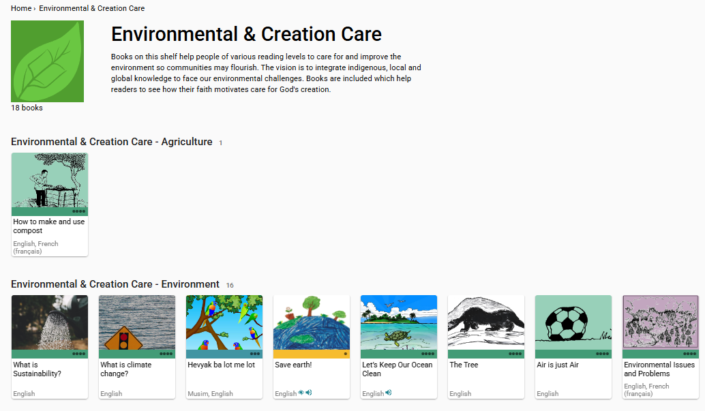
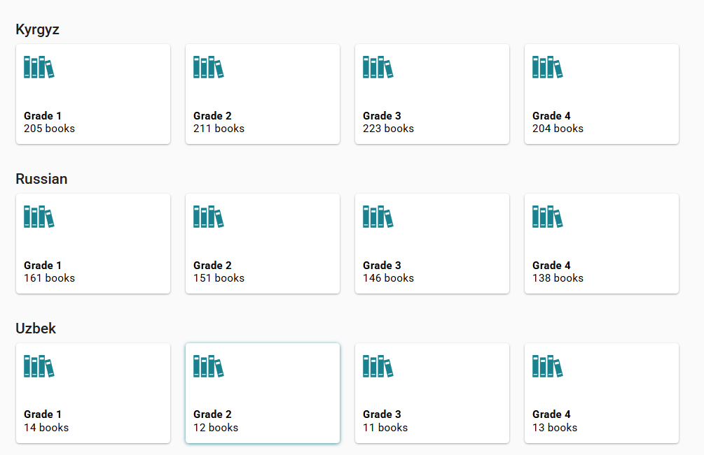

A **Bloom Library Collection** is a curated set of books grouped under a custom bookshelf. Organizations can create their own collections to:

- Introduce their organization to new users
- Highlight work in specific languages or regions
- Group books by theme, audience, or program

Collections make it easier for readers to discover related content and for teams to manage public visibility.

## Introduce Your Organization {#2164bb19df1280bab798eaa97c52f7a0}

At the top of the web page for your collection, you have the opportunity to provide a brief introduction to your organization’s work. This should include your logo and a brief paragraph about your work. 

## Organize Your Collection {#2164bb19df1280529894ff3b9031c7f1}

There are different ways that you can organize the books in your collection. Here are some samples to help you decide how your collection should be organized.

### Organize by Language {#2164bb19df128059b726f3c87a3acbdc}

### Organize by Topic {#2164bb19df12809ea905d310b6ac5e3a}

### Organize by Level {#2164bb19df12800d8438f900b8c19a1e}

To set up your collection, email the Bloom Librarian at [librarian@bloomlibrary.org](mailto:subscriptions@bloomlibrary.org).

