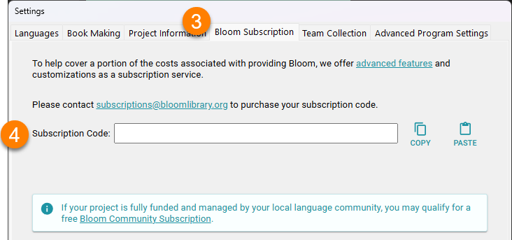
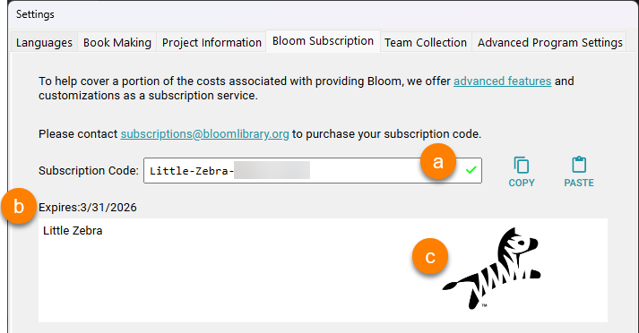
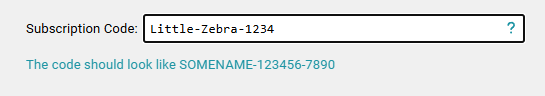
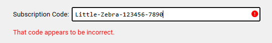
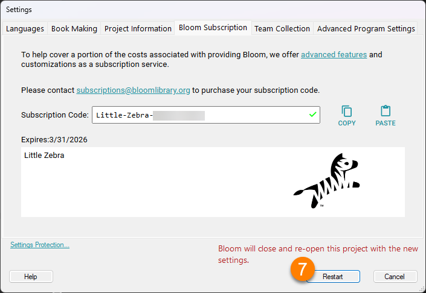

Follow these steps to enable a Bloom Subscription in Bloom Editor:

1. Go to the `Collections` tab.
2. Click on `Settings`:

	

3. Click on the `Bloom Subscription` tab.
4. Type in your  `Subscription Code` or paste it in using the Paste button.

	

5. If the `Subscription Code` is **valid**, you will see:
	1. A **green checkmark** next to the `Subscription Code`.
	2. An **expiration date** and **organization name.**
	3. A **logo** for your organization.

		

6. If the `Subscription Code` is **not valid**, you will see one of these messages:

	

	

	1. Try to copy/paste your `Subscription Code`.
	2. If you require further assistance, please don't hesitate to [contact us](mailto:enterprise@bloomlibrary.org).
7. Click the `Restart` button to restart Bloom with the new Enterprise settings:

	

