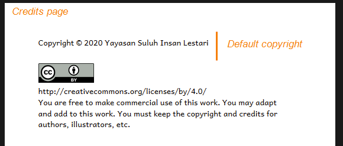

Custom branding allows your organization to apply its identity to books and Bloom Library pages. This can include:

- Logo on Title Page
- Default copyright notice
- Default license notes
- Logo on Back Cover
- Back Cover Text
- Branded Bloom Library collection

This feature is only available with Bloom Enterprise. It helps projects maintain visibility, professionalism, and cohesion across large book sets. If your project requires customization beyond this list, contact the Bloom team at [subscriptions@bloomlibrary.org](mailto:subscriptions@bloomlibrary.org).

:::note

You can do a lot with a custom branding pack, but there are limits: see [What Bloom branding cannot do](/what-branding-can-do#b681c648ec2e401999e6cefafeb002fa) below.

:::

## Branding pack samples {#6bfdcc9b92a2444ca7d72edcc3fd1560}

Here are some examples of front and back matter pages that have been customized using a custom branding pack

### Title Page {#f3f1446f6c664f8c9b2e4ab8e193d0b1}

### Credit Page default license & license notes {#b06f70e834b24b2d836daa994b082d16}

_(from Suluh-INOVASI)_

_(from GRN-REACH)_

### Back Cover Bottom {#01d0830a711f4a85b2c7d9efae7a1716}

_(from Chetana Trust)_

## What Bloom branding <u>cannot</u> do {#b681c648ec2e401999e6cefafeb002fa}

Making a branding pack in Bloom is like decorating a house: it’s easy, but there are limits. In contrast, making a custom **Front/Back Matter pack** is like moving walls or adding on new rooms. With a custom front/back matter pack (called an **Xmatter pac**k), you can add new front and back matter pages and new branding slots. Custom Xmatter packs must be created by a Bloom developer.

Creating custom Xmatter packs is a paid service. If you think you need a custom Xmatter pack, contact the Bloom team at [subscriptions@bloomlibrary.org](mailto:subscriptions@bloomlibrary.org). 

