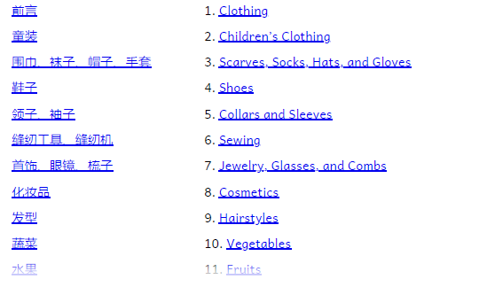
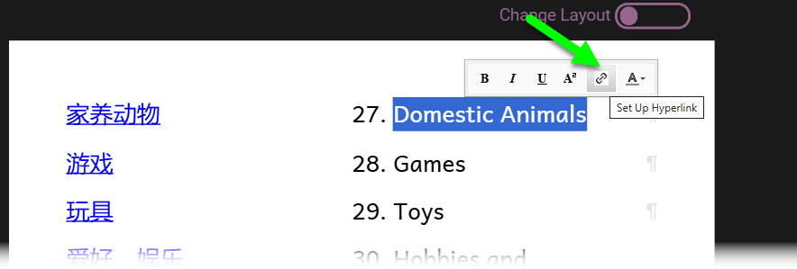
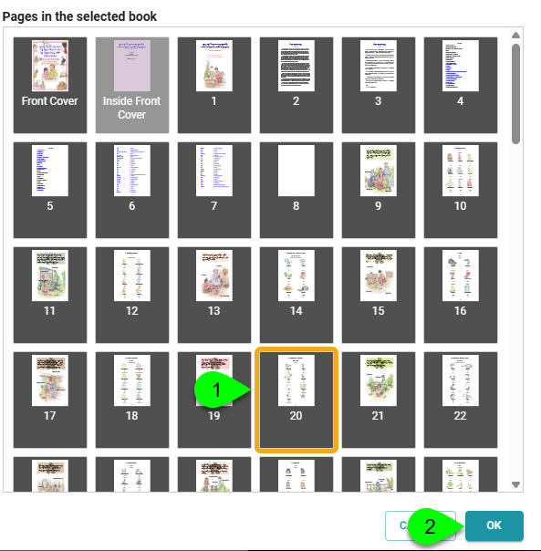

Larger books, such as [this picture dictionary](https://bloomlibrary.org/book/mtpBEpRapj), can greatly benefit from having a table of contents. And when reading or consulting such books online, it is highly useful when each entry includes a hyperlink to the appropriate section.

## Tutorial Guide for a 2-column, 2-language Table of Contents {#3184bb19df12805a9e7ccc53e4259567}

As seen in the above image, this table of contents has two columns. The left column is in Chinese, and the right column is in English.

### Step 1: prepare the page {#3184bb19df1280c488f0e38710af0418}

1. Add a “Just Text” page.
2. Add a second column using the [Change Layout](/working-with-page-layouts#cc6864f50f4841778838e1da5d6722e5).
3. Using [Text Box Properties](/formatting-text-boxes), select the language for each column.
4. Add the text for your table of contents for each language. Each entry should be a separate paragraph. If desired, each entry can be numbered manually.
5. Add spacing [between paragraphs ](/formatting-text-styles#961126a170434b8cbf320dd3c07fb580)if needed.

### Step 2: add hyperlinks {#3184bb19df128041bc5acc030621b78a}

Select the text of each entry and click on the hyperlink button

1. Select the page.
2. Click OK.

