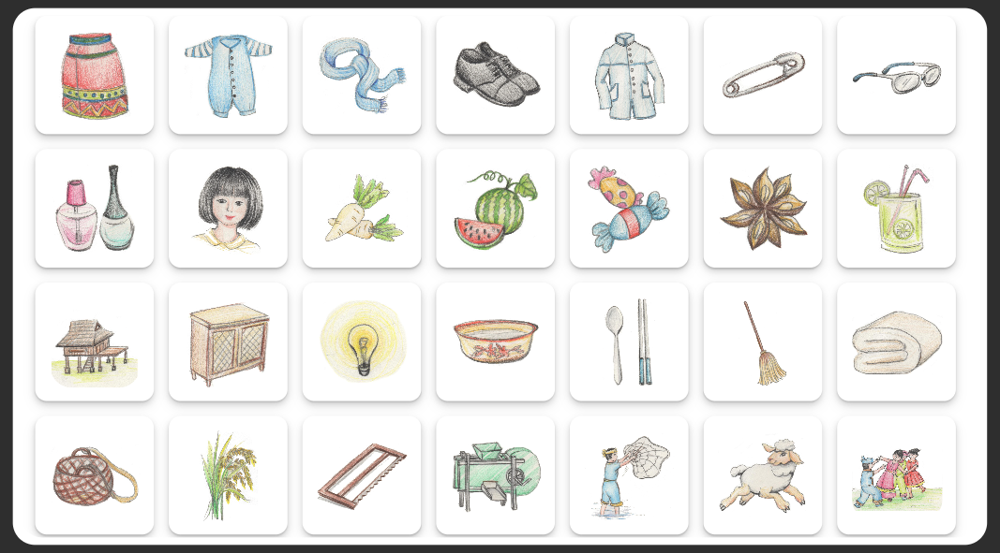
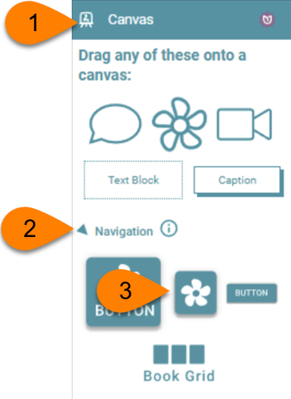
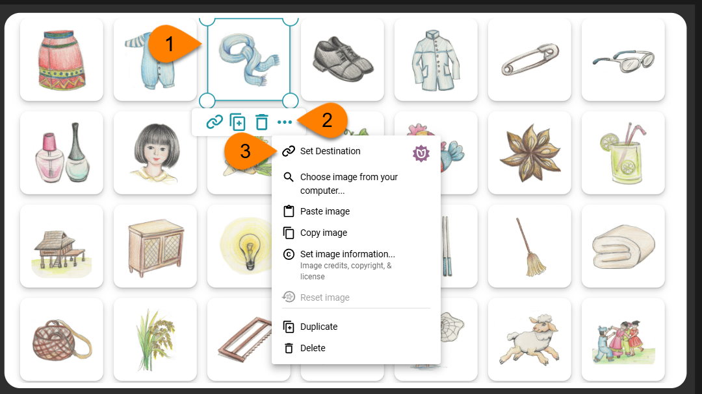

Larger books, such as [this picture dictionary](https://bloomlibrary.org/book/mtpBEpRapj) (print) or [this digital version ](https://bloomlibrary.org/book/ut7kZKm13T)of the same book, can greatly benefit from a Table of Contents. 

## Text-Based Table of Contents {#33b4bb19df1280cda521dca4c3849a8f}

Traditionally, a table of contents is a text-based list of titles like this example:

## Image-Based Table of Contents {#33b4bb19df12807fa6e2dd5a6b3ea9a6}

In addition to the above text-based Table of Contents, Bloom provides an image-based alternative as in the [following example](https://bloomlibrary.org/book/ut7kZKm13T):

Each image links to a section in this book. For a trilingual picture dictionary, this is a more compact way to present a Table of Contents, since no language is needed.

## Tutorial Guide for a 2-column, 2-language Table of Contents {#3184bb19df12805a9e7ccc53e4259567}

As seen in the above image, this table of contents has two columns. The left column is in Chinese, and the right column is in English.

### Step 1: prepare the page {#3184bb19df1280c488f0e38710af0418}

1. Add a “Just Text” page.
2. Add a second column using the [Change Layout](/working-with-page-layouts#cc6864f50f4841778838e1da5d6722e5).
3. Using [Text Box Properties](/formatting-text-boxes), select the language for each column.
4. Add the text for your table of contents for each language. Each entry should be a separate paragraph. If desired, each entry can be numbered manually.
5. Add spacing [between paragraphs ](/formatting-text-styles#961126a170434b8cbf320dd3c07fb580)if needed.

### Step 2: add hyperlinks {#3184bb19df128041bc5acc030621b78a}

Select the text of each entry and click on the hyperlink button

1. Select the page.
2. Click OK.

## Tutorial Guide for Image-Based Table of Contents {#33b4bb19df1280bba8d4c629bc09b6df}

1. Open the Canvas tool.
2. Open Navigation.
3. Drag a navigation image to the canvas on your page.

Once you have the images on your page, add the hyperlink to each image.

1. Select the image.
2. Click **`…`**
3. Select Set Destination.

The Choose Link Target will appear. On the right side are thumbnails of all the pages in the selected book. Choose a page and click OK.

