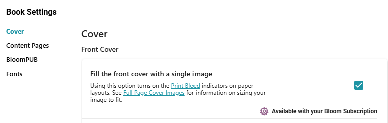

# Front Cover Fill {#3184bb19df1280e78cfdc8f6971dcf52}

A beautiful front cover is an important feature of your book to attract readers. 

Consider the following front cover from [this book](https://bloomlibrary.org/book/mtpBEpRapj):

This front cover was carefully designed using a special graphic design program.

Starting with Bloom 6.2, that carefully designed front cover can be fully integrated into the Bloom book. The user exported a high-quality PNG or JPG from the graphics program and imported it into Bloom. 

Then, the user chose to fill the [front cover with that single image](/full-page-cover-images). This premium feature is available in book settings:

:::tip

Starting Bloom 6.4, Bloom will begin to provide a set of its own tools for front cover design.

:::

