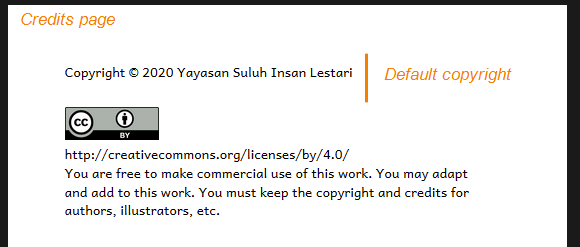
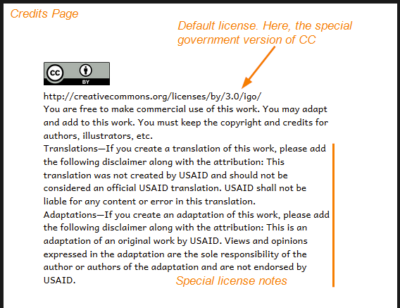
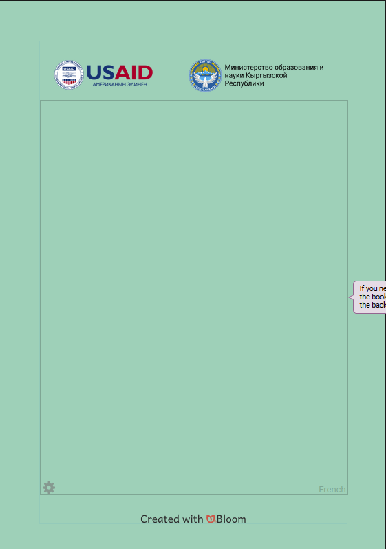
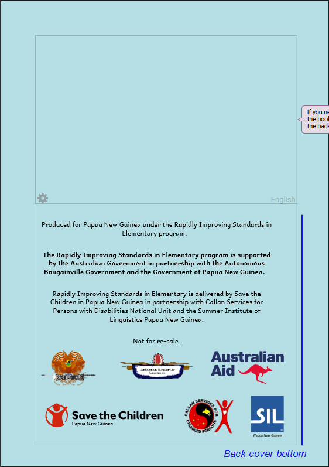
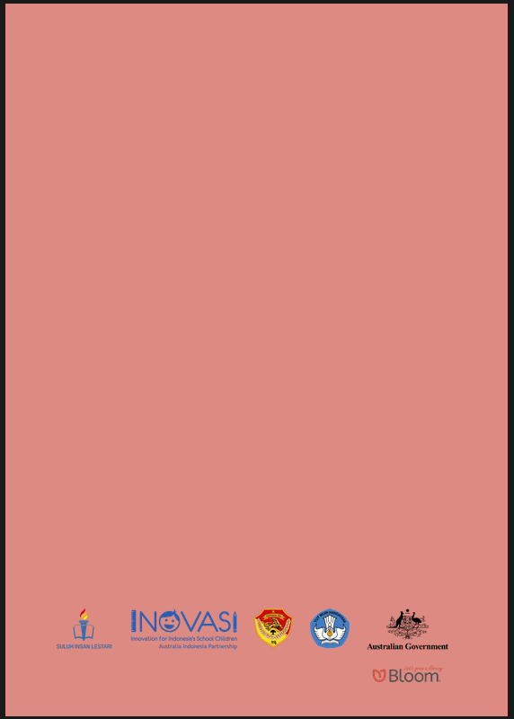

A branding pack can fill various slots that are already in a Front/Back Matter pack. It can fill them with an html (text / graphics).

Our built-in front/back matter packs have slots here:

- Front cover top (Bloom 5.3)
- Front cover bottom (Bloom 5.3)
- Credits page top
- Credits page bottom
- Title page bottom
- Outside back cover top
- Outside back cover bottom

In addition, a branding pack can declare:

- Default copyright
- License
- License notes

_Note, when you need something that can’t be done with Branding Packs, then we fall back to making “Custom Front/Back Matter Packs” (sometimes called “XMatter Packs”). For these, we can add new pages, new branding slots, etc. They require a Bloom developer to create for which we bill hourly. They require more effort than you would guess-- at least several hours per page)._

> Branding in Bloom is like decorating a house… it’s easy, but there are limits. In contrast, Custom Front/Back Matter is like moving walls or adding on new rooms.

Here’s are some examples:

# Cover Page

# Title Page

# Credits Page Top

Credit Page default license & license notes

(from Suluh-INOVASI)

(from GRN-REACH)

# Credits Page Bottom

# Back Cover Top

# 

# Back Cover Bottom

(Suluh-INOVAS)I

