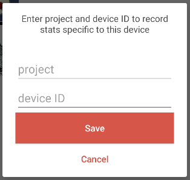

When a project owns and distributes hardware to use with Bloom Reader, it is possible to get analytics that are specific to each device. To make this work:

- You will need to tell Bloom Reader the ID you want to appear in the analytics. To do this, there are two options:
	- Option 1: Enter the information directly within Bloom Reader.
	- Option 2: Create and place a special file on each device. Make sure Bloom Reader has permission to read this file.
- You will need to be directly reading from our analytics database. This device ID will not be available from a BloomLibrary.org stats page.

### Option 1: Steps for adding the information directly within Bloom Reader {#695205e6282a4f399c1fc677dbf1d653}

1. Decide on a project ID and device IDs for each device.
2. Open the menu by clicking on the menu at the top-left of the book list.
3. At the bottom of the menu, there is an item which indicates it is trying to send stats information or all stats have been sent.
	1. Tap the menu item three times.
4. The following form will then allow you to enter the project ID and device ID:

	

5. Save.
	1. You may change the IDs using this form, but the only way to remove them completely is to clear the app settings (from the Android settings) or uninstall.
6. See [Verification](/how-to-collect-bloom-reader-analytics#f009f738890d4b0e82463be2703bff69) below.

### Option 2: Steps for creating the file that identifies each device {#eece883425d34bfeb09fa17c53ec6327}

1. Decide on a project ID and device IDs for each device.
2. Create a file called deviceId.json.
	1. The file content must be
	{ project: 'projectID' , device: 'deviceID' }
	2. Example:
	{ project: 'RISE2' , device: 'STUDENT NORTH FLY 001' }
3. Put the deviceId.json file on the device in the Bloom folder which contains the Bloom Reader books (at the root of Internal Storage).
4. Restart Bloom Reader.
	1. This may require actually closing the app if it is currently running.
	2. The user will see a brief message indicating the failure or success of loading the project and device IDs. The message is only shown once. The only way to change it after it is initially set is to clear the app settings (from the Android settings) or uninstall.
5. See [Verification](/how-to-collect-bloom-reader-analytics#f009f738890d4b0e82463be2703bff69) below.
6. If this is not working, it means that Bloom Reader does not have permission to read from the Bloom folder at the root of Internal Storage.
	1. Open the menu at the top-left of the book list.
	2. Tap “Find lost books”.
	3. Navigate to the Bloom directory if needed, then tap “Use this Folder” or “Select” to give permission to the directory.

### Verification {#f009f738890d4b0e82463be2703bff69}

To verify the setup was successful, open the menu at the top-left of the book list. There will be a new item at the end which will display “Stats ID: {device ID} ({project ID})”.

Once the device is properly set up, it will begin reporting analytics with these values in the device_project_hardware_code field of various analytics tables. The value will be projectID-deviceID.

