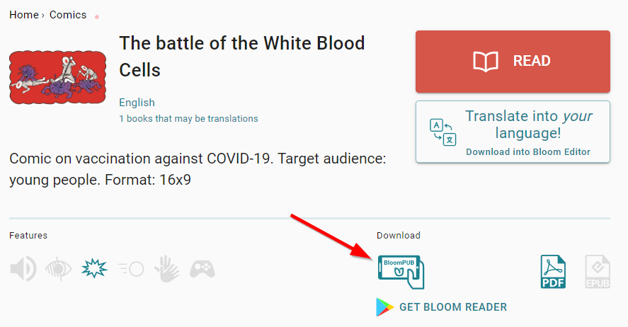
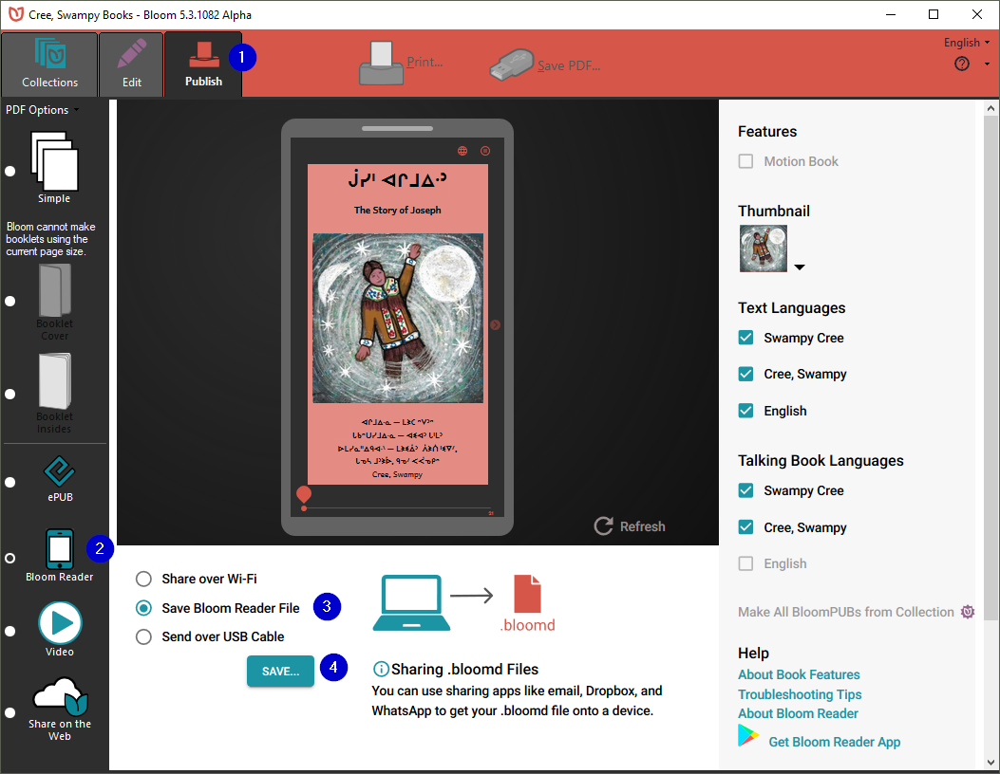

Distributing SD cards _pre-loaded_ with bloomPUBs is a fast and convenient way for an organisation to grant users access to an _entire library_ of Bloom books to a desired target audience _off-line_. And since **Bloom Reader** does not permit the deletion of books loaded on SD cards, these books are safeguarded from accidental deletion from _within_ the app. (They can, of course, be deleted through other means.)

When **Bloom Reader** starts, it automatically looks for an SD card and certain private folders reserved for the app. If it finds such a folder, it includes the books it finds there in the list of available books to read.

If it finds .[bloomshelf](https://docs.google.com/document/u/0/d/1UUvwxJ32W2X5CRgq-TS-1HmPj7gCKH9Y9bxZKbmpdAI/edit) files, Bloom Reader also organizes the books according to those _shelves_.

# **Instructions**

- **Gather your bloomPUBs**

Gather all the books you want to distribute. These books will have an extension of either:

.bloomd   or   .bloomPUB.

The main sources for Bloom books will come from either Bloom Library, or from the Bloom desktop Editor, or perhaps from a colleague.

From [Bloom Library](https://bloomlibrary.org/read), click on the book you desire and look for the Download section and click on the BloomPUB icon. For example:

Or, from the Bloom Editor, you can make a BloomPUB file of any book in your collection by choosing the Publishing tab, selecting the Bloom Reader button, selecting Save Bloom Reader File, then the Save… button:

- **Create the folder on your SD card**

After gathering all your Bloom books on your computer, you will then use your computer to create the following series of folders on the SD card:

Android\data\org.sil.bloom.reader\files\Books

For example, if you mount the SD card as drive **D** on a windows PC, you will first create the Android folder:

D:\Android\

Then, in the Android folder, you’ll add the data folder:

D:\Android\data\

And so on until you have a series of nested folders as follows:

D:\Android\data\org.sil.bloom.reader\files\Books

### 💡 Note that capitalization must be _exactly_ as shown.

- **Copy over the bloomPUBS**

Copy the bloomPUBs into the folder.

The SD card is now ready to distribute.

## **Optional: Folders & Bookshelves**

Beginning with **Bloom Reader** 3.0, you can organize this folder using subfolders. For example, you could have:

Android\data\org.sil.bloom.reader\files\Books\FooGrade1\letters.bloomPUB

Android\data\org.sil.bloom.reader\files\Books\FooGrade1\numbers.bloomPUB

Android\data\org.sil.bloom.reader\files\Books\FooGrade2\animals.bloomPUB

# **Advanced options**

This section described advanced options and is not recommended for most users.

## **Using Bloom Reader Beta or Alpha**

The private books folder is _specific_ to each ‘channel’ of Bloom Reader. Unfortunately, this means that if you want to make an SD card that will work seamlessly with Bloom Reader Beta, the books must be placed in:

Android\data\org.sil.bloom.reader.**beta**\files\Book

and for Bloom Reader Alpha, in

Android\data\org.sil.bloom.reader.**alpha**\files\Books

If you wish, and you have enough space, you can place the same collection in all these locations on the same SD card, so that it works with multiple “channels” of Bloom Reader.

## **Support for older Bloom Reader versions**

**Bloom Reader** will also notice the existence of the older system using a \BloomExternal folder at the root of the SD card, if it does not find \Android\data\org.sil.bloom.reader\files\Books.

N.B. : you can use _either_ the \BloomExternal folder, _or_ the private Books folder, not both at the same time. (Both can be present, as explained below, to support both old and new versions of BloomReader, but the newer versions will ignore \BloomExternal if they find the private Books folder, expecting it to be a duplicate.)

This is more complicated and is _not_ recommended. The following are technical notes for those who need to know:

If Bloom Reader finds a \BloomExternal folder and does not find the private books folder described above, it will show a button the user can click, which will show instructions and guide the user through the process of giving BloomReader permission to access the folder. Once this permission is granted, books in \BloomExternal work just like those in the private books folder (except it will be somewhat slower, especially for larger books). If you have a need to support both newer (3.0+) and older (pre-3.0) versions of Bloom Reader, you can place the same collection of books in both places. However, we don’t expect this to be necessary for long, since devices will typically upgrade automatically to the latest version. It does mean, though, that SD cards made for older versions of Bloom will go on working, albeit less conveniently.

So, you can

- Make SD cards with just books in \Android\data\org.sil.bloom.reader\files\Books. They will be ideal for current BloomReader
- Keep using or making SD cards with just books in \BloomExternal. They will work with all versions of BloomReader, but will be slower with newer versions and require the user to give special permission
- Make SD cards with the same books in both \Android\data\org.sil.bloom.reader\files\Books and \BloomExternal. They will work well with both new and old versions of BloomReader.
