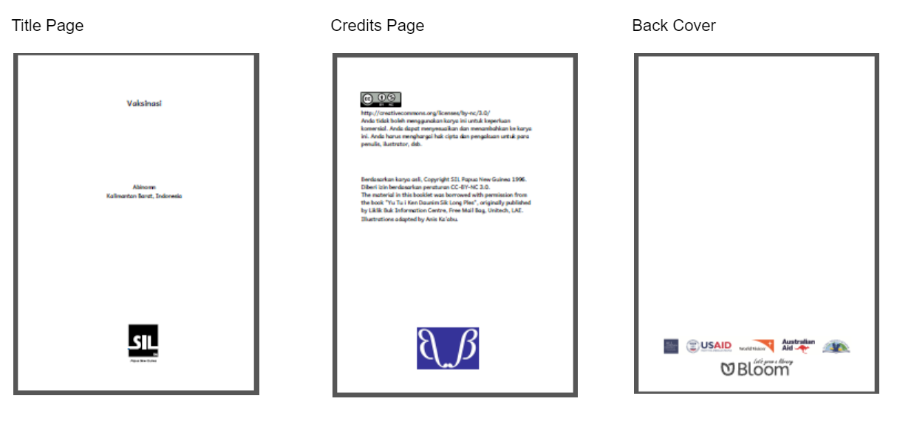
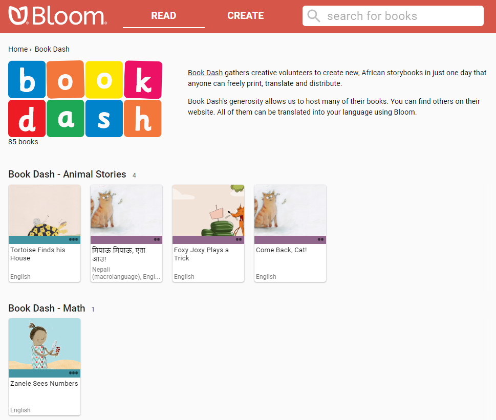
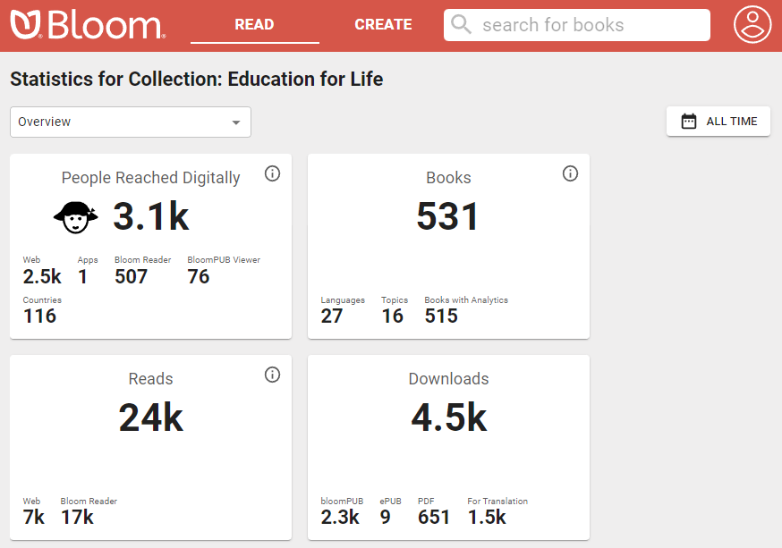

# About Bloom Enterprise {#0c41c9c9b95e4681acc645d60786abf9}

**Bloom Enterprise** is a subscription service that provides additional features and tools for organizations and projects. By subscribing to this service, organizations and projects can meet some of their unique needs while also supporting the development of Bloom, which helps everybody.

Bloom Enterprise subscribers have access to the following features and tools:

- Enterprise book features
	- [Branding and custom page layouts](/bloom-enterprise-overview#dbd3cd45b78c47de8d8873f32c03b48f)
	- [Overlay Tool](/bloom-enterprise-overview#c420f5ea3d97478998101e3c5b79aa8c)
	- [Activity pages](/bloom-enterprise-overview#5014d1f2248e479787c21b45850417e8)
	- [HTML5 widgets](/bloom-enterprise-overview#b4debe07f92845dea1d78cffbbbef385)
- Enterprise editing tools
	- [Team Collections](/bloom-enterprise-overview#371a1ac874ec46229e420d36931248f7)
	- [Spreadsheet export/import](/bloom-enterprise-overview#04fd63f5a0fa443bb635115674b580a2)
- Enterprise publishing tools
	- [Bloom Library Collections](/bloom-enterprise-overview#e681141a57404c3fb71d4a1405423568)
	- [Uploading collections to Bloom Library](/bloom-enterprise-overview#9f527fedf9a54915bc595948fab91aae)
	- [Convenient creation of multiple BloomPUBs](/bloom-enterprise-overview#66a5414a6cd44ce58f6f48113a1993ca)
- [Analytics](/bloom-enterprise-overview#e747074e415b4781bbc27aed1db5b468)
- [How to subscribe](/bloom-enterprise-overview#6e34f51010d34c988eeed8cb75f879e5)

# Enterprise book features {#ac7150b88c264bf5b0d9e5cba55805b7}

Enterprise customers gain access to additional Bloom Desktop Editor features:

## Branding and custom page layouts {#8193915c093b4da99004038e38fe09dc}

Bloom can automatically display your logo(s) on the cover, title page, or back cover of your books. Enterprise customers can also specify the copyright and license that each book will contain. For further details on Bloom branding, see [What Bloom Branding can do](/what-branding-can-do).

:::note

Bloom Enterprise customers may also request custom covers and front-matter pages at an additional charge, based on the amount of work such customization requires.

:::

## Overlay Tool {#c420f5ea3d97478998101e3c5b79aa8c}

The **Overlay Tool** allows the user to place text, images, or video over a partial or full-page image. This allows more complex page layouts, including Digital and Paper Comic Book Templates.

## Activity pages {#5014d1f2248e479787c21b45850417e8}

Bloom supports two kinds of **activity pages** in digital books: Comprehension Questions and Simple Choice Activities.’ 

**Comprehension questions** let you design multiple-choice questions for readers to answer. These activities enhance the reading experience, and Bloom’s analytics system can capture whether readers answer the questions correctly or incorrectly. Such information can provide valuable data for an organization or project’s monitoring and evaluation efforts. 

**Simple Choice Activities** come in two varieties: **Choose Word from Picture** and **Choose Picture from Word.** 

## HTML5 widgets {#b4debe07f92845dea1d78cffbbbef385}

**HTML5 widgets** are JavaScript apps that are programmed outside of Bloom and can be embedded in Bloom book pages. These widgets open up many options for making books interactive.

To view just one example of a Bloom book with a widget, click on the READ button below and go to page 9:

[embed](https://bloomlibrary.org/activities/books-with-widgets/book/wXn65BSrBI)

# Editing tools {#2af3fbf23d4c4a9c97a6b0d1e6155ec1}

## Team Collections {#55c8baa318884dcf874c76f7e0dd9859}

[Team Collections](/team-collections-intro) enable a team to collaborate on a single collection of books. Team members check books in and out as they work on them, and use the Dropbox file-sharing service to synchronize files between their computers. 

## Spreadsheet export/import {#04fd63f5a0fa443bb635115674b580a2}

**Spreadsheet export/import** allows you to export the contents of a Bloom book to a specially formatted Excel spreadsheet, and import the content back into a Bloom book. While there are some limitations on what can be exported and imported, this can be a convenient way to add translations into one or more new languages to a Bloom book.

# Publishing features {#6279ba4ee1cb4264aef9a2cdf2c3ff6c}

## Bloom Library Collections {#e681141a57404c3fb71d4a1405423568}

Enterprise customers can request a dedicated page on [bloomlibrary.org](http://bloomlibrary.org/) that features their books. The page can also feature a logo, a short blurb about the project or organization, and a link for more information. Bloom Library pages can also be embedded on your own website.

## Uploading collections to Bloom Library {#9f527fedf9a54915bc595948fab91aae}

Bloom Enterprise users can upload all the books in a collection—or even several collections of books—to Bloom Library in one step. 

## Convenient creation of multiple BloomPUBs {#66a5414a6cd44ce58f6f48113a1993ca}

**Bloom Reader** is a free Android app that allows readers with Android devices to enjoy Bloom books offline. Bloom Reader uses a special BloomPUB file format that supports all Bloom’s features, including audio and video playback. Bloom Enterprise subscribers can create BloomPUB files for all books in a collection in one step. 

# Analytics {#e747074e415b4781bbc27aed1db5b468}

Bloomlibrary.org collects anonymized analytics data from books read online, in Bloom Reader, or in other apps that use Bloom books. Enterprise customers can monitor the usage of their books through this dashboard, including reading activity, location data, and responses to comprehension questions. 

For an additional charge, customers can also be given access to the SQL database of analytic events for their collection for more detailed analysis or presentation.

# How to subscribe {#6e34f51010d34c988eeed8cb75f879e5}

To learn more about Bloom Enterprise, or to subscribe, [contact us](https://sites.google.com/sil.org/bloom-program/im-interested).

:::note

SIL International staff should read about [Bloom Enterprise on Gateway](https://gateway.sil.org/x/UolzDQ/).

:::

