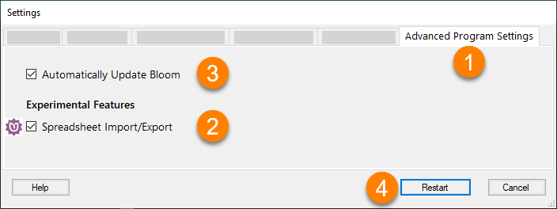
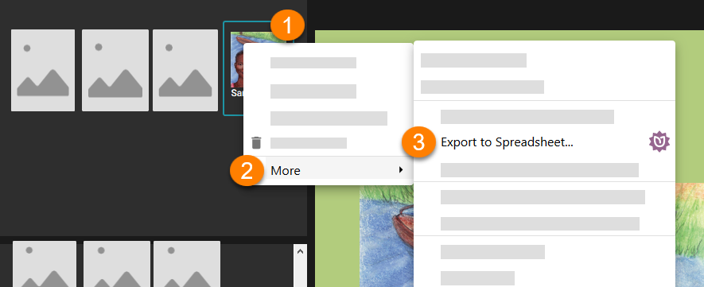
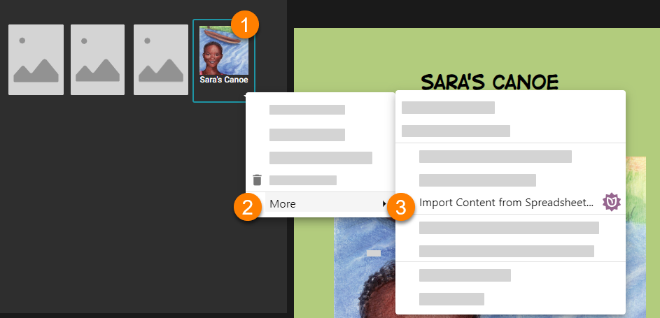
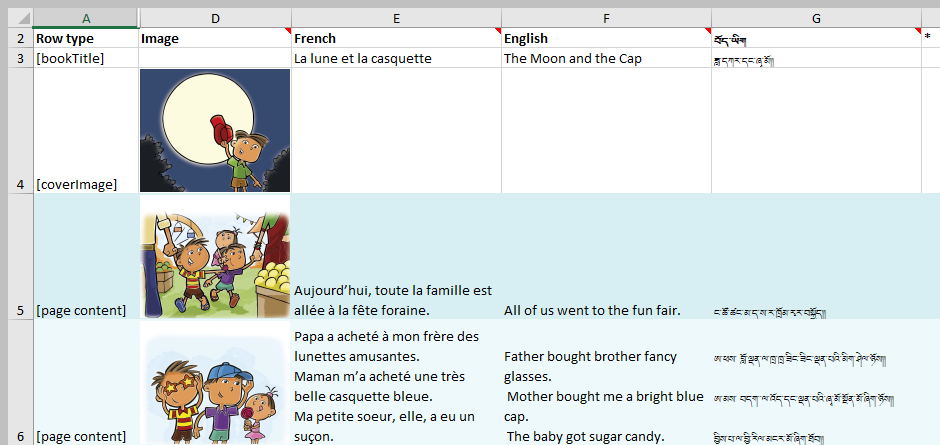

:::caution

The Spreadsheet Import/Export function was introduced in Bloom 5.2. It is an _experimental_ Bloom Enterprise feature that is still under development. 

To access the latest developments of this experimental feature, it is essential to use the very most recent version of [Bloom Beta](https://bloomlibrary.org/page/create/downloads).

:::

# 1. Introduction {#c2527373b4a9435fb22909f54a228782}

Exporting your Bloom book to a spreadsheet opens up an alternate workflow possibility for you and your colleagues. One typical workflow is to allow translators on your book-production team to add additional language translations to your books using a spreadsheet rather than the Bloom program. 

After the additional language translations have been added to the spreadsheet, the team supervisor or administrator imports the spreadsheet into Bloom. 

In this way, only the team supervisor needs to learn Bloom. 

# 2. Enabling Spreadsheet Import/Export {#15ec086328a0426484b1b0de3c041805}

To access this advanced feature, open Bloom Settings, then:

1. Click on the **Advanced Program Settings** tab
1. Tick the box **Spreadsheet Import/Export**
1. Please ensure you have ticked the box **Automatically Update Bloom**
1. Click to **Restart** Bloom

# 3. Exporting a book to a Spreadsheet {#81e60f28cc2c4c44addb3a3153ebada8}

1. [Right-click ](/glossary#d7c34190bf4344668b2df2b4e2b9338e)on the book you wish to export, then,
1. Click **More**
1. Click **Export to Spreadsheet**…

# 4. Importing a Spreadsheet into Bloom {#e9eeb69676084a158f4facc492136401}

After editing the spreadsheet, it can be imported back into Bloom. Typically, the spreadsheet will be imported back into the original book or into a duplicate of the original. In this way, the original structure of each page will be maintained. 

You can also into a spreadsheet into a new blank book. In this case, however, the original page structure will not be maintained. 

1. [Right-click ](/glossary#d7c34190bf4344668b2df2b4e2b9338e)on the book you wish to import the spreadsheet into, then,
1. Click **More**
1. Click **Import Content from Spreadsheet**…

A progress dialogue will appear. Note, a backup of your original book will be placed in a temporary folder in case there is a problem. 

The location of the backup is: `C:\Users\YOUR USER NAME\AppData\Local\Temp\bloom pre-import backups`

# 5. Understanding the Spreadsheet layout {#24b676320e7c4b04b369a4da79bd54bc}

The exported spreadsheet is organized into rows and columns. By default, only the main translatable material (the title, and the basic text) from the book is presented, and all other material — such as Copyright and Credits — is _hidden_ from view.

:::caution

The rows and columns that are hidden from view should generally _not_ be edited directly in the spreadsheet. Instead, it is best to edit these in Bloom itself. 

:::

Generally speaking, the rows of the spreadsheet progress through the translatable pages of the book, while the columns contain the content of the corresponding pages in various languages. 

By default, the following are hidden;

- Row 1
- Columns B and C
- Approximately 14 hidden rows at the end of the spreadsheet for various “xmatter” material like Copyright and Credits

# 6. Usage Scenarios {#f9d14c7f7b274baa9cefa1a385e48551}

## 6.1 Simple corrections or editing {#dfd58dbb22804a73bba3764e09f19e39}

Some teams prefer to use spreadsheets, rather than Bloom itself, to do the final editing of their Bloom books.

## 6.2 Adding another language translation to a book {#6346d7e504044a448aff0a56b1b555db}

Some teams have translators who are comfortable using spreadsheets, but not Bloom. 

To add a new language to a book, the exported spreadsheet will need a new column for the language. The easiest way to do this is to ensure the new language is listed in the Languages tab of your Bloom Settings prior to exporting the book.

Alternatively, you can add the new column to an existing spreadsheet. In this case, you will need to unhide row 1 to type in the language code of the language. The language code must be enclosed in square brackets.

## 6.3 Fixing an incorrectly tagged language {#ee4ceb62c6834b278ff390bd48bdb7ce}

Sometimes, a user makes a book and only later discovers they have used the wrong language code.

This can be a fairly technical procedure. The following steps will cover simple cases only:

1. Change the Collection Language Setting to the correct configuration.
1. Export the book to a Spreadsheet.
1. Replace the wrong language code (row 1) and language name (row 2) in the spreadsheet with the correct one.
1. Import the spreadsheet into a _blank_ book.

Bloom imports in a non-destructive way. This means it _updates_ existing data _but does not erase_ existing data. For this reason, it is important for this usage situation to import into a _blank_ book; otherwise, the original, incorrectly tagged language data, will remain.

Importing into a blank book works provided the book has a simple structure of one image and one text box per page. If the book contains multiple text boxes or images, the spreadsheet will have to be imported back into the original book in order to maintain the same data structure. In this case, the unwanted text (incorrectly tagged) will remain unless it is emptied out in the spreadsheet. This may require a Bloom specialist.

When publishing your book to Bloom Library, be sure to uncheck the box for any unwanted language. Doing this will strip out that unwanted language for Bloom Library.

## 6.4 Changing a book to Digital Comic Book {#3e1a640f7e894299ba71631636f4972d}

If your original book was made from the Basic Book template and you want to transform it into a Digital Comic Book, then do the following: 

1. Create a blank book using the Digital Comic Book template.
1. Add a **Comic** page.
1. Using the Overlay Tool, add a Caption or Text Block to the page.
1. Right-click on this page’s thumbnail, and choose **Duplicate Page Many Times** so that this blank comic book has the same number of pages as the original book.
1. Import the spreadsheet into this blank comic book.

:::caution

Limitations: this method works if the original book has one image and one text box per page. 

:::

# 7. Current Limitations {#34fbb792bd91484bb5ca087ed397e033}

The following are _not_ supported:

- Quizzes and other Activities
- Image Descriptions

In addition, there are dangers to editing a Talking Book in a spreadsheet. Obviously, if you change the words of a sentence in any way, the audio recording will no longer match. Similarly, if you change the sentence boundaries, the recording will no longer match. Consequently, 

:::tip

As a best practice, do not record the audio of your Talking Book until your book has been finalized.

:::

