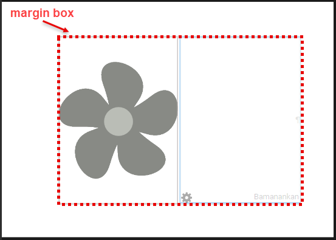
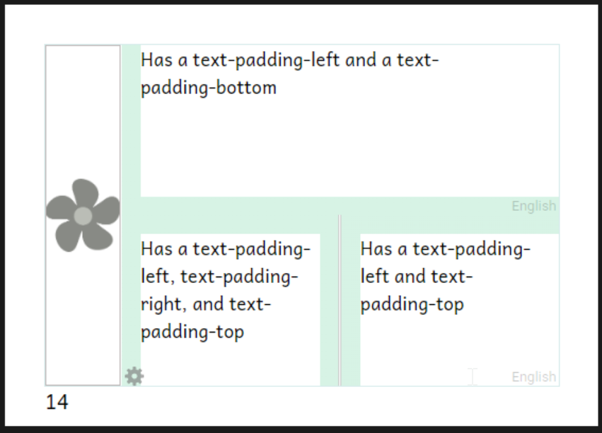

:::caution

This page is a work-in-progress for Bloom 6.0. Information subject to change.

:::


:::note

Please see this page for a more introductory explanation of the Bloom Appearance system:
[The Appearance System](/appearance-system)

:::


:::caution

This is a _very_ technical note, intended only for Publishers with technical staff.

:::


## How the Appearance System works {#307d47098b9c4f43a471690d59056d56}


Each _Theme_ is a CSS file that sets the value of one or more Appearance properties.


Each book has an `appearance.json` file that can contain the same set of properties in JSON form. It also includes a property to indicate the currently selected theme_._


As you customize settings in the “Book Settings” dialog, Bloom updates that  `appearance.json`.  Note that the user interface only shows a small number of available Appearance settings. Instead, most settings are controlled by the theme that you choose.


When Bloom displays a book, it converts that `appearance.json` and the chosen theme into a CSS file named `appearance.css`.  


The HTML page then applies these stylesheets in this order (last wins, all other things being equal):

1. `basePage.css` or `basePage-legacy.css`
2. `appearance.css`
3. `customBookStyles.css`, `customBookStyles2.css`

# Precedence {#c9d68b5d2da14105bb698e7fe97fd3ce}


A challenge in modern Bloom is that there are a number of things that each influence the final display of a page. These things may even be wanting opposite things to happen. What happens if the Book Settings Dialog is used to turn something on, but a custom css is used to turn it off? Who wins?


Since ultimately CSS is involved, the answer is complicated by CSS specificity rules. But given the same specificity, here is the order of precedence for the various sources ( `>>` here means “has precedence over”):


:::note

xmatter HTML &gt;&gt; customBookStyles.css &gt;&gt;  xmatter.json &gt;&gt; branding.json (.appearance) &gt;&gt; Book Settings (appearance.json) &gt;&gt; Theme  (foobar.css)

:::


Why is xMatter pug the ultimate winner? This is because, if an xMatter doesn’t have an HTML element for something, it can’t be CSS’ed or JSON’ed into existence.


Notice that Theme’s position in the list. Not only is it last, but actually any property that appears in Book Settings will win over that described in the Theme, unless CSS specificity rules cause it to overcome the Book Settings.


:::note

Avoid putting things in a theme that are also part of Book Settings. Be aware that in a future version, a given property may become available in Book Settings and therefore will override that setting in an older theme, unless we create a value for the Book Settings control that means “I don’t care”. Such a value is likely for things like `page-background-color`.

:::


## Creating a new Theme {#1edd7c6e6ea44a179c3cfc60b369b2aa}


:::note

If you cannot get what you need using the Book Settings UI or by choosing a theme, first, talk to us. We may advise a different solution, or we may direct you to use the following directions. 

:::


If it doesn’t already exist, create a `customBookStyles.css`  in the root of the book folder. **Use an editor that understands CSS** will show you any errors. We highly recommend [Visual Studio Code](https://code.visualstudio.com/download) (it is free). The basic template is:


```css
.bloom-page {
 /* set properties here*/    
}
```


For example, imagine that we want to draw a dashed red box around the “Margin Box”


<div class='notion-row'>
<div class='notion-column' style={{width: 'calc((100% - (min(32px, 4vw) * 1)) * 0.5)'}}>


```css
.bloom-page {
    --marginBox-border-style: dashed;
    --marginBox-border-color: red;
}
```


</div><div className='notion-spacer'></div>

<div class='notion-column' style={{width: 'calc((100% - (min(32px, 4vw) * 1)) * 0.5)'}}>





</div><div className='notion-spacer'></div>
</div>


What if we need something special in Device16x9Portrait versions of the book? For this, we add a rule group that selects for that:


```css
/* default */
.bloom-page {
    --marginBox-border-style: dashed;
    --marginBox-border-color: red;
}
.Device16x9Portrait {
    --marginBox-border-style: solid;
}
```


If you set a variable that is a dimension, like `--page-margin` or `--page-gutter`, it must have some unit, such as `px` or `em` or `mm` or `in`. Contrary to usual CSS advice, you _must_ give a unit even if setting the variable to zero. Although it seems redundant (0px = 0em = 0mm = 0in), the browser fails when doing any arithmetic with variables that are supposed to be dimensions but lack a unit, so setting such a variable to zero can have unexpected results that are difficult to diagnose, such as rules that appear to apply but don’t do anything.


We are trying to standardize on `mm` as the unit for measurements that should not related to font size, and `em` for ones that should. Following this convention may help with future compatibility if we add a UI control for the variable you are using.


As before, it is still possible to write arbitrary CSS rules based on what you find in Bloom HTML. However, we really need to move away from that practice. Instead:


:::caution

Before writing CSS rules that use anything other than the official Appearance properties, please consider asking us to add an Appearance property for what you are trying to do. This will lead to a more sustainable Bloom ecosystem.

:::


:::caution

Problems with unconstrained “custom CSS”
For a long time, highly technical Bloom users have been able to go “under the hood” to make tweaks to page layout and styling using the Web’s “Cascading Style Sheets” (CSS) language. This system is useful as a last resort, but it has several problems, including:

- We find that many of the custom CSS files in books uploaded to BloomLibrary.org are actually riddled with errors, indicating that this feature is being used by organizations that lack the tools or expertise to do it properly.

- It is difficult for us to add friendly UI controls over settings that compete with settings that may be in the custom CSS files.

- CSS rules often depend on how we implemented lower-level Bloom CSS and page HTML. This reliance prevents us from improving Bloom with simpler or more modern approaches.

:::


## Appearance Properties {#94ee30354fbf47a2a9bc020dc74ae3f0}


| **Variable Name**                                            | TODO: Changes to names<br/>nouns camelCase<br/>dimensions separated by dashes <br/>mostGeneral-moreSpecfic-even-moreSpecific-property<br/><br/>We decided to use natural property names, so “horizontal-gap” instead of “gap-horizontal” | Use Restrictions                                                                                                                               | **Description**                                                                                                                                                                                                                                                                                                                                                                                                                                                             | In Themes and Custom CSS | In Book Settings UI |
| ------------------------------------------------------------ | ---------------------------------------------------------------------------------------------------------------------------------------------------------------------------------------------------------------------------------------- | ---------------------------------------------------------------------------------------------------------------------------------------------- | --------------------------------------------------------------------------------------------------------------------------------------------------------------------------------------------------------------------------------------------------------------------------------------------------------------------------------------------------------------------------------------------------------------------------------------------------------------------------- | ------------------------ | ------------------- |
| --cover-margin-bottom                                        |                                                                                                                                                                                                                                          | ⚠️Themes should not try to change cover pages— else users may have a confusing clash with xmatter, branding, and book settings customizations. | _padding-bottom_ value for outside front and back cover pages. [default is _12mm_]                                                                                                                                                                                                                                                                                                                                                                                          | 6.0                      |                     |
| --cover-margin-top                                           |                                                                                                                                                                                                                                          |                                                                                                                                                | _padding-top_ value for outside front and back cover pages. [default is _12mm_]                                                                                                                                                                                                                                                                                                                                                                                             | 6.0                      |                     |
| --coverShowLanguageName                                      | --cover-languageName-show                                                                                                                                                                                                                | ⚠️Themes should not try to change cover pages— else users may have a confusing clash with xmatter, branding, and book settings customizations. | _display_ value for the language name on the front cover (_none_ to hide or _inline-block to_ display in a default manner). [default is _inline-block_, a keyword]                                                                                                                                                                                                                                                                                                          |                          | 6.0                 |
| --coverShowTitleL2                                           | --cover-title-L2-show                                                                                                                                                                                                                    | ⚠️Themes should not try to change cover pages— else users may have a confusing clash with xmatter, branding, and book settings customizations. | _display_ value for the Language 2 title on the front cover (_none_ to hide or _block_ to display in a default manner). [default is _block_, a keyword]                                                                                                                                                                                                                                                                                                                     |                          | 6.0                 |
| --coverShowTitleL3                                           | --cover-title-L3-show                                                                                                                                                                                                                    | ⚠️Themes should not try to change cover pages— else users may have a confusing clash with xmatter, branding, and book settings customizations. | _display_ value for the Language 3 title on the front cover (_none_ to hide or _block_ to display in a default manner). [default is _none_, a keyword]                                                                                                                                                                                                                                                                                                                      |                          | 6.0                 |
| --coverShowTopic                                             | --cover-topic-show                                                                                                                                                                                                                       | ⚠️Themes should not try to change cover pages— else users may have a confusing clash with xmatter, branding, and book settings customizations. | _display_ value for the topic on the front cover (_none_ to hide or _inline-block_ to display in a default manner) [default is _inline-block_, a keyword]                                                                                                                                                                                                                                                                                                                   |                          | 6.0                 |
| --cover-creditsRow-show                                      |                                                                                                                                                                                                                                          | ⚠️Themes should not try to change cover pages— else users may have a confusing clash with xmatter, branding, and book settings customizations. | _display_ value for the credits on the front cover (_none_, a keyword, to hide) [default is to show]                                                                                                                                                                                                                                                                                                                                                                        |                          |                     |
| --image-border-radius                                        |                                                                                                                                                                                                                                          |                                                                                                                                                | _border-radius_ for images added by the user to the front cover or to a content page [default is _0px_, for square corners]                                                                                                                                                                                                                                                                                                                                                 | 6.0                      |                     |
| --marginBox-background-color                                 |                                                                                                                                                                                                                                          |                                                                                                                                                | _background-color_ for content on numbered pages, including behind text boxes, between text boxes, behind partially transparent pictures, and between text boxes and pictures. [default is _transparent_]                                                                                                                                                                                                                                                                   | 6.0                      |                     |
| --marginBox-border-color                                     |                                                                                                                                                                                                                                          |                                                                                                                                                | _border-color_ for borders around text boxes on numbered pages. [default is _black_]                                                                                                                                                                                                                                                                                                                                                                                        | 6.0                      |                     |
| --marginBox-border-radius                                    |                                                                                                                                                                                                                                          |                                                                                                                                                | _border-radius_ for borders around text boxes on numbered pages. [default is _0px_, for square corner]                                                                                                                                                                                                                                                                                                                                                                      | 6.0                      |                     |
| --marginBox-border-style                                     |                                                                                                                                                                                                                                          |                                                                                                                                                | _border-style_ for borders around text boxes on numbered pages (typical values include _solid_, _dashed_, _dotted_, and _none_). [default is _none_, a keyword, to hide the border]                                                                                                                                                                                                                                                                                         | 6.0                      |                     |
| --marginBox-border-width                                     |                                                                                                                                                                                                                                          |                                                                                                                                                | _border-width_ for user text boxes on numbered pages (typical values include _3px_, _1mm_, _thin_, _medium_, or _thick_). [default is _medium_]                                                                                                                                                                                                                                                                                                                             | 6.0                      |                     |
| --marginBox-padding                                          |                                                                                                                                                                                                                                          |                                                                                                                                                | _padding_ for text boxes on numbered pages. [default is _0px_]                                                                                                                                                                                                                                                                                                                                                                                                              | 6.0                      |                     |
| --multilingual-editable-vertical-gap                         |                                                                                                                                                                                                                                          |                                                                                                                                                | The space between the different language sections of each block when Bloom is configured to show each block of text in more than one language. [default is _10px_]                                                                                                                                                                                                                                                                                                          | 6.0                      |                     |
| --page-background-color                                      |                                                                                                                                                                                                                                          |                                                                                                                                                | _background-color_ for the full content of all pages. [default is _white]_                                                                                                                                                                                                                                                                                                                                                                                                  | 6.0                      |                     |
| --page-gutter                                                |                                                                                                                                                                                                                                          |                                                                                                                                                | additional inner margin for pages of a book. [default is _0mm_ since most Bloom books are too small to need a gutter, or are published as e-books that inherently don’t need a gutter]                                                                                                                                                                                                                                                                                      | 6.0                      |                     |
| --page-margin                                                |                                                                                                                                                                                                                                          |                                                                                                                                                | margin for all pages. Aspects can be overriden by the more specific --page-margin-* and —cover-margin-* properties.                                                                                                                                                                                                                                                                                                                                                         | 6.0                      |                     |
| --page-margin-bottom                                         |                                                                                                                                                                                                                                          |                                                                                                                                                | _padding-bottom_ for inner pages, i.e., not outside cover pages, but including inside cover pages. [default is _12mm_]                                                                                                                                                                                                                                                                                                                                                      | 6.0                      |                     |
| --page-margin-left                                           |                                                                                                                                                                                                                                          |                                                                                                                                                | basic _padding-left_ for all pages.  It is added to **--page-gutter** for left-side pages.  Also used for _padding-right_ for pages which are inherently symmetrical left vs right.  These include outside cover pages, calendar pages, Device16x9… sized pages, etc. [default is _12mm_]                                                                                                                                                                                   | 6.0                      |                     |
| --page-margin-right                                          |                                                                                                                                                                                                                                          |                                                                                                                                                | basic _padding-right_ for all pages.  It is added to **--page-gutter** for right-side pages. [default is _12mm_]                                                                                                                                                                                                                                                                                                                                                            | 6.0                      |                     |
| --page-margin-top                                            |                                                                                                                                                                                                                                          |                                                                                                                                                | _padding-top_ for inner pages, i.e., not outside cover pages, but including inside cover pages. [default is _12mm_]                                                                                                                                                                                                                                                                                                                                                         | 6.0                      |                     |
| --page-horizontalSplit-height                                |                                                                                                                                                                                                                                          |                                                                                                                                                | _padding-top_ for the lower section when a page is split horizontally into upper and lower sections. [default is 3px, chosen conservatively to match what 5.6  had… could easily argue for 0] Normally it’s better to use --text-padding instead.                                                                                                                                                                                                                           | 6.0                      |                     |
| --page-verticalSplit-width                                   |                                                                                                                                                                                                                                          |                                                                                                                                                | _padding-left_ for the right-hand section when a page is split vertically into left and right sections. [default is 3px]                                                                                                                                                                                                                                                                                                                                                    | 6.0                      |                     |
| --pageNumber-always-left-margin                              |                                                                                                                                                                                                                                          |                                                                                                                                                | _left_ value for displaying page numbers on right side pages.  This is the distance between the left edge of the page and the page number.   This allows page number to always be on the left, regardless of page side.  The _auto_ keyword works for this value, but nothing works unless **--pageNumber-right-margin** is set to the _unset_ keyword.  If this is used, **--pageNumber-right-margin** must be set to _unset_, a keyword.  [default is _unset_, a keyword] | 6.0                      |                     |
| --pageNumber-background-color                                |                                                                                                                                                                                                                                          |                                                                                                                                                | _background-color_ for displaying the page number. [default is _transparent_]                                                                                                                                                                                                                                                                                                                                                                                               | 6.0                      |                     |
| --pageNumber-background-width                                |                                                                                                                                                                                                                                          |                                                                                                                                                | used for both _height_ and _width_ in displaying the page number.  This setting usually doesn’t matter unless **--pageNumber-background-color** is set to something other than _transparent_.  [default is _unset_, a keyword]                                                                                                                                                                                                                                              | 6.0                      |                     |
| --pageNumber-border-radius                                   |                                                                                                                                                                                                                                          |                                                                                                                                                | _border-radius_ for displaying the page number.  This usually doesn’t matter unless **--pageNumber-background-color** is set to something other than _transparent_. [default is _0px_, producing square corners]                                                                                                                                                                                                                                                            | 6.0                      |                     |
| --pageNumber-bottom                                          |                                                                                                                                                                                                                                          |                                                                                                                                                | _bottom_ value for displaying the page number.  This is the distance between the bottom of the number and the bottom of the page.  Either **--pageNumber-bottom** or **--pageNumber-top** should be set to a length value, and the other set to _unset_, a keyword.  [default is _10px_]                                                                                                                                                                                    | 6.0                      |                     |
| --pageNumber-font-size                                       |                                                                                                                                                                                                                                          |                                                                                                                                                | _font-size_ for displaying the page number.  This can be expressed exactly as in the default value, or using units of em for sizes relative to the parent element or rem for sizes relative to the body element.  If not set, the body element defaults to a font size of _16px_.  In this case, _1.1666667rem_ would roughly equal _14pt_ for the standard 96dpi screen.  If the body font-size is _10pt_, then _1.4rem_ would equal 14pt. [default is _14pt_]             | 6.0                      |                     |
| --pageNumber-left-margin                                     |                                                                                                                                                                                                                                          |                                                                                                                                                | _left_ value for displaying page numbers on left side pages.  This is the distance between the left edge of the page and the page number.  The _auto_ keyword works for this value. [default is _auto_, a keyword]                                                                                                                                                                                                                                                          | 6.0                      |                     |
| --pageNumber-right-margin                                    |                                                                                                                                                                                                                                          |                                                                                                                                                | _right_ value for displaying page numbers on right side pages.  This is the distance between the right edge of the page and the page number.   If this is used, **--pageNumber-always-left-margin** should be set to _unset_, a keyword.  The _auto_ keyword does not work for this value.  [default is _var(--page-margin-right)_, which makes it the same as the current value of **--page-margin-right**]                                                                | 6.0                      |                     |
| --pageNumber-show                                            |                                                                                                                                                                                                                                          |                                                                                                                                                | _CSS display_ value for the page number. The default is to show the page number on numbered pages.  Set to _none_ (a keyword) to hide the page numbers.                                                                                                                                                                                                                                                                                                                     |                          |                     |
| --pageNumber-top                                             |                                                                                                                                                                                                                                          |                                                                                                                                                | _top_ for displaying the page number. This is the distance between the top of the number and the top of the page. Either **--pageNumber-bottom** or **--pageNumber-top** should be set to a length value, and the other set to _unset_, a keyword. [default is _unset_, a keyword]                                                                                                                                                                                          | 6.0                      |                     |
| -pageNumber-extra-height                                     |                                                                                                                                                                                                                                          |                                                                                                                                                | How much should the marginBox shrink to leave room for the page number?                                                                                                                                                                                                                                                                                                                                                                                                     |                          |                     |
| TODO: Add this<br/>-textOverPicture-padding<br/>See BL-12948 |                                                                                                                                                                                                                                          |                                                                                                                                                |                                                                                                                                                                                                                                                                                                                                                                                                                                                                             |                          |                     |
| --topLevel-text-padding                                      |                                                                                                                                                                                                                                          |                                                                                                                                                | Only applies to boxes boxes that aren’t nested inside other boxes. (This is so that it doesn’t interfered will little grid boxes, orgami-based dictionaries, etc.) [default is 1em. Therefore it grows with the size of the font.]  See example screenshot below. Can override with the next 4 as needed.                                                                                                                                                                   | 6.0                      |                     |
| --topLevel-text-padding-top                                  |                                                                                                                                                                                                                                          |                                                                                                                                                | Space added at the top of a text when there is another box above it. [default is --text-padding-default]                                                                                                                                                                                                                                                                                                                                                                    | 6.0                      |                     |
| --topLevel-text-padding-bottom                               |                                                                                                                                                                                                                                          |                                                                                                                                                | Space added at the bottom of a text when there is another box below it. [default is --text-padding-default]                                                                                                                                                                                                                                                                                                                                                                 | 6.0                      |                     |
| --topLevel-text-padding-left                                 |                                                                                                                                                                                                                                          |                                                                                                                                                | Space added at the left of a text when there is another box to the left of it. [default is --text-padding-default]                                                                                                                                                                                                                                                                                                                                                          | 6.0                      |                     |
| --topLevel-text-padding-right                                |                                                                                                                                                                                                                                          |                                                                                                                                                | Space added at the right of a text when there is another box to its right. [default is --text-padding-default]                                                                                                                                                                                                                                                                                                                                                              | 6.0                      |                     |
|                                                              |                                                                                                                                                                                                                                          |                                                                                                                                                |                                                                                                                                                                                                                                                                                                                                                                                                                                                                             |                          |                     |


### Examples {#6f9bb848398443d88071b8ed934aa1ae}





## Selectors {#3138a62d231343218a72c2f629048e7f}


### Root Selector {#5d3f4d533e0942b19c54f2c19bfe48c9}


|             |                                                                                                                                                                                        |
| ----------- | -------------------------------------------------------------------------------------------------------------------------------------------------------------------------------------- |
| .bloom-page | This is the root that applies to every page. Use this instead of `::root` which is normally recommended in CSS documentation. `::root` will appear to work, but may fail Bloom Reader. |


### Special Page Selectors {#a744f88e56da477e80928df26aeb72af}


| .outsideFrontCover |   |
| ------------------ | - |
| .insideFrontCover  |   |
| .titlePage         |   |
| .credits           |   |
| .insideBackCover   |   |
| .outsideBackCover  |   |


### Page Size / Layout Selectors {#28b323ed3f8e42448660f6a1ea9c4abf}


| .A5Portrait            |   |
| ---------------------- | - |
| .A5Landscape           |   |
| A4Portrait             |   |
| A4Landscape            |   |
| A3Portrait             |   |
| A3Landscape            |   |
| B5Portrait             |   |
| LetterLandscape        |   |
| LetterPortrait         |   |
| HalfLetterPortrait     |   |
| HalfLetterLandscape    |   |
| QuarterLetterLandscape |   |
| QuarterLetterPortrait  |   |
| Device16x9Portrait     |   |
| Device16x9Landscape    |   |
| A6Portrait             |   |
| A6Landscape            |   |
| Cm13Landscape          |   |
| USComicPortrait        |   |
| Size6x9Portrait        |   |
| Size6x9Portrait        |   |


| .bloom-page[class*="Device"]       | Apply only to Device layouts     |
| ---------------------------------- | -------------------------------- |
| .bloom-page:not([class*="Device"]) | Apply only to non-Device layouts |
| .bloom-page[class*="Landscape"]    | Apply only to Landscape layouts  |
| .bloom-page[class*="Portrait"]     | Apply only to Portrait layouts   |


## Migrating old custom CSS {#93cc6fe2fca8440094dff51b91ebfe60}


If you have existing customBookStyles.css files, here are some of the main considerations for moving to the Appearance system. First, just try opening your book in Bloom 6.0 (or later). Go to the book settings dialog and see whether the page theme is Default, Legacy (Bloom 5.6), or something else. If it’s something other than Legacy (Bloom 5.6), you’re lucky… we already did the migration for you. It would be good to check that you like the results and see if there’s anything you want to tweak, but you shouldn’t need to do any more, unless you want to clean up padding, as described in the [release notes](/release-notes-6-0).


If you see “Legacy (Bloom 5.6)” then your book is, for the moment, stuck in the old days. It is using custom CSS that’s not compatible with the Appearance system. Some things in the Book Settings dialog are already disabled, and it’s likely that more new capabilities won’t work over time. We would encourage you to switch over.


The first thing to try is just to change the theme to Default. (You could also try some of the others.) This will disable your custom CSS and give you one of the new layouts. One of them might be close enough, especially if you make use of the new Book Settings! Then you can just discard your custom CSS. (Or if you or colleagues are still using 5.6 to work on this book, you may want to keep it until 6.0 moves from Beta to Release.)


If you still want custom CSS, we encourage you to see what you can do by setting the variables described above. If you want to do something that can’t be done with them, we’d like to know about it… maybe we can add some more variables.


In particular, books get locked into the legacy theme mainly if their customBookStyles.css sets the position and size of the margin box. You can replace such rules using the Appearance system… usually much more easily. For example, if you want just 2mm of margin around your page, and 5mm more on the bottom to show page numbers, in the old system you’d need something like


```css
.Device16x9Portrait .marginBox {
	top: 2mm;
	left: 2mm;
	width: ?mm; /* width of a Device16x9 portrait page minus 4mm */
	height: ?mm; /* height of a Device16x9 portrait page minus 9mm */
}
/* and maybe */
.Device16x9Portrait.titlePage,
.Device16x9Portrait.creditgsPage {
	height: ?mm; /* height of a Device16x9 portrait page minus 4mm, not leaving room for page number */
}
.A5Portrait .marginBox {
	/* ...needs different width and height for a different page size */
}

/* And similarly for any other page sizes you care about */
```


In the Appearance system, you can just do


```css
.bloom-page {
	--page-margin: 2mm;
	--pageNumber-extra-height: 5mm;
}

/* if you want a bigger margin on A4 you can do it, but the above will work for all sizes where you want 2mm. */
```


You could also set `--page-margin-bottom` to 7mm, but the above is better: it will do the right thing on pages that don’t have numbers and if you use book settings to turn off page numbers.


Other things like padding don’t _have_ to be changed; but see [Bloom 6.0 Beta Release Notes](/release-notes-6-0) for how padding has been improved and may make awkward ways of doing things unnecessary. The more you can do with the documented variables, the better your chances for compatibility with future Bloom versions and features.

