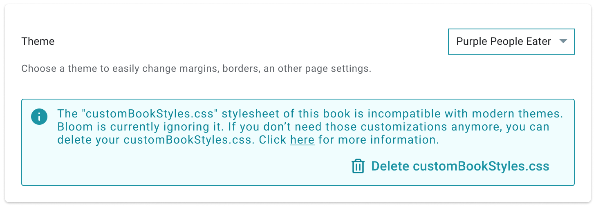

:::caution

This page is a work-in-progress for Bloom 6.0. Information subject to change.

:::

Bloom version 6.0 introduces a new page styling system that we’re calling “Appearance”. 

## Goals of the Appearance System {#4565736c09c043a9b467728f5355c64f}

- Enable users to select from a set of pre-designed “Page Themes” that set things like margins, spacing, corner rounding, background colors, and page number handling
- Make it easy for users to decide what fields to show on the cover (language name, topic, L2, and L3)
- Shift to smaller margins and gutter by default
- Simplify Bloom’s built-in stylesheets
- Enable collection-wide settings that can be overridden if needed by individual books (not yet in Bloom 6.0)
- Prepare the groundwork for phasing out `customBookStyles.css` and `customBookCollections.css` in the future

	:::note
	
	Over time, we intend to gradually deprecate the use of custom CSS in Bloom and replace it primarily with Themes + Book Settings.
	
	:::
	
	

- Do all of the above while keeping books backward-compatible with previous versions of Bloom (this was hard)

	:::note
	
	(our intent is that) Books made with Bloom 6.0 are compatible with previous versions of Bloom.
	
	:::
	
	

## Bloom 6.0 Appearance Features {#428c762d273f4c9c90b0e5c93ab1ce25}

- A new “Book Settings” Dialog that lets you change some things that previously would have required custom CSS.
- A set of “themes” that users can apply to their book.
- An automatic conversion of some of the most common customBookStyles.css files to a corresponding theme.
- A new “default” theme with the most commonly requested changes to margins and other spacing.
- A “legacy 5.6” theme that retains the margins and spacing of previous Bloom versions.

## Expected Future Appearance Features {#b6d5a8cd45b84a37adcf38ff260d03dc}

- Add Book Settings defaults to the Collection Settings, so that you can have all the books use the same themes and other settings
- Individual books will be able to override the Collection Settings

# The migration from the old to the new system {#d997fa04c2bf494db0f705489a994f2e}

If a book is “saveable”, Bloom 6.0 will migrate it to the new system. It will do this in a way that will allow the book to keep working in older Blooms, Bloom Readers, and BloomPUB Viewers.

:::note

A book is “saveable” if it is in the editable collection that is not a Team Collection or is part of a Team Collection but is currently checked out to the current user.

:::

The migration has these steps:

1. If the book does not have any custom CSS, the book will be given the “Default” theme. This will narrow its margins and gutter to an amount that is generally considered to be a better default.

	:::note
	
	A “compatible” custom CSS is one that does not interfere with Bloom’s Appearance system. For example, `.marginBox{left: 10mm}` is incompatible because, in the new system, the left margin must be controlled using `--page-margin-left: 10mm`.
	
	:::
	
	

2. Otherwise, if Bloom recognizes the contents of that stylesheet, it will add a pre-prepared `customBookStyles2.css` and `appearance.json.` We intend to prepare these automatic migrations for some of the most commonly used `customBookStyles.css` found on BloomLibrary.org.
3. Otherwise, if the book has custom CSS that is compatible with the Appearance system, it will continue to be used in addition to the “Default” theme.
4. Otherwise, if the book has a custom CSS that is incompatible with the Appearance system, Bloom will assign the book to the “Legacy 5.6” theme, and use the custom CSS in addition to the legacy theme. The intended result is the book should look the same. If you later use the Book Settings dialog to change to a modern theme, Bloom will start ignoring the incompatible `customBookStyles.css` and offer to delete it. It will then look for a file named `customBookStyles2.css` in case you really need to change something that cannot be done with themes or customizing `appearance.json`.

	

## Customization with Bloom 6.0 and later {#1af2b6d8380447a883bbcfcd30f409c4}

There are now three levels of customization:

1. Use the new “Book Settings” UI to choose a theme.
2. Use the new “Book Settings” UI to choose a theme to set a small number of other properties, such as margins.
3. Create a customBookStyles.css file that uses the new properties. For this, see:

[Create Appearance-compatible custom CSS and Themes](/appearance-system-css)

