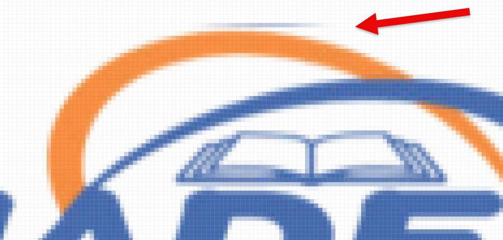
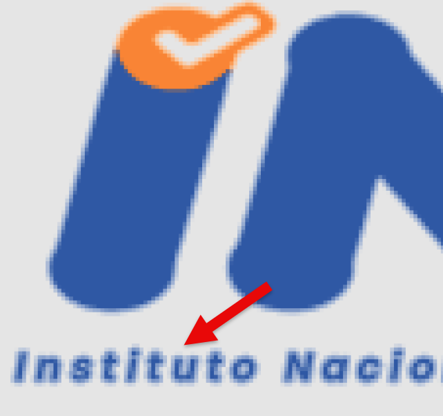
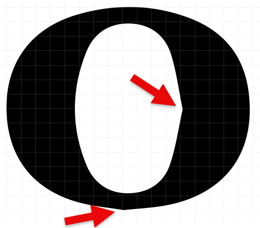
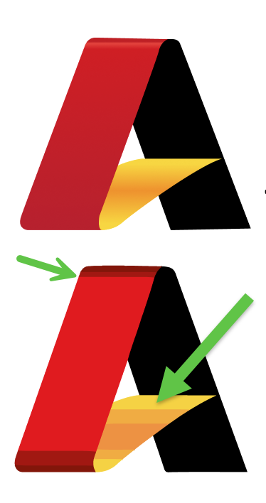
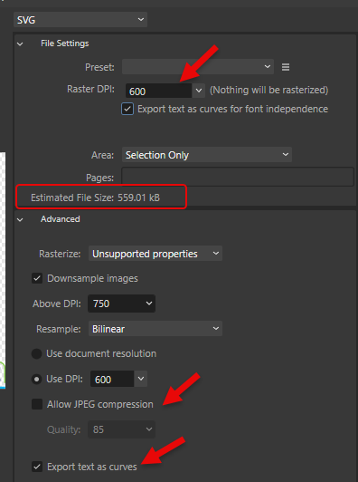

Bloom books often feature logos from sponsors and government agencies, and ensuring that these logos are high quality is essential to maintaining a professional look. However, getting a usable, high-quality logo can sometimes take significant work, especially when only a poor-quality version is provided.  Large logo files can also inflate the overall file size, making books harder to download and share.

These notes are designed to guide you through the process of finding or creating a high-quality logo, even if you’re starting with a less-than-ideal file.

## The Hard Life of a Logo File {#12a4bb19df1280dfaf02df2489038e21}

The logo files we are given often have had a long and challenging journey:

1. **Creation**: Years ago, a graphic artist created the logo as a vector (EPS, SVG) in Adobe Illustrator or another professional design application. This format is perfect for any resolution. The artist may have used a proprietary font for the text.
2. **Export Issue**: The artist exported the logo as an SVG but forgot (or didn’t know) to convert the text to outlines, making the text display correctly only if the font is installed on the viewer's device.
3. **First Conversion**: Someone later converted the SVG into a low-quality PNG for use on a website, losing the original font without anyone noticing.
4. **Second Conversion**: Another person converted the PNG to a lossy JPG format, introducing visible artifacts.
5. **Attempted Restoration**: Sometimes, someone tries to revert the logo back to vector format, but this process often introduces significant errors.
6. **Final Format**: The logo eventually arrives at Bloom in a combination of:
	- **Fuzziness**
	- **Large file size** (several MB, which complicates downloading and sharing books)
	- **Poor visual quality**
	- **White background** (making it clash with digital book backgrounds)

Using the logo as received can lead to one of two outcomes:

1. **Poor Impression**: The book may appear unprofessional, which could reflect poorly on Bloom. Those who favor expensive, complex design tools may perceive this as a limitation of Bloom, potentially reinforcing biases against using it.

:::caution

Distorted, unattractive logos can work against our mission of democratizing the production of simple books. 

:::

1. **Late-stage Issues**: When the project is near completion and PDFs are created, someone zooms in on the logos and notices their poor quality. Now everyone has to scramble to avoid missed publication deadlines.

## How It Should Work in Theory: Use Original Files {#12a4bb19df12801da26dfba93f6a336f}

In an ideal scenario, one would obtain the original artist's files (.EPS, .AI) or at least an SVG. Agencies like [USAID](https://www.usaid.gov/branding/resources) and [AUSAID](https://www.dfat.gov.au/about-us/corporate/logos-and-style-guides) offer branding guidelines that include original SVG files.

If the original file includes a font, the text should be converted to outlines to ensure proper rendering across different systems.

:::caution

If you have the font(s) used by a logo installed on your computer, and SVG that has not been converted to outlines will still look right. But it will look wrong when the book is viewed on another device.

:::

Tools like [Affinity](https://affinity.serif.com/en-us/) (with a 6-month free trial) can open these files and export them as SVGs. Alternatively, these free conversion sites can be used:

- [CloudConvert](https://cloudconvert.com/ai-to-svg)
- [Convertio](https://convertio.co/ai-svg)

## How it can work in practice {#12a4bb19df1280deb57de117afff464e}

In our experience, logos from developing countries are rarely available in high-quality formats. However, if we are provided _something_, we can start by searching for higher-quality versions through Google Image search.

### High quality, transparent PNG {#12a4bb19df128090a909c036d87c9615}

Sometimes a PNG is sufficient if it is high-resolution, crisp, and transparent. In that case:

1. **Resize for Print**: Adjust the resolution to fit print requirements. For instance, if the logo will appear at 1 inch wide on the page, it should be 300-600 pixels wide, depending on the desired DPI. You can resize using tools like Paint.NET. Inspect the resized logo closely to ensure quality.
2. **Compress the PNG**: Use [Recompressor](https://recompressor.com/) to reduce file size.
3. **Evaluate Size**: If the PNG is under 1 MB, you may decide not to create a vector version.

### Test with Bloom PDF {#12a4bb19df12805cb74ce18a9c99b76f}

Add the image to Bloom, then generate a PDF and zoom in on the logo. Look out for issues like “smudges”:

If you encounter problems like these, try opening the PNGs in MS paint or something like that and re-saving. In the case above, we decided that the quality of the text was too bad anyways, so we gave up and created vectors from the PNGs.

1. Zoom in on the text in the PNG. Make sure it doesn’t look fuzzy

### Create an SVG from the PNG {#12a4bb19df1280ac9e38cbf6e5dd49a7}

**Try an Automatic Conversion.** Using the highest-quality PNG available, try converting it to SVG with one of these paid services:

[Vectorizer.AI](http://vectorizer.ai/)  $10/month

[https://www.vectorizer.io/](https://www.vectorizer.io/)  $5/week. This tool is more extensive, including tools to try to get gradients. It may be easier just to fix the gradients in the tool of your choice after the conversion.

[https://vectormagic.com/](https://vectormagic.com/) $10/mo. Can turn off the automatic settings and to through the choices they give you. Still not as good as [vectorizor.ai](http://vectorizor.ai/) in my experience.

You can try each of these without downloading or paying.

**Hire someone.**  For this logo, [vectorizer.ai](http://vectorizer.ai/) did well with the figures, but then [posterized](https://en.wikipedia.org/wiki/Posterization) the water, converting the steady gradient from light to darker blue with large jumps from one color to another.

In the end, we paid for US$18 for someone advertising “vector tracing” on [Fiverr.com](http://fiverr.com/). That same day, we got back something that didn’t exactly match the original, but the client was ok with the changes:

### Check the outlines of the text {#12a4bb19df12805a816bfbeccc5b3c25}

Look carefully at the outlines of the text for any egregious errors, like the pointy bits in this “O”:

Note that if the text is small, errors like this would not be noticeable in the final printed version.

### Check gradients of the SVG {#12a4bb19df128089a71de9d34d5dffaa}

:::tip

Make sure that no gradients have been accidentally [_posterized_](https://en.wikipedia.org/wiki/Posterization).

:::

At the time of this writing, we are not aware of a converter that does well with gradients. You may need to add them manually in a design tool.

:::tip

Figma has an easy interface for setting linear and radial gradients.

:::

### Check the size of the SVG {#12a4bb19df1280da86ddc0ae77bbda1a}

Ideally, SVGs are smaller than PNGs, but intricate outlines can increase file size. You can try compressing using [https://vecta.io/nano](https://vecta.io/nano).

If necessary, export the SVG as a smaller PNG at the correct DPI. 

:::tip

The USAID logo is one example of a logo where the SVG is larger than a high quality PNG made from it.
USAID.ai (308KB)

USAID.svg (327KB)

USAID.png (138KB)    Compressed using [https://recompressor.com/](https://recompressor.com/) (55KB)

:::

### Side-Note: Preventing Figma from downgrading PNGs {#1474bb19df1280db8d45dde39e1064fa}

If you use Figma as part of the process, beware that if you export an SVG that contains PNGs, they get downgraded. Here’s are three work-arounds:

1. Use Affinity Publisher or Designer instead  (has a generous trial period)

— OR —

1. In Figma, export as PDF instead of SVG
!! This will already introduce unwanted artifacts over PNGs !!!

2. Open the PDF in Affinity Publisher

3. Export to SVG using high DPI settings

4. Check the resulting file size. Remember that you are shipping that to every user of Bloom, whether they use this branding or not.

— OR —

1. In Figma, grow or 2x,3x,4x export way more pixels than you think. Save as PNG.

## Wrapping Up {#12a4bb19df128081bb0ae9102790f3d5}

By following these steps, you can ensure that every logo in a Bloom book looks professional, loads efficiently, and aligns with the quality standards our readers expect. With a little extra care, even a challenging logo file can become a polished, high-quality addition to your project.

