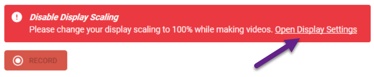
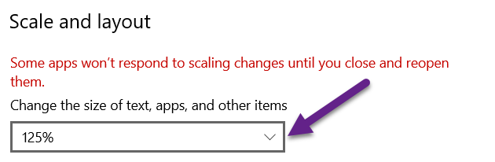
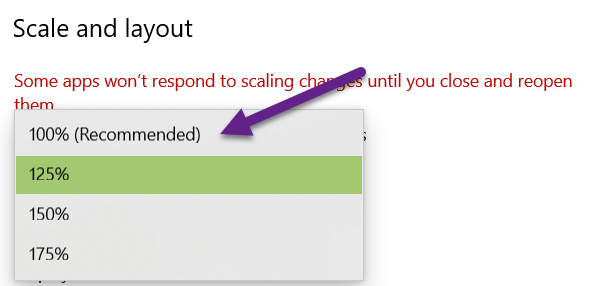

When publishing your Bloom book to video, if the display settings of your monitor have “scaling” applied, then Bloom will give a warning and will disable the RECORD button.

To disable the scaling for your monitor, click the link “<u>Open Display Settings</u>”.

Now, scroll down until you see “Scale and layout”. There you will find a percentage % set to something greater than 100%. 

Click the down-arrow:

Click on 100%:

Your scaling is now set to 100%. This is the same as saying that scaling has been disabled. 

For Bloom to recognize that your scaling has changed, you need to exit the Publish tab, then return to Publish. 

The RECORD button will now be enabled. Click the RECORD button to begin your recording:

