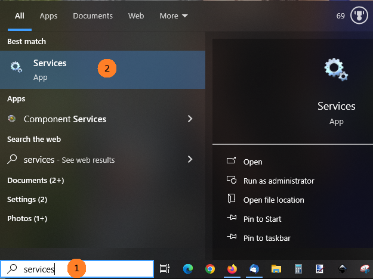

When using Bloom Team Collections with Dropbox, two problems can occur:

1. [Bloom detects that Dropbox is not running](/dropbox-trouble#d7c9e80a73764f2887d5fe7d3db16a02)
2. [Dropbox cannot handle the book’s Unicode title](/dropbox-trouble#c61dbdf00ecf48b2876591fb8fd31a6b)

# Bloom detects that Dropbox is not running {#d7c9e80a73764f2887d5fe7d3db16a02}

Sometimes users of our [Team Collections](/team-collections-intro) feature have a problem where Bloom detects that Dropbox isn’t functioning normally. Dropbox is a program that Bloom uses to enable multiple users to share a collection over the Internet.

This situation could be due to a number of issues:

- **Dropbox was never setup on this computer**

	To check to see if Dropbox is already set up on this computer you can try the following:

	1. Type “dropbox” in your Search bar.
	2. If you see the Dropbox App on the left side as in the picture below, then Dropbox has been installed.

		

	- If you don’t see Dropbox, you’ll need to install it first. See [Setting up Dropbox on your computer](/team-collections-setting-up-dropbox).
- **Some part of Dropbox isn’t running**
	- First try restarting your computer. This will usually fix the problem.
	- If Bloom _still_ gives you the error that brought you to this page, you may need to restart the Dropbox service.
		- Type “services” in your Search bar and choose the **Services** app.

			

		- You should see something similar to this:

			

		If you find “**DbxSvc**” under the **Name** column (1), and it does not say “**Running**” under the **Status** column, then you should click on the word “<u>Start</u>” in “<u>Start</u> the service” (2).

		If you still cannot get Bloom to work with Dropbox, please get in contact with us ([issues@bloomlibrary.org](mailto:issues@bloomlibrary.org)).

	# Dropbox cannot handle the book’s Unicode title

	If the title of your book has an unusual combination of Unicode characters, Dropbox _may_ have difficulty synching these files to the cloud. Under the Activity tab, your Dropbox app will show a message like this: 

	

	If this occurs, the solution is to rename the book without renaming its title. To rename a book, right-click on the book’s thumbnail, and choose rename:

	

	Then, type in a simplified name for your book and press Enter. 

