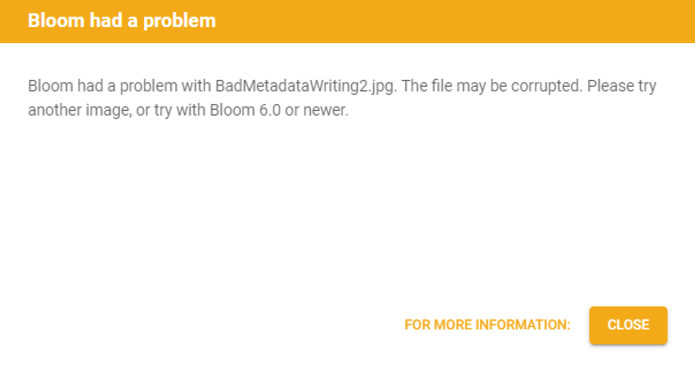

Occasionally, Bloom has a problem “reading” the copyright and license from an image file when importing it.  When this happens, Bloom will import the image, but the copyright and license information will not be imported.  

:::caution

Note: some images have the copyright and license locked so that they cannot be changed: this topic is not about those images.

:::

To jump straight to solutions to this problem, please click [here](/image-license-problem#c08da31e538f4ef8bfbe511a2d29cd5b).

If you require some background information, please read on…

## How image files are structured {#8e7965ff1b56479ea419fd139657dbac}

Most image files have two sections: 

1. The image data section. The section stores the actual picture.
2. A “metadata” section. This section stores information about the image such as when it was created and who created it.  It is in this section that the copyright and license information is stored.

## Problem “reading” the image metadata {#a3235e6f7dc046b48622dee673030cb0}

When Bloom has trouble reading or writing the metadata for an image file, there are two possible causes: 1) the metadata section has somehow gotten corrupted, or 2) Bloom does not recognize the particular format of the metadata for the image.  

In either case, when this happens, Bloom 5.6 will show a message reporting that it had a problem with that image file.  The message will display a button to obtain more information, namely, the information you are now reading: 

Note: older versions of Bloom show a different error message that does not provide this link.

## Solving image metadata problems {#c08da31e538f4ef8bfbe511a2d29cd5b}

1. Try importing the image using Bloom 6.0 or newer.  Bloom 6.0 handles the problem more gracefully, often silently fixing the problem.
2. Try using another image, or use a different copy of that image obtained from a different source.
3. Use Bloom’s Image Chooser dialog to slightly crop the image.  This causes a new file to be written with a fresh metadata section.  Note: when you crop an image in Bloom, this action cannot be undone.
4. Use an image-editing tool such as GraphicsMagick to remove the metadata from the image.  This may require technical assistance from a local expert. A blank metadata section will be recreated when Bloom imports the image.

Once you import the image following any of the above methods, you will need to manually set the copyright and licensing for the image in Bloom. 

